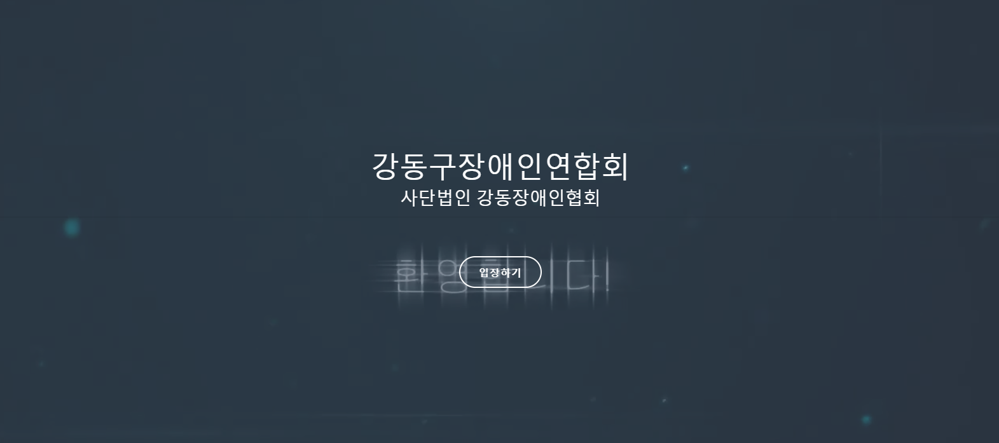

## 최초 웹 서버 정식 운영

개발의 `개`자도 모르는 내가 뜬금없는 웹 서버 운영이라니 ㅋㅋㅋㅋ
어릴 적 Apache 스리슬쩍 공부해 보다가 AMP(Apache Mysql Php)를 설치해서 잠시
테스트 해 본 적은 있었어도 정식으로 운영을 한다니... 그것도 우리 집에 있는 서버에서???

사실 알고보면 쉽게 만들 수 있는 것, 집에서 MacMini를 이용해서 웹서버를 운영중(공부용도)인데
홈페이지를 사알짝(HTML) 만들 줄 안다는 것만으로 의뢰가 들어와서 만들게 되었다.

> 강동구장애인연합회 [구경해보기](http://gangdonga.com)



```text
Webserver : Express(NodeJS)
Database : MongoDB(NoSQL)
Frontend : EJS Template(보안이 취약함 ㅜㅜ)
WegDesign: Bootstrap
```


### WebDesign 넘나 어려운 것.. ㅜㅜ

사실 그냥 웹 코딩을 하라면 어려운 것도 정보를 구글링해가며 찾으면 충분히 해낼 수 있지만
디자인은.... **ㅜㅜ** 못해먹겠다.. ㅋㅋ
상기 홈페이지를 제작할 때 `부트스트랩` 기반으로 여러번 디자인을 하다 지우다 하다 지우다를 반복하고
결국 `부트스트랩` 기반의 유료 템플릿을 구매하고 말았다.

### [사용한 템플릿](https://wrapbootstrap.com/theme/boomerang-multipurpose-bootstrap-theme-WB021609D)

유료 템플릿을 구매해서 디자인만 갖다 쓰는데 오히려 Node.JS로 구성하는 Express 백엔드가 훨씬 쉽더라!!
디자인, 색감각이 꽝인 나로서는 어쩔 수 없는 선택이었다.

이번 블로그도 사실 직접 한 번 만들었었지만 도저히 디자인 답이 나오질 않아 [Gatsby](https://www.gatsbyjs.org/)
를 이용하여 만들었다. ㅋㅋㅋ 도저히 디자인을 할 수가 없다........ 살려줘 ㅜㅜ