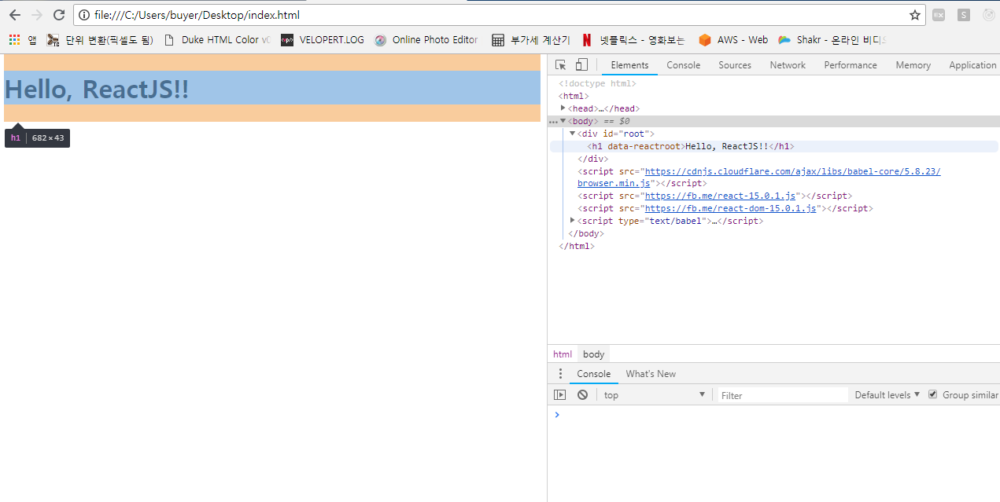

## React.JS란???

`React`는 구글이나 네이버 등에서 대충 검색만 해봐도 나오는 페이스북에서 만든 `자바스크립트 라이브러리`이다.
MVC 패턴 중 View를 담당하는 것으로 통상의 MVC 패턴은 데이터가 양방향으로 흐르기 때문에 복잡도가 증가하고
코드 이해가 어려워지는 점에 착안하여 ReactJS는 **단방향 아키텍쳐**를 사용한다.

### React.JS의 특징

#### 가상 DOM
React.JS는 실제 전체의 DOM(Document Object Model)을 다시 그리지 않는다. 데이터가 바뀔 때마다 바뀐 부분만
별도로 업데이트를 하여 성능 향을 볼 수 있는 구조이다. 전체 DOM과 비교(diff)를 하여 `최소한의 변경요소만` 실제
DOM에 적용을 시킨다.

#### 단방향 데이터 흐름
위에서 언급했듯이 React는 "상위 컴포넌트"에서 "하위 컴포넌트"로만 데이터가 흐른다.
이는 데이터 흐름의 파악을 원활하게 해 줄 수 있다.

#### 서버사이드 렌더링(SSR)
Client 측에서만 렌더링을 하면 초기 구동 속도가 느리다. 또한 자바스크립트를 실행하지 못하는 검색엔진은 처음 렌더링 된
비어있는 HTML 파일에서만 정보 수집을 하기 때문에 SEO(Search Engine Optimization)에 취약하다. 이를 해결하기 위해
Server 측에서 렌더링을 지원한다.


### React.JS 사용 예제 (script 삽입)
NPM과 Yarn을 이용하여 프로젝트를 구성하여 작성하는 것이 좋지만 일단 스크립트 삽입으로 사용해보자.
>script삽입으로 index.html
```
<!DOCTYPE html>
<html>
  <head>
    <meta charset="utf-8">
    <title>React Sample</title>
  </head>
  <body>
    <div id="root"></div>

    <script src="https://cdnjs.cloudflare.com/ajax/libs/babel-core/5.8.23/browser.min.js"></script>
    <script src="https://fb.me/react-15.0.1.js"></script>
    <script src="https://fb.me/react-dom-15.0.1.js"></script>

    <script type="text/babel">
      ReactDOM.render(<h1>Hello, ReactJS!!</h1>, document.getElementById('root'));
    </script>
  </body>
</html>
```
아래와 같이 크롬 등의 브라우저에서 파일을 읽어보면



이 죽일 놈의 Hello World!!