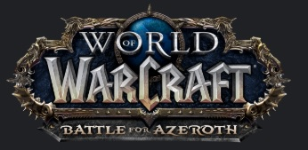

## 적성..?? 흥미..??
적성과 흥미는 엄연히 다른 것이지만 현역 근무 때 군수업무를 맡아 했어서 그런가
업무에 있어서는 정말 `군수분야`(물품, 물자, 장비 등 구매, 관리 등)는 업무가 참
편하기는 해서 좋기는 한데... 정말... ***재미가 없다!!!!***

좋아하는 분야에서 직업을 갖는다는 것이 정말 힘들긴 하지만 그런 분들을 가끔씩
볼 때면 참 부럽기도 하고 왜 나는 저렇게 되지 못했나 하는 자책을 하기도 한다.

지금 이런 블로그를 작성해가며 내가 좋아하는 프로그래밍 공부를 다시금 할 수 있는
것만 해도 참 행복한 일이긴 하지만 다른 업무를 보면서 중간 중간 해나가는게
참 생각만큼 쉽지는 않은 것 같다. 사실 누군들 안 그런가!!!

## `징징`(핑계) vs `정당한 불만`!!
사실 나는 성실하다.(ㅋㅋㅋ) 내 입으로 말해 뭐하긴 하지만 일에 집중할 때에는
정말 앞뒤 안 재고 일만 할 정도로 빠져서 한다. 이게 엄청난 장점이자 단점이 되는데,
남들 다 갖는 취미 생활 하나 제대로 가진 게 없고 사람들과의 교류도 자주 하지
못하는`(알콜 매니아임에도!!)`.. 참 재미없는 인생을 살고 있다.

## 찾아온 기회
그렇게 무기력하게 지내오던 중 갑자기 나의 흥미를 잡아 끄는 일이 생겼다. 바로
웹 코딩!! 군 입대 전 C언어로 게임 개발 공부를 하다가 직업 군인을 가서 못했었는데
그 흥미가 웹으로 이어졌다!! 원인은 와우!!!!!!!

> **World Of Warcraft** 

이 와우라는 게임에서 한 길드를 만났는데 너무나 가족같은 친밀감에 자주 정모도 하고
번개도 하며 나이가 서른이 넘어서 게임 때문에 누구를 만나 친해진다는게 신기하기도
하여 너무나 재밌게 생활을 하였는데 이 `길드`를 홍보하고 싶은 생각이 들어 길드
홈페이지를 운영, 다시 그 홈페이지를 우리집에서 웹 서버로 내가 직접 관리를 하고 싶은
생각이 들어 라즈베리파이3로 웹서버를 구축하여 운영한게 시작이다.

### 개발 언어 선택 장애 (feat. 결정장애 ㅜㅜ)
웹 코딩은 무궁무진하다. 너무나 광범위하다. 특히 요즘같이 프론트엔드가 쏟아져 나오는
시기에 나처럼 초보자가 달려들어서 배우기에는 너무나 벅찰 정도로 비대해 지고 있다.
물론 사실 쉬운 웹 페이지 제작 정도면 그냥 `html5, css, javascript`만 대충 써도
충분히 구현 가능하고 요새 무료 템플릿도 풀린 것들이 많아서 사용하면 쉽게 만들 수
있다. *하! 지! 만!* 제대로 해보고 싶었다. 시간도 없는 녀석이 무슨 소리냐 했지만,
달려들어 공부를 시작해보니 그리 못할 짓은 아니더라!

#### PHP?? Javascript, golang, Java
공부를 하려고 달려들어보니 참 배울 수 있는 선택의 폭이 넓더라. 어차피 전문적인 수준으로
갈 방향은 아니라 내가 쉽게 배우고 쉽게 사용하고 금방 적응하여 흥미를 잃지 않을 언어를
선택하는 것이 무엇보다 중요했고 나는 최종적으로 javascript 하나의 언어로 풀스택
(백엔드, 프론트엔드)을 구현할 수 있는 `NodeJS`를 선택했다. 그리하여 게시판도 만들어보고
자바스크립트의 매력에 푹 빠져 있던 중 발견한 블로그 `VELOPERT.log`, `a-mean-blog`

여기서 많은 정보를 체득하고 있었는데 Velopert(김민준)님이 소개해주는 리액트가 참
끌리더라. 물론 백엔드는 NodeJS(Express, Koa 등)로 작성이 가능했기에 프론트엔드를
규모가 너무 비대한 `Angular`같은 통합 프레임워크를 사용하기가 부담스러워서 View만
다루는 ReactJS를 선택한 이유도 있지만 그냥 땡겼다... 사실 ㅋㅋㅋ

사실 아직도 걸음마도 못 떼었다. 뭐 하나 만들려면 전부 구글링해서 찾아서 작성해야 하고
참 익숙해지지 않는데..(나이 때문인가... 궁시렁궁시렁..ㅜㅜ) 열심히 해보련다!!
목표가 생겼으니까!!