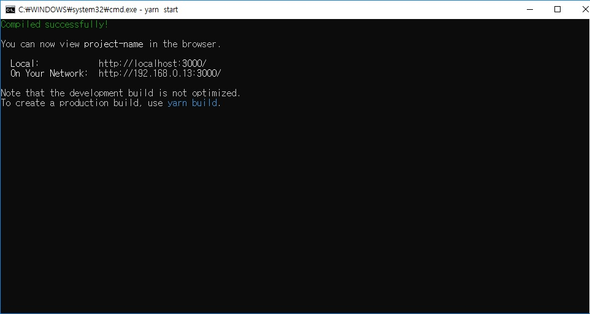
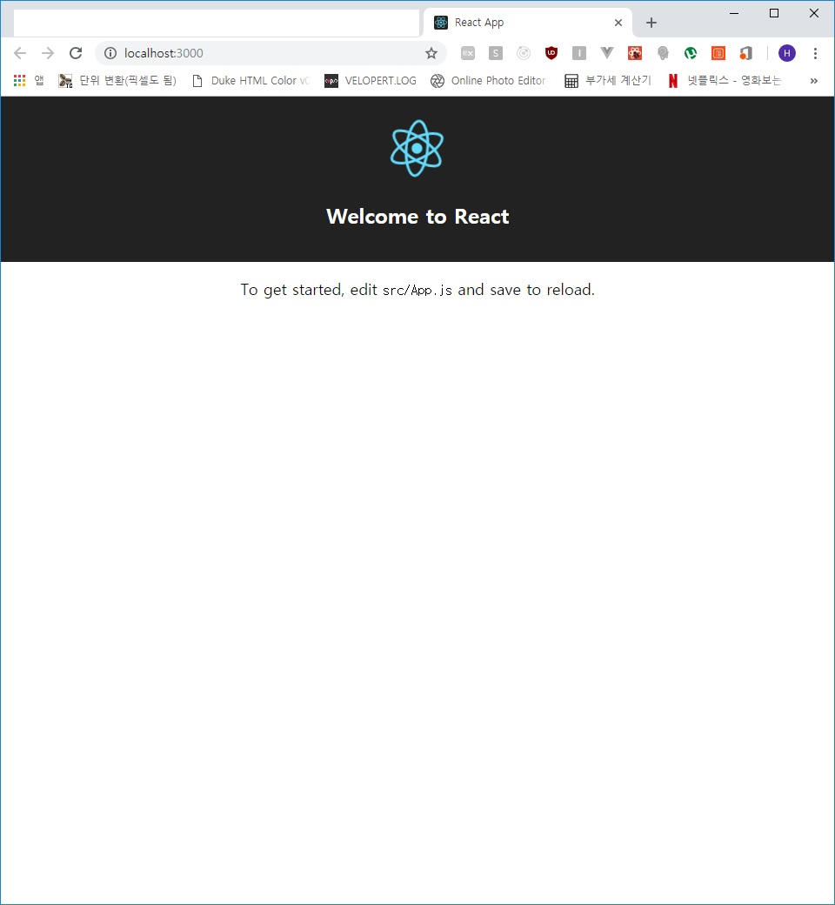

## ReactJS 공식 도구
기존 리액트를 사용할 때에는 `npm` 명령어로 **초기화, 모듈 불러오기, webpack 설정, 바벨 설정** 등등의
다소 귀찮고 시간이 걸리는 작업들을 하였는데 이를 편하게 해주는 *공식도구*가 있다.  
무려무려무려!! Redux를 개발한 Dan Abramov 라는 인물이 리액트를 한번에 설정해주는 멋진 도구를
만들어 주었다.

### Create-React-App
설치는 매우 간단하다.
```text
C:\> npm install -g create-react-app
```
위 명령어로 create-react-app를 `글로벌`로 설치한 후 사용법은 아래와 같다.
```text
C:\> create-react-app [project-name]
```

이후 프로젝트 폴더에 들어가서 아래와 같이 서버 실행
```text
C:\> cd project-name
C:\project-name> yarn start
```



웹 브라우저에서 <a href="http://localhost:3000" target="_blank">열어보기</a>

