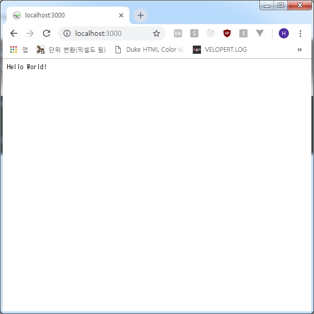

## Koa.JS
Node에서의 가장 표준이 되었고 많이 사용되어 온 웹서버인 Express를 제작한
팀에서 새롭게 만들게 된 프레임워크!!  

<a href="https://koajs.com/" target="_blank">Koa.JS</a>

Koa.JS의 공식 홈페이지의 내용을 블로깅 해보려고 한다.

### 소 개 (공식홈페이지 소개)
Koa는 웹 어플리케이션 및 API를 위한 작으면서 표현력이 뛰어나며 견고한 기반을
목표로 하는 Express 팀의 새로운 웹 프레임 워크입니다.  
비동기 함수(async)를 활용하여 Koa는 콜백을 제거하고 오류 처리를 크게 향상시킬
수 있습니다.  
Koa는 코어 내의 미들웨어를 번들로 제공하지 않으며 서버를 빠르고 재미있게 작성할
수 있는 일련의 메소드를 제공합니다.

### 설 치
Koa는 ES2015(ES6)와 비동기 기능(Async) 지원을 위해 Node v7.6.0 이상이 필요합니다.
```text
C:\> yarn add koa
```

### 비동기 함수(Async) with Babel
Node v7.6 이상 버전에서 비동기 함수(Async)를 사용하려면 `babel-register`기능이
필요합니다.
```text
require('babel-register');
const app = require('./app);
```
비동기 함수(Async)를 분석, 변환하려면 transform-async-to-generator 또는
transform-async-to-module-method 플러그인이 필요합니다.  
예를 들어 `.babelrc` 파일에 아래와 같이 기록합니다.
```text
{
  "plugins": ["transform-async-to-generator"]
}
```

### 어플리케이션 사용
Koa 어플리케이션은 요청시 스택 방식으로 작성되고 실행되는 Middleware 기능배열을
포함하는 객체입니다.  
Koa는 Ruby'sRack, Connect 등과 같은 다른 미들웨어 시스템과 유사하지만
낮은 수준의 미들웨어 계층에서 높은 수준의 `설탕(당근)`을 제공하기 위한 핵심 설계
결정이 내려졌습니다.  
이것은 상호 운용성, 견고성을 향상시키고 미들웨어 작성을 훨씬 즐겁게 만들어 줍니다.  
**What?? -_-**

여기에는 컨텐츠 협상, 캐시 최신성, Proxy 지원 및 타 개발자 간의 리디렉션과 같은
일반적인 작업을 위한 방법이 포함됩니다.  
Koa는 합리적인 수의 유용한 메소드를 제공하지만 미들웨어가 번들되지 않으므로 작은
풋-프린트를 유지합니다.(가볍다는 표현인 듯??)

Welcome to Hello World!!
```text
C:\> md test
C:\> cd test
C:\test> yarn init --yes
C:\test> yarn add koa
```
프로젝트를 생성하고 koa 모듈을 추가  
루트 폴더(C:\test>)에 index.js 파일 생성 후 아래와 같이 기록

```text
const Koa = require('Koa');
const app = new Koa();

app.use(async ctx => {
  ctx.body = 'Hello World!';
});

app.listen(3000);
```

Koa 웹서버 실행
```text
C:\test> node index.js
```

웹 브라우저에서 페이지를 확인합니다.


### 이후 Cascading 및 미들웨어에 관한 내용은 다음 포스트에 이어서