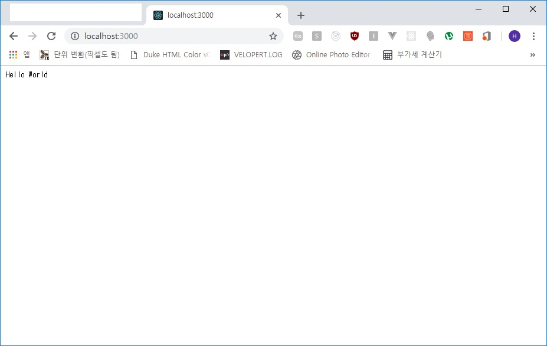

## Koa.JS 미들웨어
미들웨어`Middleware`는 어플리케이션이 운영 체제(OS)로부터 제공받는 서비스 이외의 추가적으로
이용할 수 있는 서비스를 제공하는 것을 말합니다.  
Node.JS에서의 미들웨어는 구조 내에서 `중간 처리`를 위한 함수*(메소드)* 또는 모듈*(함수의 집합)*을
의미합니다. 

### 미들웨어 사용
미들웨어 예제문은 이전 <a href="/koa01-js/" target="_blank">소개글</a>에서 사용된 `코드`인 다음과 같다.
```js
app.use((ctx, next) => {
  ctx.body = 'Hello World';
});
```
위 예문에서 보이는 app.use 파라미터가 미들웨어입니다.  
Koa의 파라미터는 두 가지가 있습니다. 첫번째는 ctx, 두번째는 next입니다.

> **ctx** : 웹 요청(Request), 응답(Response) 정보  
> **next** : 지금 처리 중인 미들웨어의 다음 미들웨어 호출

미들웨어 등록 후 next를 실행하지 않을 시 다음 미들웨어는 처리를 하지 않습니다. 그리고
next()를 실행하면 Promise를 리턴합니다.
```js
- next() 이후 Promise 예제

app.use((ctx, next) => {
  console.log('Server On');
  next()
    .then(() => {
      console.log('Server Off');
    });
});
```

콜백지옥을 피하기 위해 Async/Await를 사용합니다. 아래 예제를 보시기 바랍니다.

```js
- Async/Await 사용

const Koa = require('koa');
const app = new Koa();

const port = 3000;

app.use(async (ctx, next) => {
  console.log('첫번째 로그');
  await next();
  console.log('끝!');
});

app.use((ctx, next) => {
  console.log('두번째 로그');
  next();
});

app.use((ctx) => {
  console.log('세번째 로그 & Hello World');
  ctx.body = 'Hello World';
});

app.listen(port, () => {
  console.log(`Koa Server on ${port}port`);
});
```

위와 같이 작성한 후 `node index.js`로 실행하면 콘솔 창에 아래와 같이 나옵니다.
```js
C:\test> node index.js
Koa Server on 3000port
```
이후 웹 브라우저에서 <a href="http://localhost:3000" target="_blank">확인합니다</a>


웹 브라우저에서 접속을 하면 위와 같이 나오게 되고 콘솔창에 아래와 같이 찍히게 됩니다.
```js
첫번째 로그
두번째 로그
세번째 로그 & Hello World
끝!   <- 첫번째 미들웨어에서 await 선언으로 마지막에 실행
```