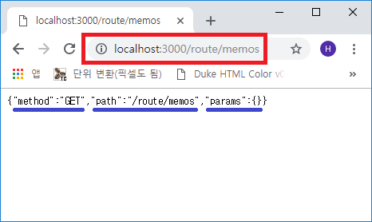

## Koa.JS 라우터 분리하기
[3장](/koa03-js/)에서처럼 라우트를 작성해도 되지만 경로를 여러가지로 설정하다보면 `index.js` 파일이 너무 길어지게 되어
관리하는데 어려움이 생기게 됩니다. 따라서 라우터를 `index.js` 파일에서 분리하여 모듈화 해보겠습니다.

작성하게 될 폴더 및 파일 구조는 다음과 같습니다.


`C:\> yarn init --yes`  
`C:\> cd test`  
`C:\test> yarn add koa koa-router`


```js
- index.js // Root 폴더에 작성

const Koa = require('koa');
const Router = require('koa-router');

const app = new Koa();
const router = new Router();

// route 라는 변수에 root/route 폴더를 포함시킵니다.
const route = require('./route');

const port = 3000;

// Routes Setting
router.use('/route', route.routes());

// Router 적용
app.use(router.routes()).use(router.allowedMethods());

app.listen(port, () => {
  console.log(`Koa Server on ${port}port`);
});
```

이후에 ~/route 폴더에 index.js 파일을 작성합니다.

```js
- /route/index.js

const Router = require('koa-router');
const route = new Router();

// 경로 설정 root index에서 /route로 설정하였으므로
// 결과적으로 /route/ 로 설정됨
route.get('/', (ctx) => {
  ctx.body = '경로 설정 확인';
});

module.exports = route;
```

작성하였으면 실행 `node index.js`


### RestAPI(CRUD) 설명
**RestAPI 란??**  
REpresentational State Transfer Aplication Programing Interface의 줄임말로 기존의 HTTP 설계의 우수성에 비해
제대로 사용이 되질 않는 것에 착안하여 웹의 장점을 최대한 활용할 수 있도록
<a href="https://en.wikipedia.org/wiki/Roy_Fielding" target="_blank">로이 필딩</a>박사학위 논문에서 최초로 소개되었습니다.  
간단하게 말하면
<font color="blue" style="font-weight: 600">URI(Uniform Resource Identifier)는 정보의 자원을 표현(사람이 알아볼 수 있는)해야 하며 자원에 대한 행위는
HTTP Method(get, post, put, delete)로 표현한다</font> 라는 뜻입니다.

만약에 웹 브라우저에서 바로 DB(데이터베이스)에 직접 접속을 하여 DB를 수정할 수 있다면 보안에
문제가 발생할 수 있으므로 RestAPI를 작성하여 DB에 접근, CRUD(Create, Read, Update, Delete) 등의 작업을 합니다.


`RestAPI`의 요청 종류에 따라 주로 사용되는
<a href="https://developer.mozilla.org/ko/docs/Web/HTTP/Methods" target="_blank">HTTP 요청 메소드</a>는 아래와 같습니다.

> **GET** : 데이터 조회  
> **POST** : 데이터 생성(등록), 인증 확인  
> **PUT** : 데이터의 전체 내용을 통으로 업데이트(수정)  
> **PATCH** : 데이터의 특정 내용만 업데이트(수정)  
> **DELETE** : 데이터 삭제

### RestAPI 작성
route를 RestAPI에 맞추어 메모를 CRUD하는 형식으로 만들겠습니다. 아래와 같이 수정 및 작성해 주세요.

```js
- ~/route/index.js

const Router = require('koa-router');
const route = new Router();

// route/memos/index.js 파일 로드
const memos = require('./memos');

route.use('/memos', memos.routes());

module.exports = route;
```

```js
- ~/route/memos/index.js

const Router = require('koa-router');
const memos = new Router();

// CRUD Test Method
const memoTest = (ctx) => {
  ctx.body = {
    method: ctx.method,
    path: ctx.path,
    params: ctx.params
  };
};

// Routes Setting
memos.get('/', memoTest);
memos.get('/:id', memoTest);

module.exports = memos;
```

작성이 다 되었으면 Koa 서버 실행 `node index.js`  
웹 브라우저에서 확인해 봅시다.




보시는 바와 같이 **json** 형식으로 각 method, path, params 값이 나오죠? 잘 작동이 되는 것 같습니다.
지금 사용한 API는 GET(Read) 메소드이며 이후 작성 및 확인해야 할 API 들은 `Javascript`로 호출하여야
합니다. 따라서 RestAPI 요청 테스트를 할 수 있게 해주는
<a href="https://www.getpostman.com/" target="_blank">POSTMAN</a>을 설치해서 테스트 해야 합니다.  
요건 다음 포스트에서 ㅋㅋ

### 참고사항
제 크롬 스크린샷을 확인하시면 아시겠지만 저는 `Velopert(김민준)`님의 광팬입니다. 따라서 여기 작성되는
내용들은 저얼대 강좌가 아니고 저 혼자 공부를 하여 요약 및 기록을 남기기 위함이니 오해하지 말아주세요!