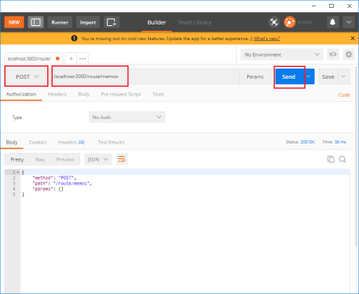

## Koa.JS RestAPI Postman 테스트
이전 [4장](/koa04-js)에서 RestAPI를 이어서 작성하겠습니다.  
그리고 추가적으로 HTTP 메소드 테스트를 위한 Postman도 설치하겠습니다.

우선 API 기능을 정확히 구현하기 위해 `koa-bodyparser` 모듈을 설치하겠습니다.
이 모듈은 post, put, patch 등의 Request의 Body에 json 형식으로 데이터를 삽입하면
이를 서버에서 사용할 수 있게끔 파싱해 주는 역할을 합니다.

`C:\test> yarn add koa-bodyparser`

```js
- ~/index.js

const Koa = require('koa');
const Router = require('koa-router');
const bodyParser = require('koa-bodyparser'); // 추가

...(생략)

// Routes Setting
router.use('/route', route.router());

app.use(bodyParser());  // 추가

// Router 적용 전에 koa-bodyparser 적용

...(생략)
```


> <a href="https://www.getpostman.com/products" target="_blank">PostMan</a> : 
HTTP 메소드 요청을 테스트 하기 위한 프로그램(Mac, Window, Linux)


`Download the App`을 클릭하여 다운로드, 설치를 하시면 됩니다.  
기존에 사용했던 코드를 약간 수정하여 post 요청을 한 번 해보겠습니다.

```js
- ~/route/memos/index.js

...(생략)

// Routes Setting
memos.get('/', memoTest);
memos.get('/:id', memoTest);

memos.post('/', memoTest);  // 추가

module.exports = memos;
```

Postman을 실행합니다.


아래와 같이 Method는 `POST`로, 옆의 주소는 아래와 같이 하신 후에 `SEND` 버튼을 누르면


```json
{
  "method": "POST",
  "path": "/route/memos",
  "params": {}
}
```
위와 같이 응답이 돌아옵니다. 나머지 RestAPI도 작성하여 테스트 해봅시다.

```js
- ~/route/memos/index.js

...(생략)

// Routes Setting
memos.get('/', memoTest);
memos.get('/:id', memoTest);
memos.post('/', memoTest);

// 추가
memos.put('/:id', memoTest);
memos.patch('/:id', memoTest);
memos.delete('/:id', memoTest);

module.exports = memos;
```

이후 포스트 맨에서 동일하게 테스트를 합니다.


이상없이 잘 작동하는 것 같습니다!

### 라우트 처리 함수 분리
라우트 작성 시 방금 작성한 한 파일에 라우트 처리 함수를 전부 집어넣게 되면 라우터 설정을 확인하기도
힘들 뿐더러 작성하다가 혼동이 오는 경우가 있습니다. 따라서 컨트롤러 파일을 분리해주면 좋습니다.  
컨트롤러 파일을 생성한 후 아래와 같이 작성합니다.

```js
- ~/route/memos/controller/controller.js

const memos = [
  {
    id: 1,
    title: '제목',
    author: '작성자',
    body: '내용'
  }
];

let memoNum = 1;
```

데이터베이스를 적용하기 전이기 때문에 javascript의 배열 기능으로 작성해 보기 위하여 위와 같이
작성하였고 `memos` 배열 안에 순번인 **id**, 제목 **title**, 작성자 **author**, 내용 **body**를
객체 형식으로 넣었고, 이후 순번인 **id**의 번호를 자동으로 올리기 위해 변수 memoNum을 1로 초기화 해주었습니다.  
이어서 모듈화 시킨 route를 불러들일 이름을 정하여 `~/route/index.js` 파일을 수정하여 줍니다.

```js
- ~/route/memos/index.js

const Router = require('koa-router');
const memosController = require('./controller/controller');

const memos = new Router();

memos.get('/', memosController.list);
memos.get('/:id', memosController.read);
memos.post('/', memosController.write);
memos.put('/:id', memosController.update);
memos.patch('/:id', memosController.modify);

module.exports = memos;
```

### 컨트롤러 파일 작성
컨트롤러 파일(`controller.js`)에 export.호출명 = 으로 함수를 export 시켜서
`const memosController.호출명()` 으로 사용할 수 있습니다.  

#### 먼저 list(get) 컨트롤러를 추가하겠습니다.

```js
- ~/route/memos/controller/controller.js

...(생략)

// Get '/routes/memos' 추가
export.list = (ctx) => {
  ctx.body = memos;
}
```


#### 다음으로 read(get) 컨트롤러를 추가해 보겠습니다.
read는 id에 따른 특정 데이터를 확인하는 메소드입니다.
```js
- ~/route/memos/controller/controller.js

...(생략)

// Get '/routes/memos/:id'
exports.read = (ctx) => {
  const { id } = ctx.params;
  const memo = memos.find(memo => memo.id.toString() === id);

  if (!memo) {
    ctx.status = 404;
    ctx.body = { message: '메모가 없습니다.' };
    return ;
  }

  ctx.body = memo;
}
```


다음 포스트에 이어서