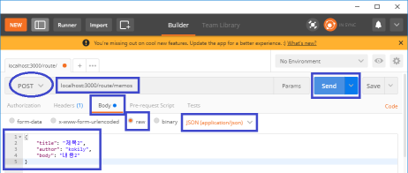
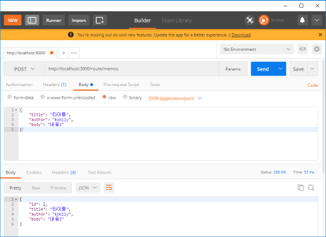
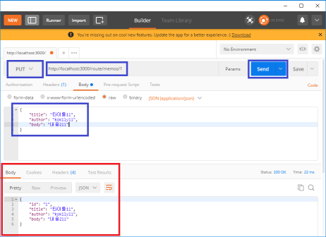
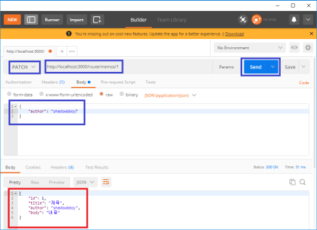
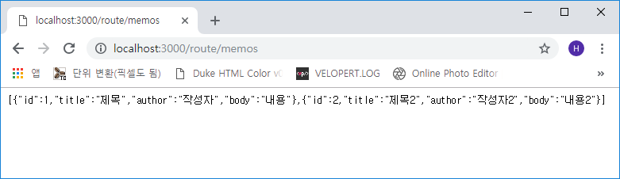
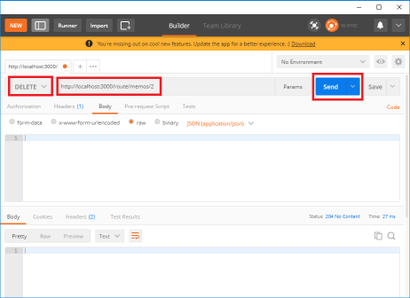
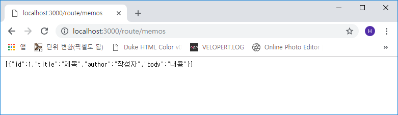

#### 다음으로 write(post) 컨트롤러를 추가해 보겠습니다.
```js
- ~/route/memos/controller/controller.js

...(생략)

// Post '/route/memos' 실제 경로
exports.write = (ctx) => {
  const { title, author, body } = ctx.request.body;

  memoNum += 1;

  const memo = { id: memoNum, title, author, body };
  memos.push(memo);

  ctx.body = memo;
}
```
기존 순번(memoNum) 값에 1을 추가하면서 memos 객체 배열에 `id, title, author, body` 항목을
**push()** 함수로 추가합니다.  
post 테스트이기 때문에 Postman을 실행하여 아래 화면과 같이 작성합니다.


위와 같이 메소드는 **POST**, 주소는 **localhost:3000/route/memos**, 하단부의 **raw**를 선택하고
가장 우측의 **TEXT**를 **JSON(application/json)**으로 선택한 후에 json 형식으로 작성을 합니다.
이후 `Send` 버튼을 클릭하면



#### 다음은 update(post) 컨트롤러(통째로 교환)를 추가하겠습니다.
```js
- ~/route/memos/controller/controller.js

...(생략)

// PUT '/route/memos/:id'
exports.update = (ctx) => {
  const { id } = ctx.params;
  const order = memos.findIndex(memo => memo.id.toString() === id);

  if (order === -1) {
    ctx.status = 404;
    ctx.body = { message: '메모가 없습니다' };
    return ;
  }

  memos[order] = { id, ...ctx.request.body };

  ctx.body = memos[order];
};
```
put 메소드는 id에 따른 특정 데이터를 `통째로 교환`을 합니다. 파라미터로부터 id를 받아오고
해당 아이디가 memos 객체 배열에서 몇 번째 인지를 **order**에 담고 `memos[order]`를 통해
memos 객체 배열에서 order의 id를 가진 데이터를 찾아 `ctx.request.body`에 담긴 내용으로
새로운 객체 `memos[order]` 를 생성하여 ctx.body로 날려줍니다.  
설명이 다소 복잡하지만 한 줄씩 읽어보면 그리 어려운 내용은 아닙니다(제가 이해했으므로!! ㅋㅋ)  

포스트맨에서 확인 해 보겠습니다.


위와 같이 메소드는 **PUT**, 주소는 **localhost:3000/route/memos/1**로 한 뒤 json 데이터를
위와 같이 입력한 후에 `Send` 버튼을 누르면 <font color="red">빨간 네모</font>와 같이 적용됨을
알 수 있습니다.  
주소에서 id 값을 `1`로 주었기에 id가 `1`인 객체를 찾아서 각 항목들이 덮어 씌워짐이 확인됩니다.

#### 다음은 patch(post) 컨트롤러(항목별 수정)를 추가해 보겠습니다.
```js
- ~/route/memos/controller/controller.js

...(생략)

// PATCH '/route/memos/:id'
exports.modify = (ctx) => {
  const { id } = ctx.params;
  const order = memos.findIndex(memo => memo.id.toString() === id);

  if (order === -1) {
    ctx.status = 404;
    ctx.body = { message: '메모가 없습니다' };
    return;
  }

  memos[order] = {
    ...memos[order],
    ...ctx.request.body
  };

  ctx.body = memos[order];
}
```
put과 동일하게 patch도 id가 memos 객체 배열에서 몇 번 째인지 확인 한 후에 기존 값인
**memos[order]**에서 변경된 **ctx.request.body** 내용을 수정합니다.  
포스트맨에서 확인해보겠습니다.


위와 같이 메소드는 **PATCH**, 주소는 **localhost:3000/route/memos/1**로 한 뒤 json 데이터를
위처럼 `author` 항목만 입력하여 `Send` 버튼을 눌러 확인합니다.
<font color="red">빨간 네모</font>와 같이 `author` 항목만 변경된 것을 알 수 있습니다.

#### 다음은 delete(post) 컨트롤러(remove)를 추가하겠습니다.
```js
- ~/route/memos/controller/controller.js

...(생략)

// DELETE '/route/memos/:id'
exports.remove = (ctx) => {
  const { id } = ctx.params;
  const order = memos.findIndex(memo => memo.id.toString() === id);

  if (order === -1) {
    ctx.status = 404;
    ctx.body = { message: '메모가 없습니다' };
    return;
  }

  memos.splice(order, 1);
  ctx.status = 204;
}
```
delete도 동일하게 id가 memos 객체 배열에서 몇 번 째인지 확인 한 후에 order번째 데이터를
삭제합니다. 기존 내용을 삭제하기 애매하므로 2번 id를 추가하여 삭제하겠습니다.


이후 포스트맨에서 2번 id를 삭제해 보겠습니다.


`Send` 버튼을 누른 후 브라우저에서 확인해 보겠습니다.


쨔란! 삭제가 정상적으로 잘 되었습니다.

이것으로 이번 포스트를 마치겠습니다