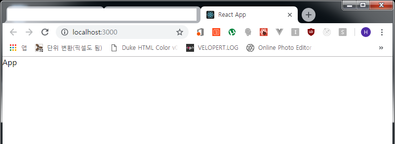
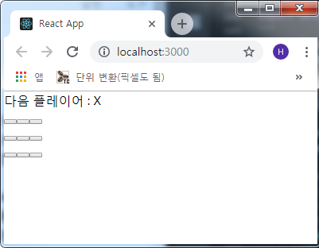
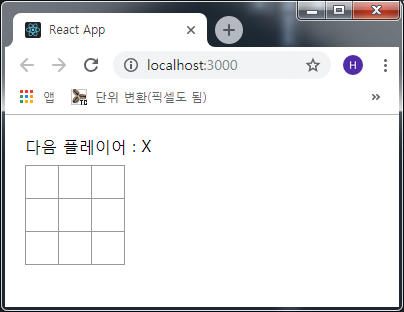
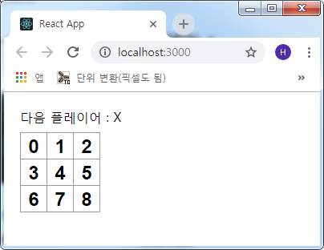

## ReactJS 튜토리얼(틱택토 게임!)
<a href="https://reactjs.org/tutorial/tutorial.html" target="_blank">React 공식 홈페이지</a>
에 있는 예제문으로 리액트의 기본을 익히기 좋은 예제라 해보려고 합니다.  
(저는 영어 포기자라.. 번역이 이상하게 되더라도 이해 부탁드립니다... ㅜㅜ)

이번에 만들 웹앱은 다들 잘 아는 틱택토 게임입니다. 9칸의 네모 상자를 만들어서 작성되며
구조 상 만들게 될 컴포넌트는 3가지(Game, Board, Square)입니다.

**Square** 컴포넌트는 `<button>` 엘리먼트를 렌더링하고 **Board** 컴포넌트는 9칸의
네모상자(Square)를 렌더링 합니다.  
**Game** 컴포넌트는 **Board** 컴포넌트에서 placeholder 값을 렌더링하고 나중에
수정하겠습니다.

기본적으로 CRA(create-react-app)를 이용하여 앱 세팅을 하겠습니다.

```js
- 예제 기본 세팅

C:\> create-react-app tictactoe-game
C:\> cd tictactoe-game
C:\tictactoe-game> yarn start
```

필요 없는 세팅을 없애기 위해 기본적으로 설치되는 파일을 좀 정리하겠습니다. `src/`
폴더의 `App.css, App.test, logo.svg` 파일을 삭제하고 `src/App.js` 파일을 수정하겠습니다.

```js
- src/App.js

import React, { Component } from 'react';

class App extends Component {
  render() {
    return (
      <div>
        App
      </div>
    );
  }
}

export default App;
```



### 컴포넌트 파일 생성
리액트 공홈에 있는 자료와 다르게 저는 `Components` 폴더를 만들어서 컴포넌트 파일을
생성합니다. `Square.js, Board.js, Game.js` 순으로 생성하고 `App.js`파일에서
불러와 렌더링 하겠습니다.

```js
- src/Components/Square.js

import React, { Component } from 'react';

class Square extends Component {
  render() {
    return (
      <button className="square">
        {/* 나중에 */}
      </button>
    );
  }
}

export default Square;
```
`Square` 컴포넌트는 `<button>` 엘리먼트를 렌더링 합니다. CSS는 외형 완성후에
설정하도록 하겠습니다.

```js
- src/Components/Board.js

import React, { Component } from 'react';
import Square from './Square';

class Board extends Component {
  renderSquare(i) {
    return <Square />;
  }

  render() {
    const status = "다음 플레이어 : X";

    return (
      <div>
        <div className="status">{status}</div>
        <div className="board-row">
          { this.renderSquare(0) }
          { this.renderSquare(1) }
          { this.renderSquare(2) }
        </div>
        <div className="board-row">
          { this.renderSquare(3) }
          { this.renderSquare(4) }
          { this.renderSquare(5) }
        </div>
        <div className="board-row">
          { this.renderSquare(6) }
          { this.renderSquare(7) }
          { this.renderSquare(8) }
        </div>
      </div>
    )
  }
}

export default Board;
```
`Board` 컴포넌트는 `Square` 컴포넌트를 불러와 **renderSquare()** 함수를 만들어
`<Square />` 컴포넌트를 렌더링하게 일단 임시로 만들어 놓습니다. 9칸의 상자를
렌더링합니다. 역시 CSS는 나중에 설정하겠습니다.

```js
- src/Components/Game.js

import React, { Component } from 'react';
import Board from './Board';

class Game extends Component {
  render() {
    return (
      <div className="game">
        <div className="game-board">
          <Board />
        </div>
        <div className="game-info">
          <div>{/* status */}</div>
          <ol>{/* 나중에 */}</ol>
        </div>
      </div>
    );
  }
}

export default Game;
```
`Game` 컴포넌트는 이 `Board` 컴포넌트를 로드해서 렌더링 해 줍니다. state 설정 및
CSS는 나중에 설정하고 외형만 만듭니다.

```js
- src/App.js

import React, { Component } from 'react';
import Game from './Components/Game';   // 추가

class App extends Component {
  render() {
    return (
      <div>
        <Game />  {/* 변경 */}
      </div>
    );
  }
}

export default App;
```



스타일링은 `index.css` 파일에서 한번에 수정하겠습니다.

```css
- src/index.css

body {
  font: 14px;
  margin: 20px;
}

ol, ul {
  padding-left: 30px;
}

.board-row:after {
  clear: both;
  content: "";
  display: table;
}

.status {
  margin-bottom: 10px;
}

.square {
  background: #fff;
  border: 1px solid #999;
  float: left;
  font-size: 24px;
  font-weight: bold;
  line-height: 34px;
  height: 34px;
  margin-right: -1px;
  margin-top: -1px;
  padding: 0;
  text-align: center;
  width: 34px;
}

.square:focus {
  outline: none;
}

.kbd-navigation .square:focus {
  background: #ddd;
}

.game {
  display: flex;
  flex-direction: row;
}

.game-info {
  margin-left: 20px;
}
```



### Props 데이터 전송 및 사용
Props(속성) 값을 `Board`에서 `Square`로 전송하여 사용하여야 하므로 `Board`
컴포넌트의 `renderSquare()` 메소드에 `value`값을 props로 전달하게끔 수정합니다.

```js
- src/Components/Square.js

...(생략)
<button className="square">
  { this.props.value }  {/* props value를 렌더링 */}
</button>
...(생략)
```

```js
- src/Components/Board.js

...(생략)
class Board extends Component {
  renderSquare(i) {
    return <Square value={i} />;  // value를 props(i)로
  }
...(생략)
```


부모 컴포넌트인 `Board` 컴포넌트에서 `Square` 컴포넌트로 **props**를 이용하여
**value** 를 전달해 주었습니다.  
이로써 틱택토 게임의 외형은 완성하였습니다.

다음 포스트에서 Interactive(대화형) 컴포넌트로 작성하는 예제를 진행하겠습니다.