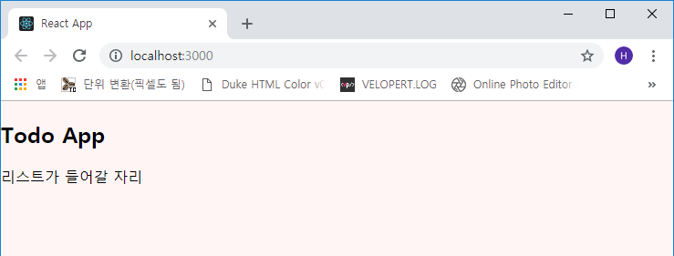

## CRUD의 기초! Todo App 만들기
모든 웹앱 제작의 기초인 투두앱을 만들어 보겠습니다. Redux, MobX 등의 상태관리 라이브러리 없이
순수 리액트로만 제작을 먼저 해볼 것이고 그 다음에 Redux를 붙여서 리팩토링 하는 것으로 진행합니다.

### 프로젝트 세팅
```js
- 프로젝트 생성

C:\> create-react-app todo-app
C:\> cd todo-app
C:\> yarn start
```

기본적인 파일 정리를 한 후에 라이브러리를 설치합니다.  
App.css, logo.svg, App.test.js를 삭제하고 `Components` 폴더를 생성하여 *App.js* 파일을 이동시켜
줍니다. (물론 이건 제 정리 방법이고 굳이 안 따라하셔도 됩니다 ㅋㅋ)


그리고 *index.js, Components/App.js* 파일을 아래와 같이 수정합니다.

```js
- src/index.js

import React from 'react';
import ReactDOM from 'react-dom';
import './index.css';

import App from './Components/App';
import * as serviceWorker from './serviceWorker';

ReactDOM.render(<App />, document.getElementById('root'));
serviceWorker.unregister();
```

```js
- src/Components/App.js

import React, { Component } from 'react';

class App extends Component {
  render() {
    return (
      <>
        Todo App
      </>
    );
  }
}

export default App;
```

위 *Components/App.js* 에서 보시면 `<></>` 라는 표현이 나오는데 이는 이번에 릴리즈 된 v2에서
업데이트 된 내용으로 나중에 한 번 작성할 예정이지만 간단히 말씀드리면 JSX Fragment를 별도의
커스터마이징 없이 사용할 수 있게 되었습니다.

```js
import React, { Fragment } from 'react';
...
return (
  <Fragment>
    App
  </Fragment>
)

또는

return (
  <React.Fragment>
    App
  </React.Fragment>
)

위와 같이 사용했던 것을

return (
  <>
  </>
)

이렇게 사용할 수 있습니다.
```

이제 필요한 라이브러리를 설치합니다. 사용할 라이브러리는 *node-sass, classnames*입니다.

```js
C:\> yarn add node-sass classnames open-color
```

이 *sass*도 예전에는 웹팩 설정을 다 해주어야 했지만 v2에서는 그냥 됩니다!! 하핫  
이제 기본 스타일(body) 설정을 하겠습니다. 아래와 같이 코드를 작성해 주세요  
*open-color* 라이브러리를 지정하고 *index.js*에서 불러오겠습니다.

```sass
- src/setting/open.scss

@import '~open-color/open-color';
```

```sass
- src/setting/theme.scss

@import './open';

body {
  background: $oc-red-0;
  margin: 0px;
}
```

```js
- src/index.js

import React from 'react';
import ReactDOM from 'react-dom';

import './setting/theme.scss';  // 추가

import App from './Components/App';
import * as serviceWorker from './serviceWorker';

ReactDOM.render(<App />, document.getElementById('root'));
serviceWorker.unregister();
```

이제 개발서버를 실행하여 sass 및 open-color의 적용을 확인합니다.


***

### 컴포넌트 외관 작성
먼저 기본 틀인 `PageContainer.js` 를 작성합니다.  
코드를 보시면 *classnames*를 이용하여 클래스를 지정하는 것을 보실 수 있는데 이는
<a href="https://github.com/JedWatson/classnames" target="_blank">이 곳</a>을 확인하시면
쉽게 배우실 수 있습니다.

```js
- src/Containers/PageContainer.js

import React from 'react';

import styles from './PageContainer.scss';
import classNames from 'classnames/bind';

const cx = classNames.bind(styles);

const PageContainer = ({ children }) => {
  return (
    <div className={cx('page-container')}>
      <h2>TODO App</h2>
      <div className={cx('content')}>
        { children }
      </div>
    </div>
  );
};

export default PageContainer;
```

이후 **App.js**에 컨테이너를 추가합니다.

```js
- src/Components/App.js

import React, { Component } from 'react';

import PageContainer from '../Containers';

class App extends Component {
  render() {
    return (
      <PageContainer>
        리스트가 들어갈 자리
      </PageContainer>
    );
  }
}

export default App;
```

브라우저에서 확인하겠습니다.



잘 나오죠? 그럼 스타일링을 하겠습니다.

```scss
- src/Containers/PageContainer.scss

.page-container {
  margin: 5rem;
  margin-left: auto;
  margin-right: auto;
  padding: 1.5rem;
  width: 500px;
  background: #f3f0ff;
  box-shadow: 0 3px 6px #7950f2, 0 3px 6px #7950f2;
  
  @media(max-width: 768px) {
    width: calc(100% - 5rem);
  }

  h2 {
    text-align: center;
    margin: 0;
  }

  .content {
    margin-top: 3rem;
  }
}
```

컨테이너 틀을 만들었으니 입력란(Input)과 목록(List) 컴포넌트를 만들겠습니다.

먼저 입력란(List) 컴포넌트입니다.

```js
- src/Components/Input.js

import React from 'react';

import styles from './Input.scss';
import classNames from 'classnames/bind';

const cx = classNames.bind(styles);

const Input = ({ onAdd, onChange, value }) => {
  const keyPress = (e) => {
    if(e.key === 'Enter') {
      onAdd();
    }
  }

  return (
    <div className={cx('input')}>
      <input onKeyPress={keyPress} onChange={onChange} value={value} />
      <div className={cx('add-button')} onClick={onAdd}>입력</div>
    </div>
  );
};

export default Input;
```

특별한 내용은 없습니다. props 값으로 `onAdd, onChange, value`를 받으며 *onAdd*는 input 버튼이
눌리거나 `Enter` 키가 눌렸을 때, *onChange*는 input 태그의 내용이 변경되었을 때 실행하는 이벤트
이고 input 태그의 *props* 값으로 **onChange, value**을 설정합니다.  
또한 동일하게 컴포넌트 index.js 파일을 생성합니다.

```js
- src/Components/Input/index.js

export { default } from './Input';
```

그럼 App.js에서 불러와 렌더링 해 보겠습니다.

```js
- src/Components/App.js

...(생략)
    return (
      <PageContainer>
        <Input />
      </PageContainer>
    );
...(생략)
```


*Input* 컴포넌트도 스타일링 하겠습니다.

```scss
- src/Components/Input/Input.scss

@import '../../setting/open.scss';

.input-comp {
  border-bottom: 1px solid $oc-gray-9;
  display: flex;
  padding: 1rem;

  input {
    flex: 1;
    font-size: 1.1rem;
    outline: none;
    border: none;
    background: transparent;
    border-bottom: 1px solid $oc-violet-4;

    &:focus {
      border-bottom: 2px solid $oc-red-6;
    }
  }

  .add-button {
    width: 5rem;
    height: 2rem;
    margin-left: 1rem;
    border: 1px solid $oc-violet-4;
    font-size: 1.2rem;
    display: flex;
    align-items: center;
    justify-content: center;
    background: $oc-violet-4;
    color: $oc-gray-0;
    box-shadow: 0 3px 3px $oc-violet-9;
    cursor: pointer;

    &:hover {
      box-shadow: 0 4px 6px $oc-violet-9;
    }

    &:active {
      background: $oc-yellow-9;
    }
  }
}
```

브라우저 테스트를 하시면


이상없이 작동합니다. 다음 포스트에 이어서 List와 List안의 내용인 Item을 만들겠습니다.  
수고하셨습니다!