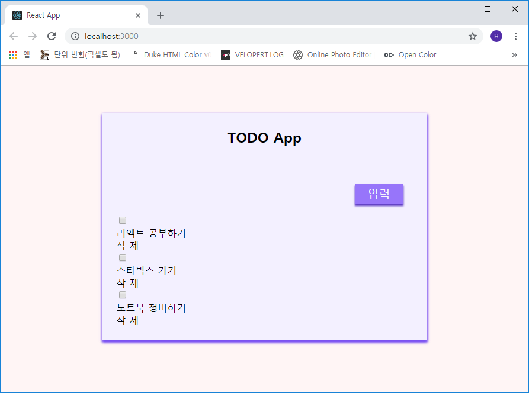
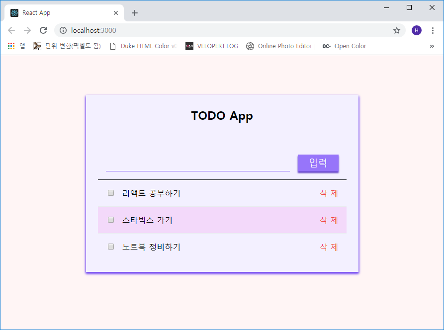

## 투두 리스트 및 아이템 작성
*List* 컴포넌트는 데이터의 배열을 컴포넌트 리스트로 렌더링합니다. 테스트로 3가지 항목을 임시로
입력해 놓겠습니다.

```js
- src/Containers/List.js

import React, { Component } from 'react';

import Item from '../Components/Item';

class List extends Component {
  render() {
    return (
      <>
        <Item>리액트 공부하기</Item>
        <Item>스타벅스 가기</Item>
        <Item>노트북 정비하기</Item>
      </>
    );
  }
}

export default List;
```

그리고 컨테이너 인덱스 파일을 수정합니다.

```js
- src/Containers/index.js

export { default as PageContainer } from './PageContainer';
export { default as List } from './List';
```

이제 이 *List* 컨테이너에 들어가는 **Item**을 생성해봅시다.

이 **Item** 컴포넌트는 onToggle, onRemove 함수를 내장하고 doit, children의 props를 받습니다.
이 props의 역할은 다음과 같습니다.

* onToggle : 일정의 완료 상태(on, off)
* onRemove : 항목(일정) 제거
* doit : 해당 일정 완료 여부
* children : 항목(일정)의 정보

아래와 같이 코딩합니다.

```js
- src/Components/Item/Item.js

import React, { Component } from 'react';

import styles from './Item.scss';
import classNames from 'classnames/bind';

const cx = classNames.bind(styles);

class Item extends Component {
  render() {
    const { onToggle, onRemove, doit, children } = this.props;

    return (
      <div className={cx('item')} onClick={onToggle}>
        <input type="checkbox" className={cx('check')} checked={doit} readOnly />
        
        <div className={cx('article', { doit })}>
          { children }
        </div>
        <div className={cx('remove')} onClick={onRemove}>
          삭 제
        </div>
      </div>
    );
  }
}

export default Item;
```

props를 로드할 때 **비구조화 할당 문법(const { do } = this.props)**으로 props 안의 값 레퍼런스를
만들어 주면 this.props를 생략할 수 있습니다. (*this.props.onToggle* → **onToggle**)

하나씩 살펴봅시다.

우선 Item 컴포넌트에서 각 항목별 가장 앞에 체크박스를 두어 체크의 여부를 확인하게끔 *checked* 항목을
두었고 강제 체크를 할 수 없게 `readOnly`를 넣었습니다.

그리고 체크 박스 우측에 *본문(article)* 을 넣는데 *doit* props의 값이 true면 클래스 명에 *doit*을
추가하여 글자 중간 선(text-decoration: line-through)을 긋도록 하였습니다.

*삭제* 버튼을 클릭하면 *onRemove* 함수를 호출하도록 설정합니다.

이제 아이템 인덱스 파일을 작성 후 *App* 에서 렌더링 해보겠습니다.

```js
- src/Components/Item/index.js

export { default } from './Item';
```

```js
- src/Components/App.js

...(생략)
import { PageContainer, List } from '../Containers';  // 수정
import Input from '../Components/Input';

class App extends Component {
  render() {
    return (
      <PageContainer>
        <Input />
        <List />                                 {/* 추가 */}
      </PageContainer>
    );
...(생략)
```



이제 스타일링을 합시다!

```scss
- src/Components/Input/Input.scss

@import '../../setting/open.scss';

.item {
  padding: 1rem;
  display: flex;
  align-items: center;
  cursor: pointer;

  .check {
    margin-right: 1rem;
  }

  .article {
    flex: 1;
    word-break: break-all;

    &.doit {
      text-decoration: line-through;
    }
  }

  .remove {
    margin-left: 1rem;
    color: $oc-red-7;

    &:hover {
      color: $oc-red-5;
      text-decoration: underline;
    }
  }

  &:nth-child(odd) {
    background: $oc-grape-1;
  }

  &:hover {
    background: $oc-violet-1;
  }
}

.item + .item {
  border-top: 1px solid $oc-gray-2;
}
```



어떤가요?? 겁나 핑크핑크 하죠??? ㅋㅋㅋ

다음 포스트에서 state를 작성하여 외형뿐인 앱에 기능을 넣어보겠습니다.