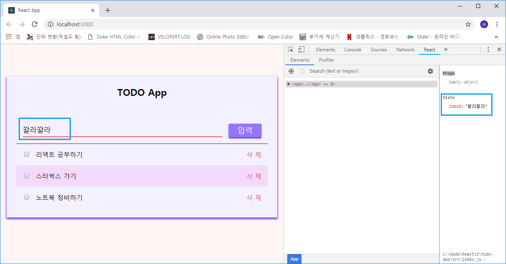
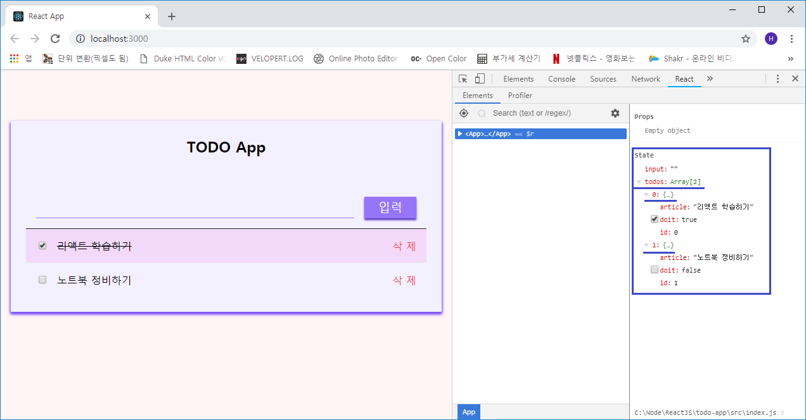
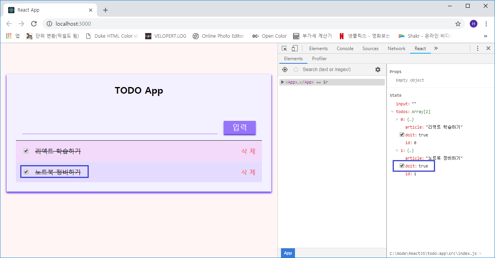

## State 작성
현재까지는 외형만 작성된 TODO App이므로 여기에 상태(state)를 넣어 기능을 만들도록 하겠습니다.

개발 중 *state* 관리는 주로 상위 컴포넌트에서 통제를 하는 것이 더 편리하기 때문에 *App*에
작성하도록 하겠습니다.

```js
- src/Components/App.js

import React, { Component } from 'react';

import { PageContainer, List } from '../Containers';
import Input from '../Components/Input';

class App extends Component {
  state = {
    input: ''
  }

  handleChange = (e) => {
    const { value } = e.target;
    this.setState({ input: value });
  }

  render() {
    const { input } = this.state;
    const { handleChange } = this;

    return (
      <PageContainer>
        <Input onChange={handleChange} value={input} />
        <List />
      </PageContainer>
    );
  }
}

export default App;
```

이전 장에서 설명했던 비구조화 할당으로 레퍼런스를 미리 만들어서 this를 참조할 필요가 없게 작성하였고
인풋 컴포넌트에 onChage(handleChange)와 value(input)값을 넣어주었습니다.

그리고 개발자 모드에서 확인해 보면 아래와 같이 *state* 가 변하는 것을 알 수 있습니다.



***

### TODO 일정 객체 초기화 및 렌더링
*state* 에 `todos` 라는 객체 배열을 만들어 두 값을 넣습니다. 바로 *article, doit*인데 *map()*을
이용하여 배열을 나열할 것이기 때문에 *id*값도 고유의 값을 부여시켜 나중에 컴포넌트 배열을 렌더링 시
**map()의 key값**으로 사용할 겁니다.

* **article** : TODO의 일정 정보
* **doit** : TODO 각 항목 체크

*App*의 *state*에 **todos 배열**을 추가하고 초기화를 시키겠습니다. 그리고 todos 배열항목을 기존의
*List 컴포넌트*에 추가하겠습니다.

```js
- src/Components/App.js

...(생략)
class App extends Component {
  state = {
    input: '',
    // todos 배열 추가
    todos: [
      { id: 0, article: '리액트 학습하기', doit: true },
      { id: 1, article: '노트북 정비하기', doit: false }
    ]
  }

  handleChange = (e) => {
    const { value } = e.target;
    this.setState({ input: value });
  }

  render() {
    // todos 비구조화 할당
    const { input, todos } = this.state;
    const { handleChange } = this;

    return (
      <PageContainer>
        <Input onChange={handleChange} value={input} />

        {/* List 컴포넌트에 todos 배열 추가 */}
        <List todos={todos} />
      </PageContainer>
    );
...(생략)
```

그리고 `List` 컴포넌트에서 todos 배열을 map() 메소드로 Item 컴포넌트로 구성된 배열로 수정하겠습니다.

```js
- src/Containers/List.js

...(생략)
  render() {
    const { todos } = this.props;
    const todoList = todos.map(
      todo => (<Item key={todo.id} doit={todo.doit}>{todo.article}</Item>)
    );

    return (
      <div>{ todoList }</div>
    );
...(생략)
```

지금까지 적용한 사항을 개발자 모드에서 확인하겠습니다.



***

### 데이터 추가 기능 구현하기 (**C** rud)
`Input 컴포넌트`에서 *todos 배열* 추가 기능을 만들겠습니다. App 컴포넌트를 수정하겠습니다.

```js
- src/Components/App.js

...(생략)
  state = {
    input: '',
    todos: [
      { id: 0, article: '리액트 학습하기', doit: true },
      { id: 1, article: '노트북 정비하기', doit: false }
    ]
  }

  id = 1
  getId = () => {
    return ++this.id;
  }

  handleChange = (e) => {
    const { value } = e.target;
    this.setState({ input: value });
  }

  handleAdd = () => {
    const { todos, input } = this.state;
    const newItem = {
      article: input,
      doit: false,
      id: this.getId()
    };

    this.setState({
      todos: [...todos, newItem],
      input: ''
    });
  }

  render() {
    const { input, todos } = this.state;
    const { handleChange, handleAdd } = this;

    return (
      <PageContainer>
        <Input
          onChange={handleChange}
          onAdd={handleAdd}
          value={input}
        />
        <List todos={todos} />
      </PageContainer>
    );
...(생략)
```

***

### 데이터 수정 기능 구현하기 (cr **U** d)
*Item* 컴포넌트를 클릭했을 때 체크박스를 활성화 비활성화 하는 과정에서 데이터 수정이 이루어집니다.
배열 내부 데이터를 수정하려면 *id* key값을 찾아 slice() 함수와 전개 연산자(...)를 사용하여 새 배열을
만들어 업데이틑를 해야 합니다. 절대 push() 등의 함수로 직접 배열을 수정해서는 안됩니다.

App 컴포넌트를 아래와 같이 수정합니다.

```js
- src/Components/App.js

...(생략)
    this.setState({
      todos: [...todos, newItem],
      input: ''
    });
  }

  handleToggle = (id) => {
    const { todos } = this.state;
    const index = todos.findIndex(todo => todo.id === id);

    const toggled = {
      ...todos[index],
      doit: !todos[index].doit
    };

    this.setState({
      todos: [
        ...todos.slice(0, index),
        toggled,
        ...todos.slice(index + 1, todos.length)
      ]
    });
  }

  render() {
    const { input, todos } = this.state;
    const { handleChange, handleAdd, handleToggle } = this;

    return (
      <PageContainer>
        <Input
          onChange={handleChange}
          onAdd={handleAdd}
          value={input}
        />
        <List todos={todos} onToggle={handleToggle} />
      </PageContainer>
    );
...(생략)
```

이후 App으로부터 받은 onToggle() 함수를 실행할 때 index를 파라미터로 전달해 주어야 하기 때문에
List 컨테이너도 수정하겠습니다.

```js
- src/Containers/List.js

...(생략)
  render() {
    const { todos, onToggle } = this.props; // onToggle 비구조화 할당
    const todoList = todos.map(
      todo => (
        <Item
          key={todo.id}
          doit={todo.doit}
          onToggle={() => onToggle(todo.id)}  // 추가
        >
          { todo.article }
        </Item>)
    );
...(생략)
```

그리고 브라우저에서 Item 컴포넌트를 클릭하여 확인을 해봅니다.



