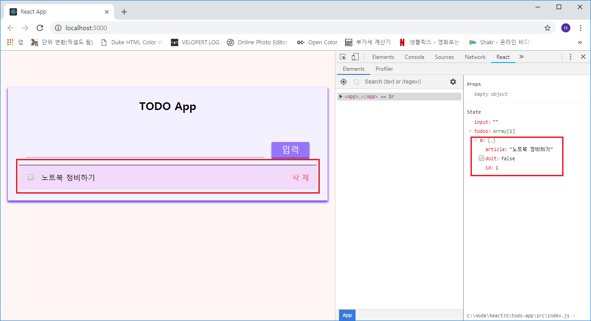

## State 작성(계속)

***

### 데이터 삭제 기능 구현하기 (cru **D**)
*handleRemove() 함수*를 추가하여 *id*를 찾아서 제거하는 기능을 추가하겠습니다.

```js
- src/Components/App.js

...(생략)
  }

  handleRemove = (id) => {
    const { todos } = this.state;
    const index = todos.findIndex(todo => todo.id === id);

    this.setState({
      todos: [
        ...todos.slice(0, index),
        ...todos.slice(index + 1, todos.length)
      ]
    });
  }

  render() {
    const { input, todos } = this.state;
    const {
      handleChange,
      handleAdd,
      handleToggle,
      handleRemove
    } = this;

    return (
      <PageContainer>
        <Input
          onChange={handleChange}
          onAdd={handleAdd}
          value={input}
        />
        <List
          todos={todos}
          onToggle={handleToggle}
          onRemove={handleRemove}
        />
      </PageContainer>
    );
...(생략)
```

그리고 List 컨테이너를 수정합니다.

```js
- src/Containers/List.js

...(생략)
  render() {
    const { todos, onToggle, Remove } = this.props;
    const todoList = todos.map(
      todo => (
        <Item
          key={todo.id}
          doit={todo.doit}
          onToggle={() => onToggle(todo.id)}
          onRemove={() => onRemove(todo.id)}
        >
          { todo.article }
        </Item>)
    );
...(생략)
```

onRemove() 함수를 작성하고 *todo.id* 파라미터를 전달합니다.

그리고 나서 실행을 해보면 *삭제*가 실행이 되질 않습니다.  
이유는 부모 컴포넌트와 자식 컴포넌트에 *onClick* 이벤트가 같이 설정이 되어 있으면 항상 메소드는
자식 → 부모 순으로 메소드가 실행이 됩니다. (propagation)

이런 현상을 막으려면 자식 컴포넌트의 *onClick* 함수에서 `e.stopPropagation` 함수를 아래와 같이
호출해야 합니다.

```js
- src/Components/Item/Item.js

...(생략)
    return (
      <div className={cx('item')} onClick={onToggle}>
        <input
          type="checkbox"
          className={cx('check')}
          checked={doit}
          readOnly
        />
        
        <div className={cx('article', { doit })}>
          { children }
        </div>
        <div className={cx('remove')} onClick={(e) => {
          onRemove();
          e.stopPropagation();  // (e) 화살표 함수로 호출
        }}>
          삭 제
        </div>
      </div>
    );
...(생략)
```

그리고 삭제 기능을 수행해 봅니다.

#### 삭제 누르기 전


#### 삭제 누른 후


드디어 TODO App(일정관리)이 완성되었습니다.  

이 소스의 깃허브 주소는 <a href="https://github.com/kokily/todo-app" target="_blank">이곳</a>
이며  
예제 실행 화면은 <a href="https://cra-todo-app.netlify.com/" target="_blank">이곳</a>
에서 확인하시면 됩니다.

이 포스트는 Velopert(김민준)님의 `리액트를 다루는 방법` 책을 참고하여 작성한 독학 포스트임을
밝힙니다!