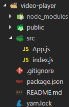
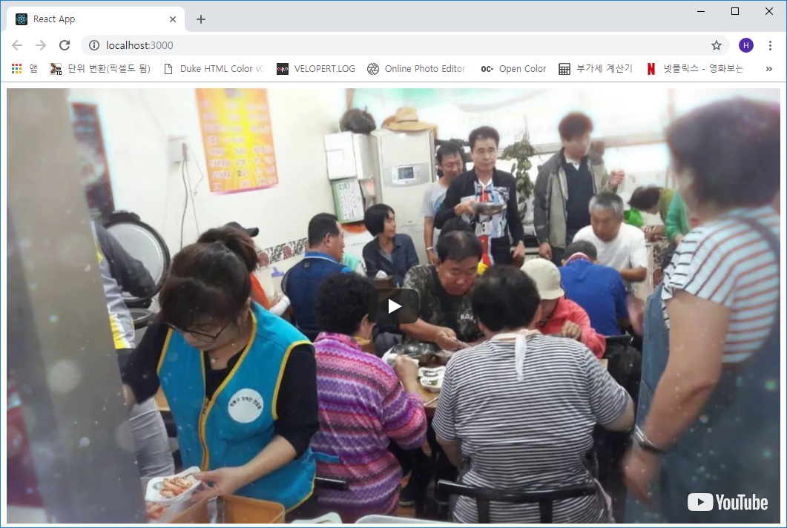
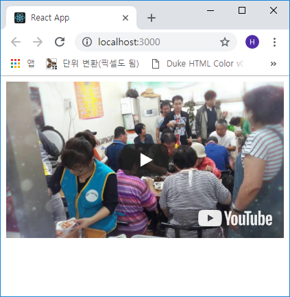
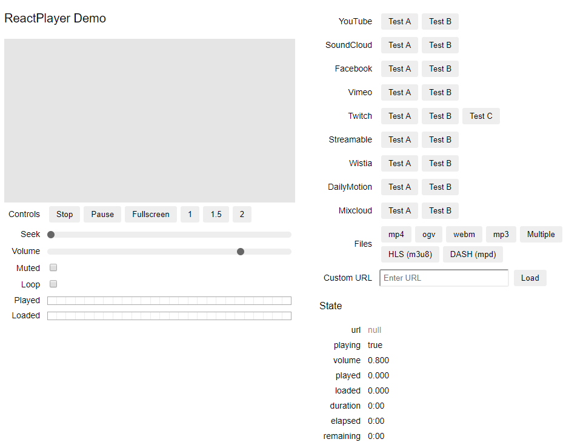

## 리액트 플레이어
스트리밍 서버를 구축하려고 구글링을 열심히 하다 발견한 리액트 플레이어(*ReactPlayer*)

우선 Github 저장소는 <a href="https://github.com/CookPete/react-player" target="_blank">여기</a>다.

이 플레이어는 URL 주소를 이용하여 유튜브, 페이스북, 트위치, 사운드클라우드, 비메오 등 여러 스트리밍
동영상 서비스 영상을 재생할 수 있고, File Path를 이용해서도 이용이 가능하며 여러 옵션을 가지고 있다.

이번 포스트에서는 단순한 브라우저 크기에 따른 반응형 플레이어만 구축하려고 한다.

***

### 프로젝트 초기화 및 라이브러리 설치
```js
- 아래와 같이 설치합니다.

C:\> create-react-app video-player
C:\> cd video-player
C:\video-player> yarn add react-player
```

이후 필요 없는 파일들을 삭제하고 *index.js, App.js* 파일을 수정합니다.



```js
- src/index.js

import React from 'react';
import ReactDOM from 'react-dom';

import App from './App';

ReactDOM.render(<App />, document.getElementById('root'));
```

```js
- src/App.js

import React, { Component } from 'react';
import ReactPlayer from 'react-player';

const wrapperStyle = {
  position: 'relative',
  paddingTop: '56.25%'
}

const playerStyle = {
  position: 'absolute',
  top: '0',
  left: '0'
}

class App extends Component {
  render() {
    return (
      <>
        <div style={wrapperStyle}>
          <ReactPlayer
            style={playerStyle}
            url="https://www.youtube.com/watch?v=pKDaxUZOfx0"
            width="100%"
            height="100%"
          />
        </div>
      </>
    );
  }
}

export default App;
```

`C:\video-player> yarn start`

브라우저에서 접속해보면




이상없이 반응형으로 잘 실행이 된다.
(<a href="https://github.com/kokily/video-player" target="_blank">Github</a>
, <a href="https://video-react-player.netlify.com/" target="_blank">예제페이지</a>)

***

### 사용할 수 있는 옵션
포스트 처음에 적혀있는 깃허브 주소로 가면 아래 그림과 같은 옵션들을 사용할 수 있음을 알 수 있다.
옵션은 귀찮아서.... ㅜㅜ 안함!

