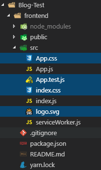
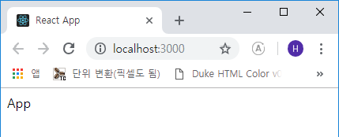

# 리액트 블로그 만들기
리액트와 백엔드를 구축하여 간단한 블로그를 만들어 보려 합니다.  
전에 말씀드렸듯이 제 블로그는 개발자 블로그가 아닌 일반 직장인이 책과 구글링을 통해
혼자 기록을 남기면서 공부를 하기 위함이고, 책은 주로 *Velopert(김민준)*님의 책을 참고,
인터넷 영상은 *노마드코더*의 도움을 받아 제작하는 포스트임을 밝힙니다.  

***

## 사용할 기술 및 모듈
> 백엔드 : KoaJS, MongoDB  
> 프론트엔드 : ReactJS, Sass, Redux

위와 같이 모듈을 사용할 것이고 프론트엔드의 기본 틀을 만들어 놓고나서 백엔드를 제작, 후에
API를 연동하겠습니다. 이번 포스트까지는 KoaJS로 RestAPI를 제작할 것이고 이 후 요즘 유행하는
**GraphQL, Apollo, ReactJS**를 이용하여 블로그를 만들어 볼 계획입니다.

***

## 프로젝트 시작
```js
- 폴더 및 파일명은 동일하지 않아도 됩니다.
C:\> md Blog-Test
C:\> cd Blog-Test
C:\Blog-Test> create-react-app frontend
```

이후 코딩을 위한 파일 정리를 합니다. 아래 선택된 필요 없는 파일을 먼저 삭제합니다.



그리고 프론트엔드를 위한 모듈을 설치합니다.

```js
C:\Blog-Test\frontend> yarn add node-sass classnames
C:\Blog-Test\frontend> yarn add cross-env --dev
C:\Blog-Test\frontend> yarn add react-router-dom immutable
C:\Blog-Test\frontend> yarn add redux redux-actions react-redux redux-pender
```

설치한 모듈은 아래와 같습니다.

> **스타일링** : node-sass, classnames, open-color, include-media  
> **경로설정** : cross-env(dev 옵션), react-router-dom  
> **상태관리** : immutable, redux, redux-actions react-redux redux-pender

모듈 설치가 끝났으니 이제 스타일 세팅 먼저 하고 코딩을 시작합니다.  
우선 그림자 처리를 쉽게 해주는 material-shadow 믹스인


```scss
- src/styles/_mixins.scss

// https://codepen.io/dbox/pen/RawBEW
@mixin material-shadow($z-depth: 1, $strength: 1, $color: black) {
  @if $z-depth == 1 {
    box-shadow: 0 1px 3px rgba($color, $strength * 0.14), 0 1px 2px rgba($color, $strength * 0.24);
  }

  @if $z-depth == 2 {
    box-shadow: 0 3px 6px rgba($color, $strength * 0.16), 0 3px 6px rgba($color, $strength * 0.23);
  }

  @if $z-depth == 3 {
    box-shadow: 0 10px 20px rgba($color, $strength * 0.19), 0 6px 6px rgba($color, $strength * 0.23);
  }

  @if $z-depth == 4 {
    box-shadow: 0 15px 30px rgba($color, $strength * 0.25), 0 10px 10px rgba($color, $strength * 0.22);
  }

  @if $z-depth == 5 {
    box-shadow: 0 20px 40px rgba($color, $strength * 0.30), 0 15px 12px rgba($color, $strength * 0.22);
  }

  @if($z-depth < 1) or ($z-depth > 5) {
    @warn "$z-depth must be between 1 and 5";
  }
}
```

```scss
- src/styles/_setting.scss

@import '~open-color/open-color';
@import '~include-media/dist/include-media';
@import 'mixins'
```

```scss
- src/styles/base.scss

@import 'setting';

$breakpoints: (small: 320px, medium: 768px, large: 1024px, wide: 1400px);
```

`_mixins.scss` 는 material-shadow 믹스인이고 `_setting.scss` 는 *open-color, include-media, mixins*를 포함하며 이것을 `base.scss` 에서 통합하고 반응형 디자인을 위한 변수를 만들었습니다.

이제 코딩을 시작합니다.

먼저 `src/index.js` 파일과 `src/client/App.js` 파일을 수정합니다.

```js
- src/index.js

import React from 'react';
import ReactDOM from 'react-dom';

import App from './client/App';
import * as serviceWorker from './serviceWorker';

import 'styles/base.scss';

ReactDOM.render(<App />, document.getElementById('root'));
serviceWorker.unregister();
```

```js
- src/client/App.js

import React, { Component } from 'react';

// 브라우저 라우터로 App 을 감싸줍니다.
import { BrowserRouter } from 'react-router-dom';

class App extends Component {
  render() {
    return (
      <BrowserRouter>
        <>
          App
        </>
      </BrowserRouter>
    );
  }
}

export default App;
```

위와 같이 작성하고 나서 *cross-env* 모듈 사용을 위해 `package.json`을
아래와 같이 수정해 줍니다.

```json
- package.json

...(생략)
  },
  "scripts": {
    "start": "cross-env NODE_PATH=src react-scripts start",
    "build": "cross-env NODE_PATH=src react-scripts build",
    "test": "react-scripts test",
    "eject": "react-scripts eject"
  },
  "eslintConfig": {
...(생략)
```

그리고 **yarn start**



***

다음 포스트에서 헤더와 푸터 컴포넌트 그리고 페이지 컨테이너를 만들겠습니다