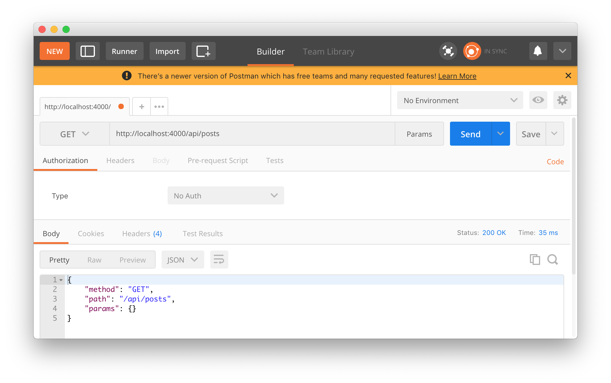

# KoaJS 라우터 세팅 및 함수 생성
라우터 및 라우팅에 따라 사용할 함수들을 만들겠습니다.

```js
- src/api/index.js

import Router from 'koa-router';

const api = new Router();

api.get('/', (ctx) => {
  ctx.body = '라우터 잘 되나요??'
});

export default api;
```

그리고 이 api를 *index.js*에서 불러 올게요!

```js
- index.js

(...)생략
import mongoose from 'mongoose';

import api from 'api';  // 추가

const app = new Koa();
(...)생략
```

원래대로라면 `import api from './src/api/index';`가 되겠지만 *cross-env* 설정으로
기본 폴더가 `src`가 되었으므로 *api*라고만 해주고 *index* 파일을 자동으로 찾아주게 됩니다.  
이 얼마나 편리한 기능인가!!! >ㅁ<

그리고 이 **API**를 라우터에 적용시킵니다.

```js
- index.js

(...)생략
  .catch((err) => { console.error(err); });

// 라우터 적용 추가
router.use('/api', api.routes());

// BodyParser 미들웨어 사용
app.use(bodyParser());
(...)생략
```

브라우저에서 확인


***

## /api/posts 라우터 작성 및 연결
나중에 블로그 CRUD를 연결하기 위한 라우터를 작성하겠습니다.

```js
- src/api/posts/index.js

import Router from 'koa-router';

const posts = new Router();

posts.get('/', (ctx) => {
  ctx.body = '포스트 라우터 잘 되나요??'
});

export default posts;
```

그리고 api에서 연결

```js
- src/api/index.js

import Router from 'koa-router';
import posts from './posts';

const api = new Router();

api.use('/posts', posts.routes());

export default api;
```

다시 브라우저에서 확인


그럼 이제 *printInfo* 라는 함수를 만들어서 라우터 테스트를 해볼게요. 기존 KoaJS 작성할 때와
마찬가지로 **포스트맨**을 사용할 겁니다.

***

```js
- src/api/posts/index.js

import Router from 'koa-router';

const posts = new Router();

const printInfo = (ctx) => {
  ctx.body = {
    method: ctx.method,
    path: ctx.path,
    params: ctx.params
  };
};

posts.get('/', printInfo);
posts.get('/:id', printInfo);
posts.post('/', printInfo);
posts.put('/:id', printInfo);
posts.patch('/:id', printInfo);
posts.delete('/:id', printInfo);

export default posts;
```

이후 포스트맨에서 테스트를 해봅니다.



상기에 기록된 모든 경로를 테스트 해봅시다. 이상이 없으면 이제 posts 컨트롤 파일을 작성하겠습니다.