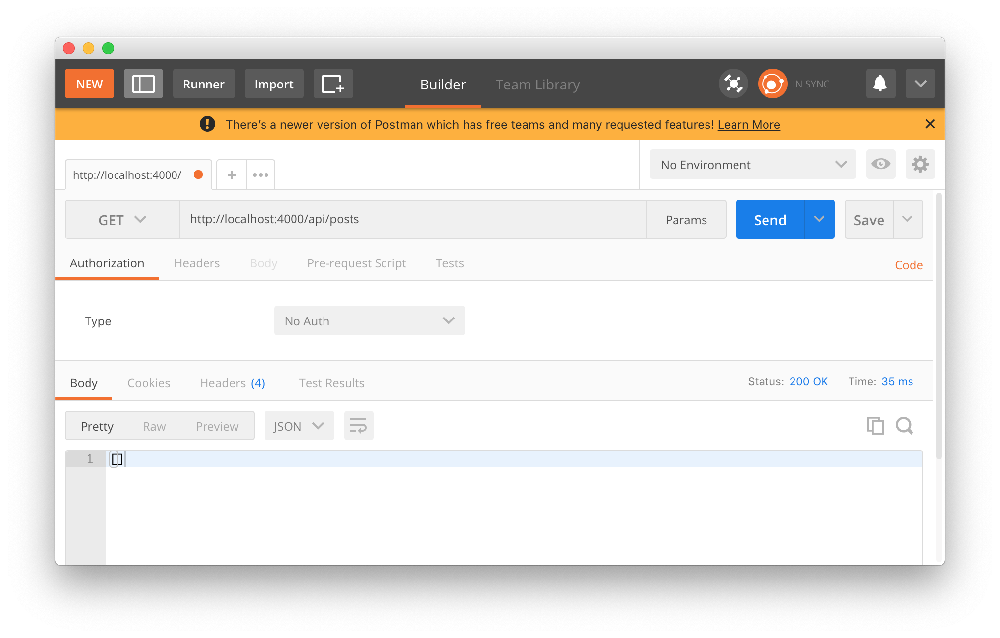
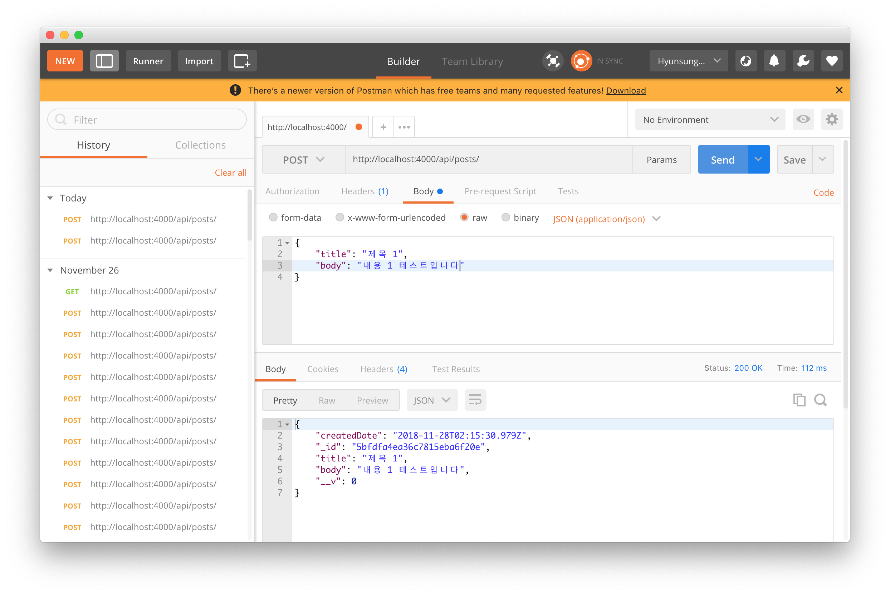
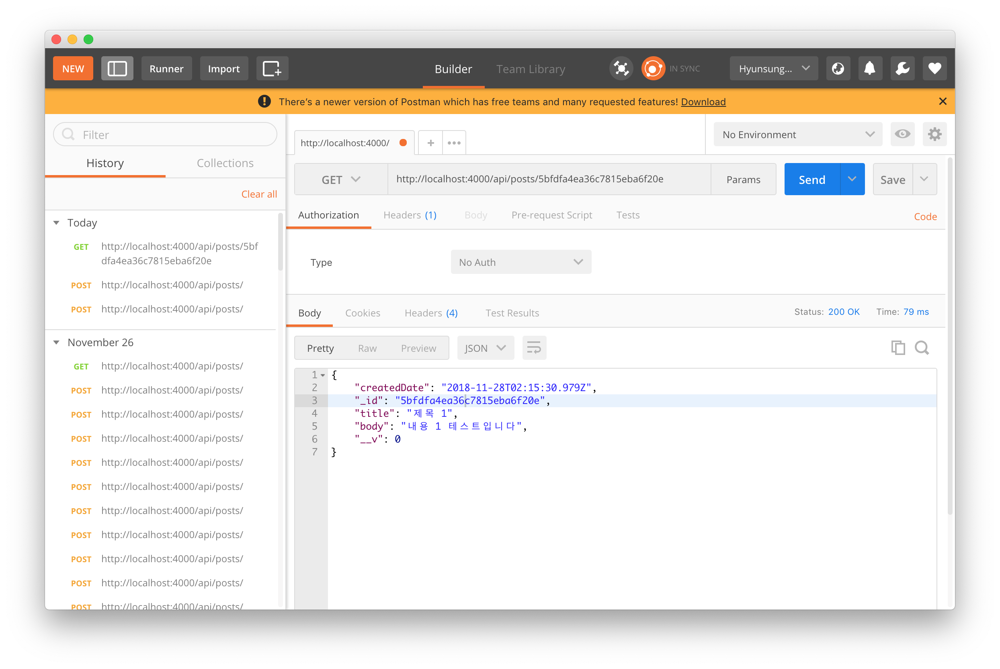

# 포스트 모델 생성
포스트에 사용할 몽구스 모델(스키마)을 생성하겠습니다. 포스트에서 사용할 항목들인 *제목, 본문 작성일자*들을
포함하여 만들겠습니다.

```js
- src/models/Post.js

/*
  몽고DB 스키마(Schema) 생성(포스트 작성 항목)
    1. title: 제목(문자열-String)
    2. body: 내용(문자열-String)
    3. createdDate: 작성 날짜(날짜-Date)
*/

import mongoose from 'mongoose';

const { Schema } = mongoose;

const Post = new Schema({
  title: String,
  body: String,
  createdDate: {
    type: Date,
    default: new Date()
  }
});

const post = mongoose.model('Post', Post);
export default post;
```

작성된 이 모델을 불러와 포스트 함수(CRUD)를 만들겠습니다.  

***

## 포스트 CRUD 작성
먼저 컨트롤 파일을 생성하고 아래와 같이 리스트 코드를 작성합니다.

***

### 리스트 컨트롤러 GET '/api/posts'

```js
- src/api/posts/posts.ctrl.js

import Post from 'models/Post';

// List 컨트롤러 GET '/api/posts' : 포스트 글 리스트
exports.list = async (ctx) => {
  try {
    const posts = await Post.find()
      .exec();
    
    ctx.body = posts;
  } catch(err) {
    ctx.throw(err, 500);
  }
};
```

```js
- src/api/posts/index.js

import Router from 'koa-router';
import postsCtrl from './posts.ctrl';

const posts = new Router();

posts.get('/', postsCtrl.list);

export default posts;
```

이제 포스트 맨으로 요청해보면



위와 같이 **[]** 빈 배열이 반환됨을 알 수 있습니다.

***

### 포스트 읽기 컨트롤러 GET '/api/posts/:id'
다음은 *포스트 읽기* 컨트롤러 입니다.

```js
- src/api/posts/posts.ctrl.js 아래 추가

// Read 컨트롤러 GET '/api/posts/:id' : 특정 포스트(id) 읽기
exports.read = async (ctx) => {
  const { id } = ctx.params;

  try {
    const post = await Post.findById(id).exec();

    if (!post) {
      ctx.status = 404;
      return;
    }

    ctx.body = post;
  } catch(err) {
    ctx.throw(err, 500);
  }
};
```

```js
- src/api/posts/index.js

(...)생략
posts.get('/', postsCtrl.list);
posts.get('/:id', postsCtrl.read);  // 추가
(...)생략
```

별 다른 특이사항이 없어서 그냥 넘어갈게요 ㅋㅋ  
아 물론 현재 등록되어 있는 포스트가 없으므로 포스트 작성 컨트롤러를 작성한 후에 같이 테스트 하겠습니다.

***

### 포스트 작성 컨트롤러 POST '/api/posts'
포스트 작성 컨트롤러입니다. 포스트 작성은 *Post* 모델을 불러와 **post** 인스턴스를 생성하고
그 값을 DB에 저장(save())하고 저장한 결과를 리턴합니다.

```js
- src/api/posts/posts.ctrl.js 아래 추가

// Write 컨트롤러 POST '/api/posts' : 포스트 작성하기
exports.write = async (ctx) => {
  const { title, body } = ctx.request.body;

  // 새로운 포스트 인스턴스 생성
  const post = new Post({
    title, body
  });

  try {
    await post.save();
    ctx.body = post;
  } catch(err) {
    ctx.throw(err, 500);
  }
};
```

```js
- src/api/posts/index.js

posts.get('/', postsCtrl.list);
posts.get('/:id', postsCtrl.read);

posts.post('/', postsCtrl.write); // 추가

export default posts;
```

포스트 맨에서 Post 테스트를 해보면



잘 요청됩니다!! 그럼 아까 작성한 특정 포스트(id) 불러오기도 테스트 해봅시다.



잘 읽어집니다! 그럼 다음 포스트에서 수정과 삭제 컨트롤러를 작성해 볼게요!!