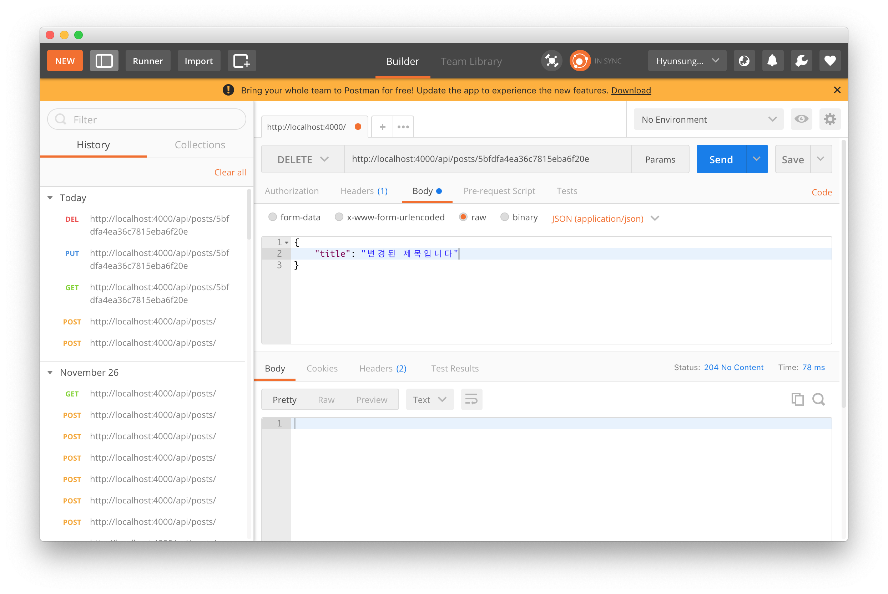

## 포스트 수정 컨트롤러 PUT '/api/posts/:id' (교체)
그럼 이전 포스트에 이어 특정 포스트(id)를 수정하는 컨트롤러를 작성하겠습니다.

```js
- src/api/posts/posts.ctrl.js 에 추가

// Update 컨트롤러 PUT '/api/posts/:id' : 특정 포스트(id) 수정하기
exports.update = async (ctx) => {
  const { id } = ctx.params;

  try {
    const post = await Post.findByIdAndUpdate(id, ctx.request.body, {
      // new 옵션을 true로 했을 시 업데이트된 객체를 리턴함
      new: true
    }).exec();

    if (!post) {
      ctx.status = 404;
      return;
    }

    ctx.body = post;
  } catch(err) {
    ctx.throw(err, 500);
  }
};
```

그리고 posts의 index 파일에 이 함수를 추가해 줍니다.

```js
- src/api/posts/index.js

...(생략)
posts.post('/', postsCtrl.write);
posts.put('/:id', postsCtrl.update);

export default posts;
```

그리고 동일하게 포스트맨에서 확인해 보시면


이상없이 수정된 내용이 적용됨을 알 수 있습니다.

***

## 포스트 삭제 컨트롤러 DELETE '/api/posts/:id'
이제 CRUD 의 마지막 함수인 특정 포스트(id)의 마지막 함수인 삭제기능을 구현하겠습니다.

```js
- src/api/posts/posts.ctrl.js 에 추가

// Remove 컨트롤러 DELETE '/api/posts/:id' : 특정 포스트(id) 삭제하기
exports.remove = async (ctx) => {
  const { id } = ctx.params;

  try {
    await Post.findByIdAndRemove(id).exec();
    ctx.status = 204;
  } catch(err) {
    ctx.throw(err, 500);
  }
};
```

```js
- src/api/posts/index.js

...(생략)
posts.put('/:id', postsCtrl.update);
posts.delete('/:id', postsCtrl.remove);

export default posts;
```

그리고 포스트맨에서 테스트를 해보면



이상없이 삭제가 되고 Status가 204(No Content)를 응답받을 수 있습니다.  
삭제는 매우매우 쉽죠!

***

## 객체 검증(Joi Library)
현재 우리가 입력받을 객체의 속성은 title, body, tags의 세가지 항목입니다.  
이를 검증하는 라이브러리(Joi)를 설치하여 포스트를 작성할 때 적용시키고
검증하며 특정 포스트(id)를 사용할 때 객체에 이상이 없는 지 확인하는 함수를 만들겠습니다.

```js
- src/api/posts/posts.ctrl.js 추가

import Post from 'models/Post';
import Joi from 'joi';

import { Types as ObjectId } from 'mongoose';

// ObjectId 검증 함수
exports.checkObjectId = (ctx, next) => {
  const { id } = ctx.params;

  if (!ObjectId.isValid(id)) {
    ctx.status = 400;
    return null;
  }

  return next();
}
...(생략)
```

객체 검증 함수는 매우 간단합니다.  
우선 몽구스(mongoose)의 ObjectId를 가져와서 ctx의 파라미터인 id를
isValid 함수로 확인을 하여 400(Bad Request) 응답이 돌아오면 null을
리턴하고 아니면 next를 리턴합니다.

이제 이 함수를 인덱스에서 적용시킵니다.  
적용시킬 컨트롤러는 Read, Update, Delete입니다.

```js
- src/api/posts/index.js

...(생략)
posts.get('/:id',postsCtrl.checkObjectId, postsCtrl.read);
posts.put('/:id',postsCtrl.checkObjectId, postsCtrl.update);
posts.delete('/:id',postsCtrl.checkObjectId, postsCtrl.remove);
...(생략)
```

위와 같이 적용시켜 주면 끝!  
이제 Joi라이브러리를 사용하여 포스트 작성시에 객체 검증을 해보겠습니다.

```js
- src/api/posts/posts.ctrl.js

...(생략)
exports.write = async (ctx) => {
  // RequestBody(객체가 가진 값) 검증
  const schema = Joi.object().keys({
    title: Joi.string().required(),
    body: Joi.string().required(),
    tags: Joi.array().items(Joi.string()).required()
  });
  
  const result = Joi.validate(ctx.request.body, schema);

  if (result.error) {
    ctx.status = 400;
    ctx.body = result.error;
    return;
  }

  const { title, body, tags } = ctx.request.body;
...(생략)
```

간단하게 설명을 덧붙이자면 먼저 스키마(schema)에 title, body, tags의 형식을 지정합니다.  
- title, body는 문자열(string), 필수항목(required)
- tags는 문자열을 포함한 배열(array(items(string)))

validate 함수의 첫번째 인자는 검증할 객체, 두번째 인자는 스키마입니다.
그리고 그 값을 *result*에 저장하고 에러 발생시 400(Bad Request)을
리턴합니다.

***

## 페이지네이션
포스트의 양이 많아지면 확인하는데도 불편하기 때문에 페이지 네이션 기능을
넣도록 하겠습니다. 이에 대한 알고리즘은 작성하면서 확인하죠!

```js
- src/api/posts/posts.ctrl.js

...(생략)
exports.list = async (ctx) => {
  const page = parseInt(ctx.query.page || 1, 10);

  if (page < 1) {
    ctx.status = 400;
    return;
  }

  try {
    const posts = await Post.find()
      .sort({_id: -1})
      .limit(10).skip((page - 1) * 10)
      .lean()
      .exec();

    const lastPage = await Post.count().exec();

    ctx.body = posts.map(post => ({
      ...post,
      body: post.body.length < 200 ?
        post.body :
        `${post.body.slice(0, 200)}...`
    }));
    
    ctx.set('Last-Page', Math.ceil(lastPage / 10));
    ctx.body = posts;
  } catch(err) {
    ctx.throw(err, 500);
  }
};
```

위 부분부터 하나씩 보면

***

```js
const page = parseInt(ctx.query.page || 1, 10);

if (page < 1) {
  ctx.status = 400;
  return;
}
```
기존의 *page*값이 없으면 1로 설정하고 ctx의 query는 문자열이므로 숫자로 변환합니다. 그리고 페이지가 없으면 400(Bad Request)를 리턴합니다.

***

```js
try {
  const posts = await Post.find()
    .sort({_id: -1})
    .limit(10).skip((page - 1) * 10)
    .lean()
    .exec();
```
Post의 리스트를 불러올 때
- sort(정렬) : 파라미터는 { key: 1 }, 1은 오름차순, -1은 내림차순
- limit(제한) : limit(제한할 수)
- skip(무시) : 예) 20page - 1 => 19 * 10(페이지 리스트 제한) => 190개를 무시
- lean() : 받아온 정보를 JSON 형태로 조회하기 위함

***

```js
const lastPage = await Post.count().exec();

ctx.body = posts.map(post => ({
  ...post,
  body: post.body.length < 200 ?
    post.body :
    `${post.body.slice(0, 200)}...`
}));

ctx.set('Last-Page', Math.ceil(lastPage / 10));
```
포스트의 수를 카운트하여 *lastPage*에 넣고 포스트의 리스트를 .map으로
돌려서 200글자가 넘는 본문(body)은 **slice** 하여 ... 으로 대체합니다.  
Last-Page 라는 Custom HTTP-header를 설정합니다.  
Math.ceil 함수를 이용하여 최종 페이지 정보를 계산하여 넣습니다.

이제 포스트맨으로 확인하겠습니다. 페이지 정보를 확인하기 위해 포스트를
40~50번 이상 클릭하여 추가 한 후 조회합니다.


Headers에 보시면 last-page가 8로 나오는 것을 알 수 있습니다.

***

이로써 리액트 블로그 구축을 위한 백엔드(KoaJS) 코딩이 끝났습니다.
이어서 다음 포스트에서는 프론트엔드(ReactJS)를 작성하겠습니다!