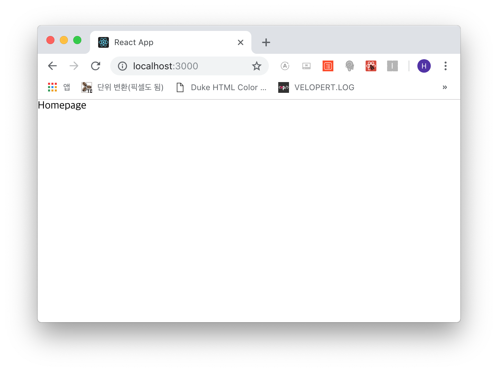

# ReactJS 프론트엔드
기본적으로 CRA(create-react-app)을 이용하여 프로젝트를 만들고 처음에는 sass를 하려 했지만
Material-React를 이용하여 디자인을 하려 합니다.... 제가 미적감각이 똥망인 관계로 ㅜㅜ

## 프로젝트 시작
```js
- src/
 $ yarn global add create-react-app
  또는
 $ npm install -g create-react-app

 $ create-react-app frontend && cd frontend
```

그리고 프론트엔드에서 사용할 모듈을 설치합니다.

```js
- src/frontend
 $ yarn add cross-env --dev
 $ yarn add react-router-dom @material-ui/core @material-ui/icons
```

리덕스나 나머지 상태 관리 등에 사용할 모듈은 나중에 설치할게요!

그럼 백엔드 구축할 때와 마찬가지로 cross-env 설정을 해줍니다.

```js
- src/frontend/package.json

...(생략)
  "scripts": {
    "start": "NODE_PATH=src react-scripts start",
    "build": "NODE_PATH=src react-scripts build"
...(생략)
```

프로젝트에 필요없는 파일들을 삭제하고 아래와 같이 코딩 시작!

> App.test.js, logo.svg, serviceWorker.js 삭제

src/App.js 파일은 라우팅을 목적으로 작성할 것이므로 src/shared라는 폴더로 이동하겠습니다.

```js
- src/shared/App.js

import React, { Component } from 'react';

class App extends Component {
  render() {
    return (
      <div>
        Test Blog
      </div>
    );
  }
}

export default App;
```

```js
- src/client/Root.js

import React from 'react';
import { BrowserRouter } from 'react-router-dom';

import App from 'shared/App';

const Root = () => (
  <BrowserRouter>
    <App />
  </BrowserRouter>
);

export default Root;
```

```js
- src/index.js

import React from 'react';
import ReactDOM from 'react-dom';

import Root from 'client/Root';

import './index.css';

ReactDOM.render(
  <Root />,
  document.getElementById('root')
);
```

```css
- src/index.css

body {
  margin: 0;
  box-sizing: border-box;
}

* {
  margin: 0;
  color: inherit;
}

a {
  text-decoration: none;
  color: inherit;
}
```

기본 스타일까지 지정하고 이제 시작하겠습니다!

***

## 페이지 구성
보여줄 페이지는 총 3가지입니다.
- 최초 인덱스 페이지(Homepage): 메인페이지, 포스트 리스트를 보여줌
- 포스트 페이지(Postpage): 포스트의 내용을 보여주는 페이지
- 에디터 페이지(Editorpage): 포스트를 작성하는 페이지(관리자모드)

그럼 페이지를 만들고 라우터를 연결합시다.

```js
- src/pages/Homepage.js, Postpage.js, Editorpage.js

import React, { Component } from 'react';

class Homepage extends Component {
  render() {
    return (
      <>
        Homepage
      </>
    );
  }
}

export default Homepage;
```

```js
- src/pages/index.js

export { default as Homepage } from './Homepage';
export { default as Postpage } from './Postpage';
export { default as Editorpage } from './Editorpage';
```

```js
- src/shared/App.js

import React, { Component } from 'react';
import { Switch, Route } from 'react-router-dom';

import { Homepage, Postpage, Editorpage } from 'pages';

class App extends Component {
  render() {
    return (
      <Switch>
        <Route exact path="/" component={Homepage} />
        <Route path="/posts" component={Postpage} />  
        <Route path="/editor" component={Editorpage} />
      </Switch>
    );
  }
}

export default App;
```

위와 같이 라우터를 각 페이지에 연결해 줍니다.

그리고 브라우저에서 확인!



나머지 라우터도 확인해 보시면 이상없이 작동할 겁니다.

***

다음 포스트에서 헤더와 푸터, 페이지의 기본 템플릿을 작성하겠습니다.