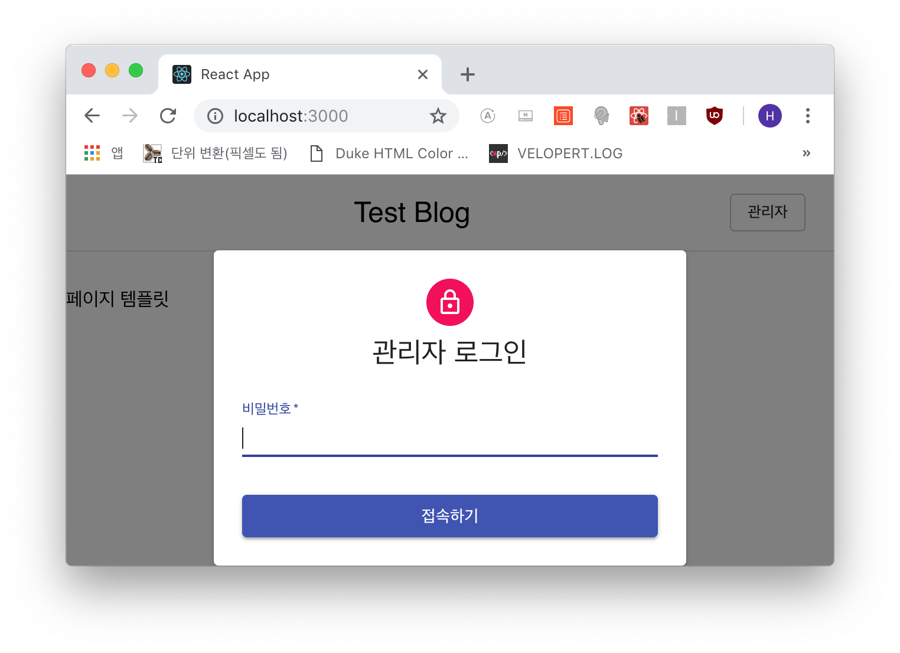
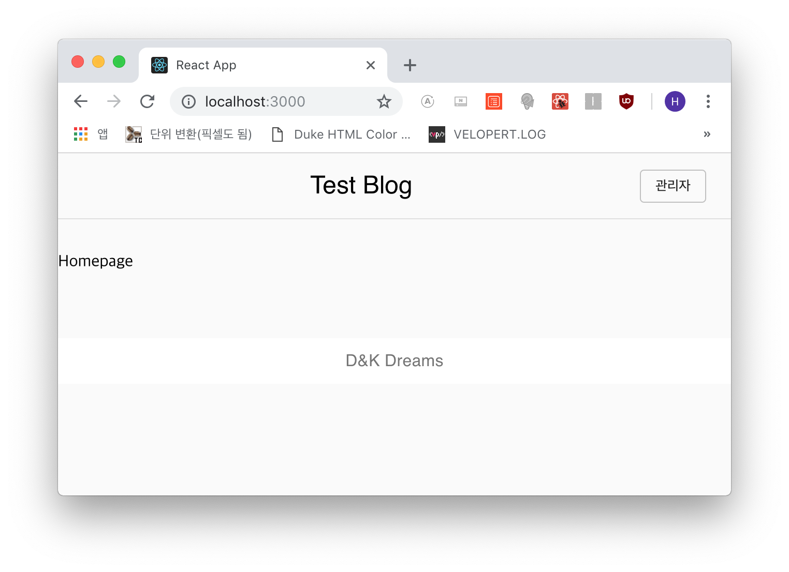
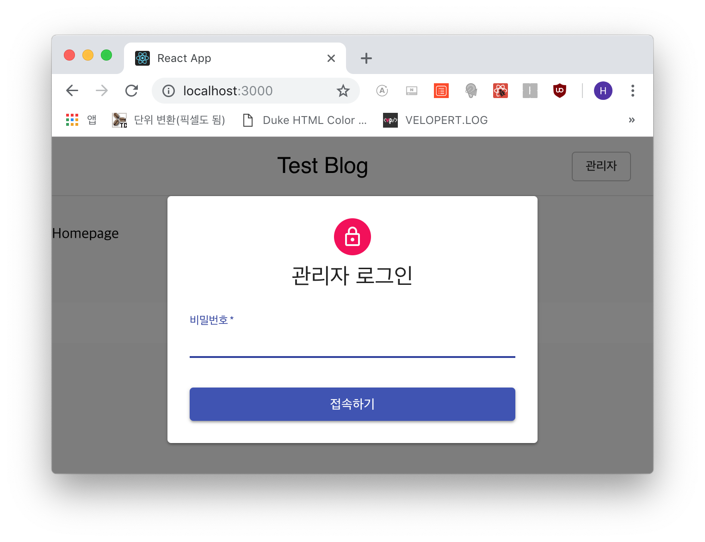

## Common Components 생성
common components, 즉 헤더와 푸터 그리고 페이지 기본 템플릿을 만들겠습니다.

***

### Header Component
먼저 헤더입니다. 여기서부터 Material-Style을 적용할 겁니다.  
별도의 설명은 생략하겠습니다. 기본적인 리액트에 Material 스타일을 적용한 것뿐이라
자세한 사항은 Material-React 를 구글링하시면 나옵니다.

```js
- src/components/common/Header.js

import React, { Component } from 'react';
import PropTypes from 'prop-types';
import { Link } from 'react-router-dom';

// Material-Styles
import { withStyles } from '@material-ui/core/styles';

import Toolbar from '@material-ui/core/Toolbar';
import Button from '@material-ui/core/Button';
import Typography from '@material-ui/core/Typography';
import Modal from '@material-ui/core/Modal';
import Paper from '@material-ui/core/Paper';
import Avatar from '@material-ui/core/Avatar';
import FormControl from '@material-ui/core/FormControl';
import Input from '@material-ui/core/Input';
import InputLabel from '@material-ui/core/InputLabel';

import LockIcon from '@material-ui/icons/LockOutlined';

const styles = theme => ({
  toolbarMain: {
    borderBottom: `1px solid ${theme.palette.grey[300]}`,
    marginBottom: theme.spacing.unit * 4
  },
  toolbarTitle: {
    flex: 1
  },
  layout: {
    width: 'auto',
    display: 'block',
    marginLeft: theme.spacing.unit * 3,
    marginRight: theme.spacing.unit * 3,
    [theme.breakpoints.up(400 + theme.spacing.unit * 3 * 2)]: {
      width: 400,
      marginLeft: 'auto',
      marginRight: 'auto'
    }
  },
  paper: {
    marginTop: theme.spacing.unit * 8,
    display: 'flex',
    flexDirection: 'column',
    alignItems: 'center',
    padding: `${theme.spacing.unit * 2}px ${theme.spacing.unit * 3}px ${theme.spacing.unit * 3}px`
  },
  avatar: {
    margin: theme.spacing.unit,
    backgroundColor: theme.palette.secondary.main
  },
  form: {
    width: '100%',
    marginTop: theme.spacing.unit
  },
  submit: {
    marginTop: theme.spacing.unit * 3
  }
});

class Header extends Component {
  state = {
    isOpen: false
  };

  handleOpen = () => {
    this.setState({ isOpen: true })
  };

  handleClose = () => {
    this.setState({ isOpen: false })
  };

  render() {
    const { classes } = this.props;

    return (
      <Toolbar className={classes.toolbarMain}>
        <Typography className={classes.toolbarTitle}
          component="h2" variant="h5" color="inherit"
          align="center" noWrap
        >
          <Link to="/">Test Blog</Link>
        </Typography>
        <Button variant="outlined" size="small" onClick={this.handleOpen}>
          관리자
        </Button>
        <Modal aria-labelledby="제목" aria-describedby="본문"
          open={this.state.isOpen} onClose={this.handleClose}
        >
          <div className={classes.layout}>
            <Paper className={classes.paper}>
              <Avatar className={classes.avatar}>
                <LockIcon />
              </Avatar>
              <Typography component="h1" variant="h5">
                관리자 로그인
              </Typography>
              <form className={classes.form}>
                <FormControl fullWidth required margin="normal">
                  <InputLabel htmlFor="password">비밀번호</InputLabel>
                  <Input id="password" name="password" 
                    type="password" autoFocus autoComplete="current-password"
                  />
                </FormControl>
                <Button type="submit" fullWidth variant="contained"
                  color="primary" className={classes.submit}
                >
                  접속하기
                </Button>
              </form>
            </Paper>
          </div>
        </Modal>
      </Toolbar>
    );
  }
}

Header.propTypes = {
  classes: PropTypes.object.isRequired
};

export default withStyles(styles)(Header);
```

스타일은 무시하고 코드만 보시면 블로그의 타이틀에 *Link*를 걸어서 홈으로 연결했고
우측편에 관리자 로그인용 버튼으로 비밀번호를 모달창으로 입력 받도록 *state*를
설정했습니다.



***

### Footer Component
이어서 푸터입니다. 아래와 같이 코딩합니다.

```js
- src/components/common/Footer.js

import React from 'react';
import PropTypes from 'prop-types';

// Material Styles
import { withStyles } from '@material-ui/core/styles';
import Typography from '@material-ui/core/Typography';

const styles = theme => ({
  footer: {
    backgroundColor: theme.palette.background.paper,
    marginTop: theme.spacing.unit * 8,
    padding: `${theme.spacing.unit * 1}px 0`
  }
});

const Footer = (props) => {
  const { classes } = props;

  return (
    <footer className={classes.footer}>
      <Typography component="p" variant="subtitle1"
        align="center" color="textSecondary"
      >
        D&K Dreams
      </Typography>
    </footer>
  );
};

Footer.propTypes = {
  classes: PropTypes.object.isRequired
};

export default withStyles(styles)(Footer);
```


푸터는 간결하게! 끝!

***

### PageTemplate Component
이제 이 블로그에서 작성될 모든 페이지의 기본인 템플릿을 만들겠습니다.
오히려 헤더보다 간단하며 이 템플릿을 작성하여 모든 페이지에서 렌더시킬겁니다.

```js
- src/components/common/PageTemplate.js

import React, { Component } from 'react';
import PropTypes from 'prop-types';

import { Header, Footer } from 'components/common';

// Material Styles
import { withStyles } from '@material-ui/core/styles';
import CssBaseLine from '@material-ui/core/CssBaseline';

const styles = theme => ({
  width: 'auto',
  marginLeft: theme.spacing.unit * 3,
  marginRight: theme.spacing.unit * 3,
  [theme.breakpoints.up(1100 + theme.spacing.unit * 3 * 2)]: {
    width: 1100,
    marginLeft: 'auto',
    marginRight: 'auto'
  }
});

class PageTemplate extends Component {
  render() {
    const { classes } = this.props;

    return (
      <>
        <CssBaseLine />
        <div className={classes.layout}>
          <Header />
          <main>
            { this.props.children }
          </main>
          <Footer />
        </div>
      </>
    );
  }
}

PageTemplate.propTypes = {
  classes: PropTypes.object.isRequired
};

export default withStyles(styles)(PageTemplate);
```

그럼 이제 이 템플릿을 각 페이지에서 불러옵니다.  
에디터는 완전히 다른 스타일을 적용할 것이므로 따로 작성하겠습니다.

```js
- src/pages/Homepage.js, Postpage.js

...(생략)
import { PageTemplate } from 'components/common';

class Homepage extends Component {
  render() {
    return (
      <PageTemplate>
        Homepage
      </PageTemplate>
    );
...(생략)
```

그리고 위 공통 컴포넌트들의 인덱스를 만들어줍니다.

```js
- src/components/common/index.js

export { default as Header } from './Header';
export { default as Footer } from './Footer';
export { default as PageTemplate } from './PageTemplate';
```

그리고 홈 라우트("/")에서 확인해 봅시다.




이상없이 잘 나오네요!

***

그럼 다음 포스트에서는 홈(포스트 리스트)과 포스트(상세보기) 페이지를 만들어보고
그 다음에 포스트를 작성하는 에디터 페이지를 만들겠습니다.