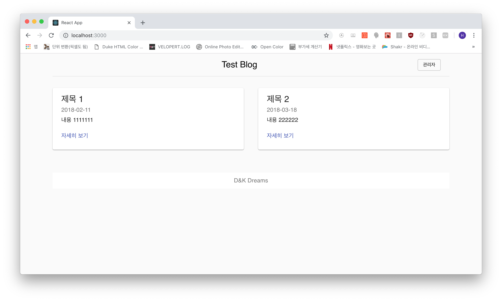
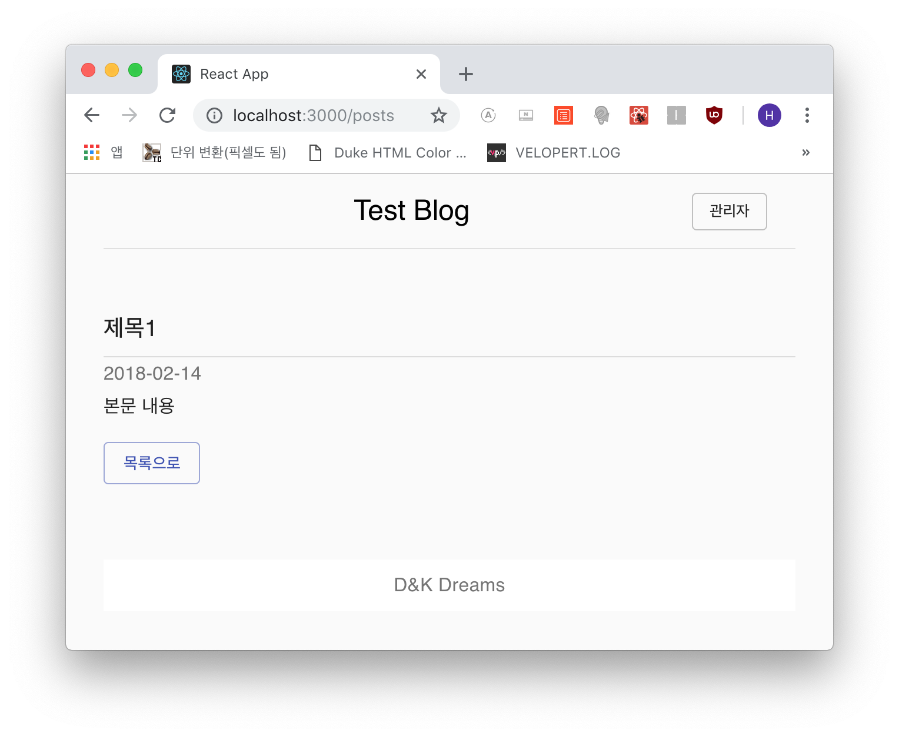
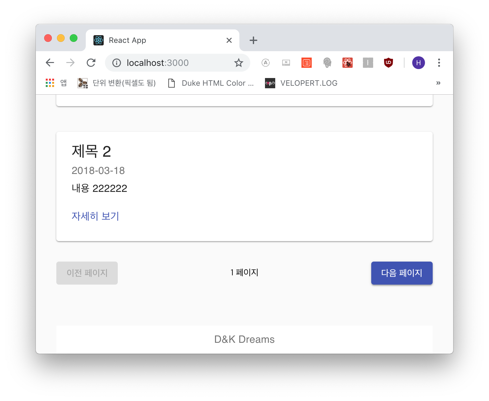

## 홈(포스트 리스트) 보기
지난 포스트에 이어서 홈('/') 최초 인덱스 페이지를 블로그 리스트 페이지로 꾸며보겠습니다.
먼저 페이지를 만들고 그 안에 페이지 템플릿을 렌더링, 그 안에 포스트 리스트를 렌더링하겠습니다.
이전과 마찬가지로 스타일은 Material을 참고해주세요.

```js
- src/components/post/PostList.js

import React from 'react';
import PropTypes from 'prop-types';

import { withStyles } from '@material-ui/core/styles';

import Grid from '@material-ui/core/Grid';
import Card from '@material-ui/core/Card';
import CardContent from '@material-ui/core/CardContent';
import Typography from '@material-ui/core/Typography';

const styles = theme => ({
  card: {
    display: 'flex'
  },
  cardDetails: {
    flex: 1
  }
});

const PostTests = [
  {
    id: 1,
    title: '제목 1',
    body: '내용 1111111',
    date: '2018-02-11'
  },
  {
    id: 2,
    title: '제목 2',
    body: '내용 222222',
    date: '2018-03-18'
  }
];

const PostList = (props) => {
  const { classes } = props;

  return (
    <Grid container spacing={40} className={classes.cardGrid}>
      {PostTests.map(post => (
        <Grid item key={post.id} xs={12} md={6}>
          <Card className={classes.card}>
            <div className={classes.cardDetails}>
              <CardContent>
                <Typography component="h2" variant="h5">
                  { post.title }
                </Typography>
                <Typography variant="subtitle1" color="textSecondary">
                  { post.date }
                </Typography>
                <Typography variant="subtitle1" paragraph>
                  { post.body }
                </Typography>
                <Typography variant="subtitle1" color="primary">
                  자세히 보기
                </Typography>
              </CardContent>
            </div>
          </Card>
        </Grid>
      ))}
    </Grid>
  );
};

PostList.propTypes = {
  classes: PropTypes.object.isRequired
};

export default withStyles(styles)(PostList);
```

```js
- src/components/post/index.js

export { default as PostList } from './PostList';
```

이 포스트 리스트를 *src/pages/Homepage.js*의 *PageTemplate* 컴포넌트 안(children)에서 렌더링합니다.

```js
- src/pages/Homepage.js

import React, { Component } from 'react';

import { PageTemplate } from 'components/common';
import { PostList } from 'components/post';

class Homepage extends Component {
  render() {
    return (
      <PageTemplate>
        <PostList />
        {/* Pagination */}
      </PageTemplate>
    );
  }
}

export default Homepage;
```



잘 나오네요!!!

***

## 포스트 세부내용 페이지 작성
포스트 세부내용 페이지는 뭐 디자인만 하고 나중에 데이터베이스의 자료를 갖다 붙이면 되기
때문에 우선 디자인만 합니다.

```js
- src/components/post/Post.js

import React, { Component } from 'react';
import PropTypes from 'prop-types';

import { withStyles } from '@material-ui/core/styles';

import Grid from '@material-ui/core/Grid';
import Typography from '@material-ui/core/Typography';
import Divider from '@material-ui/core/Divider';
import Button from '@material-ui/core/Button';

const styles = theme => ({
  mainGrid: {
    marginTop: theme.spacing.unit * 3
  }
});

class Post extends Component {
  render() {
    const { classes } = this.props;

    return (
      <Grid container spacing={40} className={classes.mainGrid}>
        <Grid item xs={12} md={8}>
          <Typography variant="h6" gutterBottom>
            { this.props.title }
          </Typography>
          <Divider />

          <Typography variant="subtitle1" color="textSecondary">
            { this.props.date }
          </Typography>

          <Typography variant="subtitle1" paragraph>
            { this.props.body }
          </Typography>

          <Button color="primary" variant="outlined">목록으로</Button>
        </Grid>
      </Grid>
    );
  }
}

Post.propTypes = {
  classes: PropTypes.object.isRequired
};

export default withStyles(styles)(Post);
```

```js
- src/components/post/index.js

export { default as PostList } from './PostList';
export { default as Post } from './Post'; // 추가
```

그리고 *Postpage*에서 렌더링 합니다.

```js
- src/pages/Postpage.js

import React, { Component } from 'react';

import { PageTemplate } from 'components/common';
import { Post } from 'components/post';

class Postpage extends Component {
  render() {
    return (
      <PageTemplate>
        <Post title="제목1" date="2018-02-14" body="본문 내용" />
      </PageTemplate>
    );
  }
}

export default Postpage;
```

그리고 브라우저 확인!



***

## Pagination Component 생성 및 렌더
이 포스트 처음 부분에서 만들었던 포스트 리스트 아래부분에 페이지 표시를 위한 페이지 네이션을
만들어서 넣겠습니다. 나중에 포스트가 왕창 많아지면 짜증나니깐요 ㅋㅋ

```js
- src/components/post/Pagination.js

import React from 'react';
import PropTypes from 'prop-types';

import { withStyles } from '@material-ui/core/styles';

import Button from '@material-ui/core/Button';

const styles = theme => ({
  pagination: {
    marginTop: '2rem',
    display: 'flex',
    alignItems: 'center'
  },
  page: {
    fontSize: '0.85rem',
    textAlign: 'center',
    flex: 1
  }
});

const Pagination = (props) => {
  const { classes } = props;

  return (
    <div className={classes.pagination}>
      <Button variant="raised" disabled>이전 페이지</Button>
      <div className={classes.page}>1 페이지</div>
      <Button variant="raised" color="primary">다음 페이지</Button>
    </div>
  );
};

Pagination.propTypes = {
  classes: PropTypes.object.isRequired
};

export default withStyles(styles)(Pagination);
```

```js
- src/components/post/index.js

export { default as PostList } from './PostList';
export { default as Post } from './Post';
export { default as Pagination } from './Pagination'; // 추가
```

그리고 *Homepage* 페이지에서 렌더링 하겠습니다.

```js
- src/pages/Homepage.js

import React, { Component } from 'react';

import { PageTemplate } from 'components/common';
import { PostList, Pagination } from 'components/post';

class Homepage extends Component {
  render() {
    return (
      <PageTemplate>
        <PostList />
        <Pagination />
      </PageTemplate>
    );
  }
}

export default Homepage;
```

그럼 아래와 같이 렌더링이 잘 되는 걸 확인할 수 있습니다!



이번 포스트 내용이 길어진 관계로 다음 포스트에서 `에디터` 페이지를 만들겠습니다.