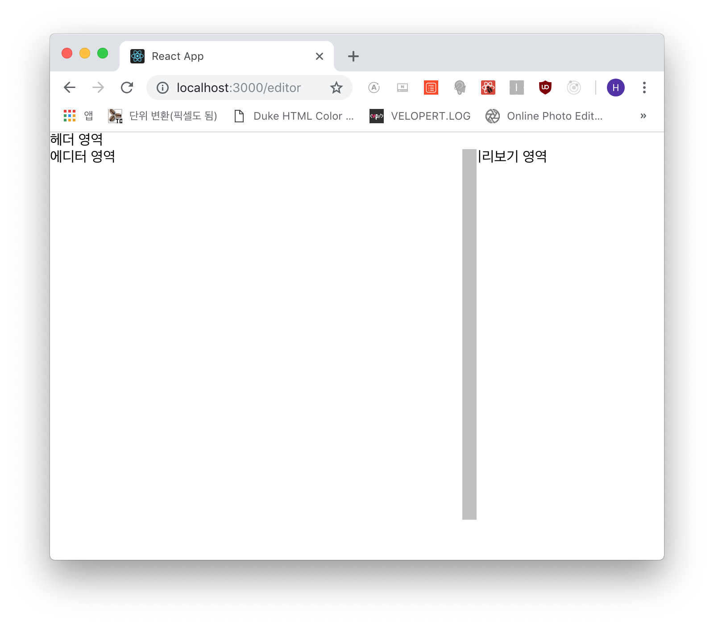
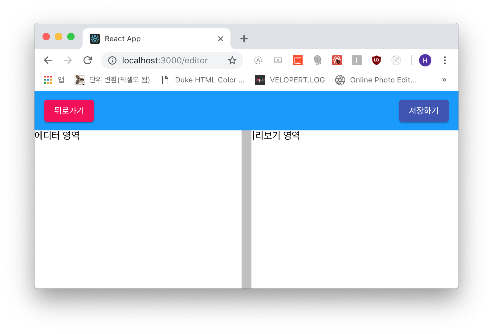

## 에디터 페이지 만들기!!
자~ 자~!! 대망의 에디터입니다. 더럽게 어렵죠; 혼자 힘으론 힘들어서 **Velopert**님의 글을
참고하여 작성하겠습니다.

에디터 템플릿을 만들고 그 안에 *헤더, 에디터, 미리보기* 영역을 렌더링하게끔 만들겠습니다.

먼저 에디터 템플릿입니다.

```js
- src/components/editor/EditorTemplate.js

import React, { Component } from 'react';
import './EditorTemplate.css';

class EditorTemplate extends Component {
  render() {
    const { header, editor, preview } = this.props;
    
    return (
      <div className="editor-template">
        {header}

        <div className="panes">
          <div className="pane editor">
            {editor}
          </div>
          <div className="pane preview">
            {preview}
          </div>
        </div>
      </div>
    );
  }
}

export default EditorTemplate;
```

```js
- src/components/editor/index.js

export { default as EditorTemplate } from './EditorTemplate';
```

```scss
- src/components/editor/EditorTemplate.scss

.editor-template {
  .panes {
    height: calc(100vh - 4rem);
    display: flex;
    background: silver;

    .pane {
      display: flex;
      flex: 1;
    }
  }
}
```


그리고 이 템플릿을 *에디터 페이지*에서 렌더링합니다.

```js
- src/pages/Editorpage.js

import React, { Component } from 'react';

import { EditorTemplate } from 'components/editor';

class Editorpage extends Component {
  render() {
    return (
      <EditorTemplate
        header="헤더 영역"
        editor="에디터 영역"
        preview="미리보기 영역"
      />
    );
  }
}

export default Editorpage;
```

이제 *에디터, 미리보기* 영역이 절반으로 나뉘어졌습니다. 이 영역을 마우스로 클릭&드래그 할 시
영역의 크기를 실시간으로 변경하여 리렌더링하겠습니다.

```js
- src/components/editor/EditorTemplate.js

import React, { Component } from 'react';
import './EditorTemplate.scss';

class EditorTemplate extends Component {
  state = {
    leftRatio: 0.5
  };

  handleMouseMove = (ev) => {
    this.setState({ leftRatio: ev.clientX / window.innerWidth })
  }

  handleMouseUp = (ev) => {
    document.body.removeEventListener('mousemove', this.handleMouseMove);
    window.removeEventListener('mouseup', this.handleMouseUp);
  };

  handleDivideMouseDown = (ev) => {
    document.body.addEventListener('mousemove', this.handleMouseMove);
    window.addEventListener('mouseup', this.handleMouseUp);
  }

  render() {
    const { header, editor, preview } = this.props;
    const { leftRatio } = this.state;
    const { handleDivideMouseDown } = this;
    const leftLand = { flex: leftRatio };
    const rightLand = { flex: 1 - leftRatio };
    const devideLand = { left: `${leftRatio * 100}%` };
    
    return (
      <div className="editor-template">
        {header}
        <div className="panes">
          <div className="pane editor" style={leftLand}>
            {editor}
          </div>
          <div className="pane preview" style={rightLand}>
            {preview}
          </div>
          <div className="divide"
            style={devideLand}
            onMouseDown={handleDivideMouseDown}
          />
        </div>
      </div>
    );
  }
}

export default EditorTemplate;
```

추가된 사항이 많은데요. 하나씩 살펴봅시다.  
`divide` 를 클릭 후 마우스 드래그 시 *leftRatio*의 스테이트 값이 업데이트 됩니다.
그리고 마우스를 떼면(handleMouseUp) 등록된 이벤트를 제거하고 `divide`가 클릭되면
document.body와 window에 mousedown 이벤트를 제외하고 적용합니다.  
이는 `divide` 영역을 벗어나게 될 때 이벤트 실행이 안되기 때문입니다.

이제 저 `divide` 영역을 클릭하기 쉽게 임시로 스타일링을 해보죠.

```scss
- src/components/editor/EditorTemplate.scss

.editor-template {
  .panes {
    height: calc(100vh - 4rem);
    display: flex;
    position: relative;

    .pane {
      display: flex;
      min-width: 0;
      overflow: auto;
    }

    .divide {
      width: 1rem;
      height: 100%;
      position: absolute;
      transform: translate(-50%);
      cursor: col-resize;
      background: silver;
    }
  }
}
```

요렇게 바꾸어주고 렌더링 한 상태에서 저 회색 영역을 드래그 해봅시다!



잘 움직이면서 리렌더링 되는 것을 확인할 수 있습니다.

***

## 에디터 헤더 컴포넌트
에디터툴의 헤더 컴포넌트를 만들겠습니다. 아래와 같이 매우 칩니다!

```js
- src/components/editor/EditorHeader.js

import React from 'react';
import './EditorHeader.scss';

import Button from '@material-ui/core/Button';

const EditorHeader = ({ onBack, onSubmit }) => {
  return (
    <div className="editor-header">
      <div className="back">
        <Button onClick={onBack} color="secondary" variant="raised">뒤로가기</Button>
      </div>
      <div className="submit">
        <Button onClick={onSubmit} color="primary" variant="raised">저장하기</Button>
      </div>
    </div>
  );
};

export default EditorHeader;
```

```js
- src/components/editor/index.js

export { default as EditorTemplate } from './EditorTemplate';
export { default as EditorHeader } from './EditorHeader';
```

```scss
- src/components/editor/EditorHeader.scss

.editor-header {
  background: #0099FF;
  height: 4rem;
  padding-left: 1rem;
  padding-right: 1rem;
  display: flex;
  align-items: center;

  .submit {
    margin-left: auto;
  }
}
```

이제 에디터 페이지에서 *header* 속성으로 렌더링 시킵니다.

```js
- src/pages/Editorpage.js

...(생략)
    return (
      <EditorTemplate
        header={<EditorHeader />}
        editor="에디터 영역"
        preview="미리보기 영역"
      />
    );
...(생략)
```



포스트가 너무 길어져서 다음 포스트로 넘깁니다.