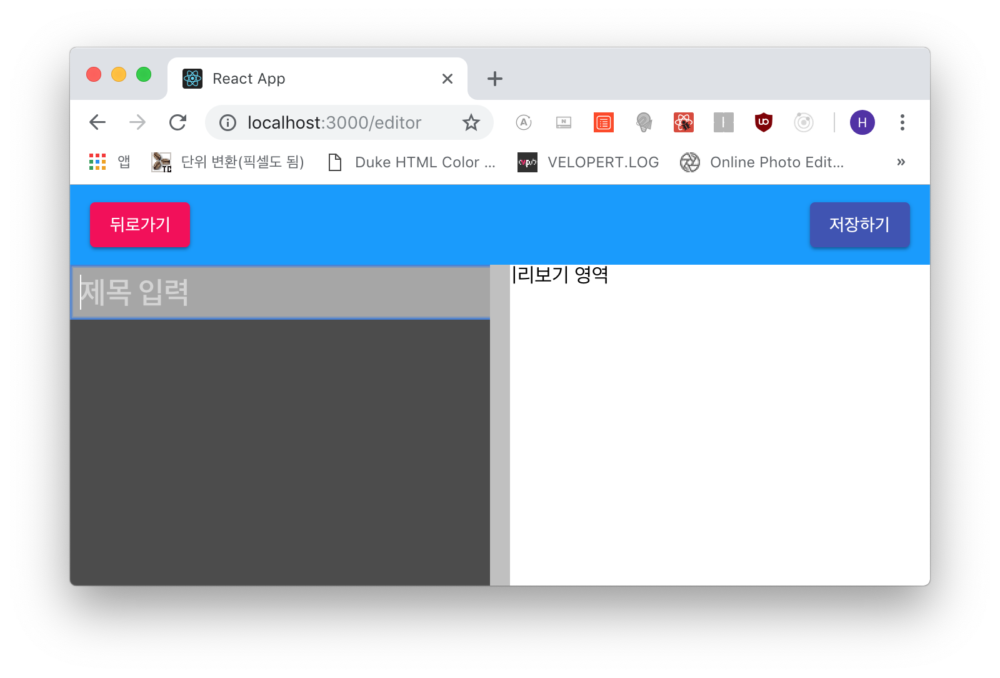
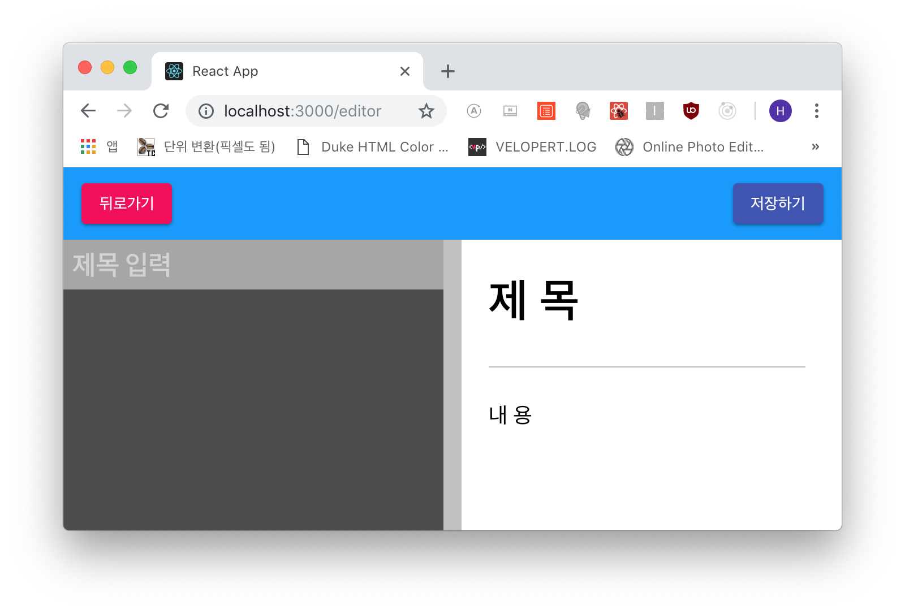
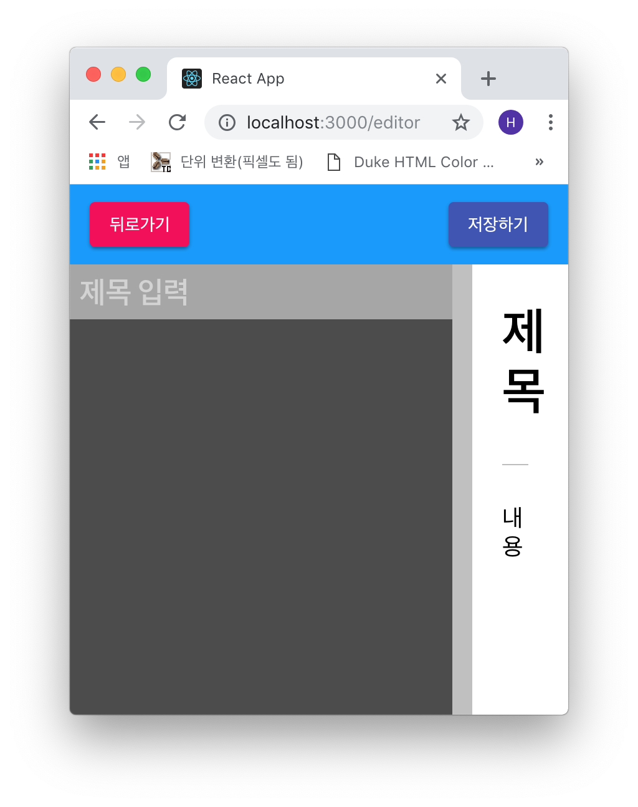
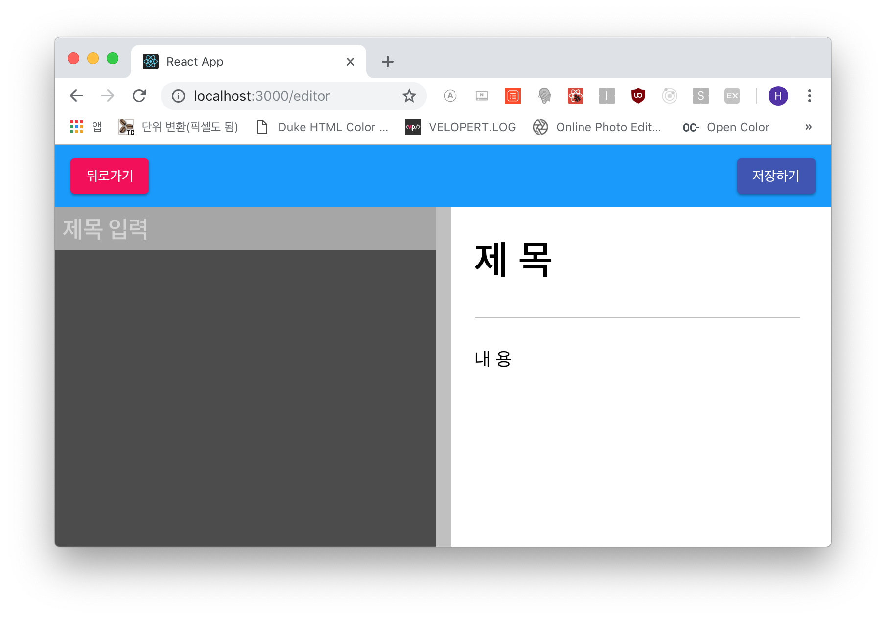
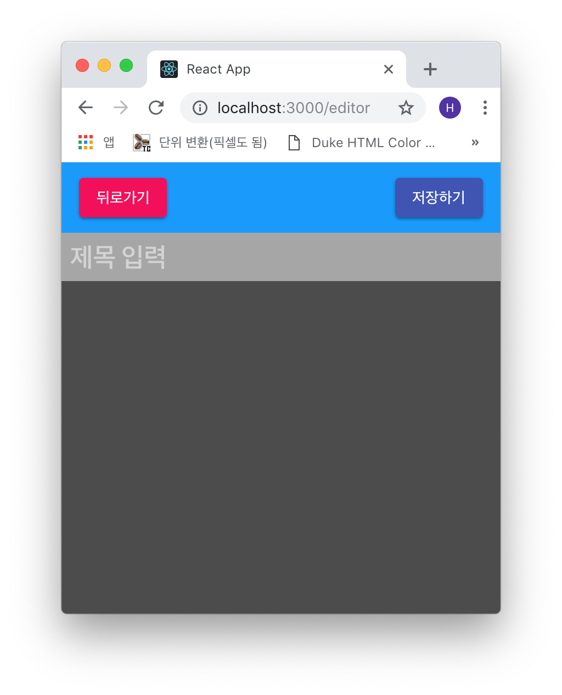

## 에디터 판 생성
에디터 판 컴포넌트입니다. 스타일링을 제외하곤 별 다른 내용은 없습니다.

```js
- src/components/editor/EditorPane.js

import React, { Component } from 'react';
import './EditorPane.scss';

class EditorPane extends Component {
  render() {
    return (
      <div className="editor-pane">
        <input className="title" placeholder="제목 입력" name="title" />
        <div className="code-editor"></div>
      </div>
    );
  }
}

export default EditorPane;
```

```js
- src/components/editor/index.js

export { default as EditorTemplate } from './EditorTemplate';
export { default as EditorHeader } from './EditorHeader';
export { default as EditorPane } from './EditorPane';
```

```scss
- src/components/editor/EditorPane.scss

.editor-pane {
  flex: 1;
  display: flex;
  flex-direction: column;

  .title {
    background: #A6A6A6;
    border: none;
    font-size: 1.5rem;
    color: white;
    padding: 0.5rem;
    font-weight: 600;

    &::placeholder {
      color: rgba(255, 255, 255, 0.5)
    }
  }

  .code-editor {
    flex: 1;
    background: #4C4C4C;
  }
}
```

그리고 에디터 페이지에서 렌더링합니다.

```js
- src/pages/Editorpage.js

...(생략)
    return (
      <EditorTemplate
        header={<EditorHeader />}
        editor={<EditorPane />}
        preview="미리보기 영역"
      />
    );
...(생략)
```



***

## 에디터 미리보기 생성
이제 에디터 페이지의 마지막 컴포넌트인 미리보기 컴포넌트를 만들겠습니다.

```js
- src/components/editor/EditorPreview.js

import React from 'react';
import './EditorPreview.scss';

const EditorPreview = ({ markdown, title }) => (
  <div className="editor-preview">
    <h1 className="title">제 목</h1>
    <div>내 용</div>
  </div>
);

export default EditorPreview;
```

```js
- src/components/editor/index.js

export { default as EditorTemplate } from './EditorTemplate';
export { default as EditorHeader } from './EditorHeader';
export { default as EditorPane } from './EditorPane';
export { default as EditorPreview } from './EditorPreview';
```

```scss
- src/components/editor/EditorPreview.scss

.editor-preview {
  flex: 1;
  padding: 2rem;
  overflow-y: auto;
  font-size: 1.2rem;

  .title {
    font-size: 2.5rem;
    font-weight: 600;
    padding-bottom: 2rem;
    margin-bottom: 2rem;
    border-bottom: 1px solid #BDBDBD;
  }
}
```

그리고 동일하게 에디터 페이지에서 렌더링!

```js
- src/pages/Editorpage.js

...(생략)
    return (
      <EditorTemplate
        header={<EditorHeader />}
        editor={<EditorPane />}
        preview={<EditorPreview />}
      />
    );
...(생략)
```

아 물론 제가 계속해서 *에디터 페이지*에서 저 컴포넌트들을 불러올 때 `import` 문은 생략한
겁니다. 세가지 다 추가 해 주셔야 해용.



이상없이 잘 렌더링 되네요.

근데 이쯤에서 보면 화면이 너무 작아질 경우(모바일 포함) 요렇게 되버립니다!



그래서 모바일 접속이나 사이즈가 작아질 경우는 미리보기를 숨겨버립시다!

```scss
- src/components/editor/EditorTemplate.scss

.editor-template {
  .panes {
    ...(생략)

    @media all and (max-width: 768px) {
      .editor {
        flex: 1!important;
      }

      .preview, .divide {
        display: none;
      }
    }
  }
}
```

요렇게 하면!




***

우선 에디터의 기본 틀만 완성했습니다. 다음 포스트에서 에디터에 마크다운 등의 기능을
탑재하고 코드에 색상을 부여하는 *코드미러* 등의 모듈을 설치해서 에디터를 완성해 볼게요!