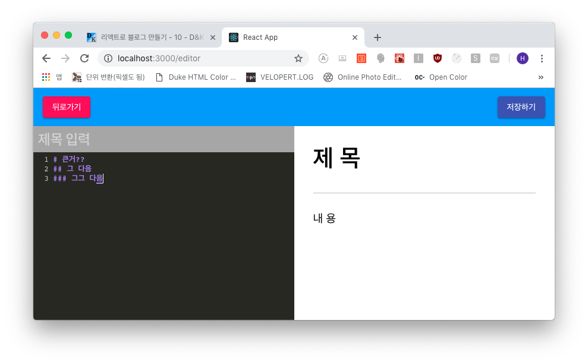
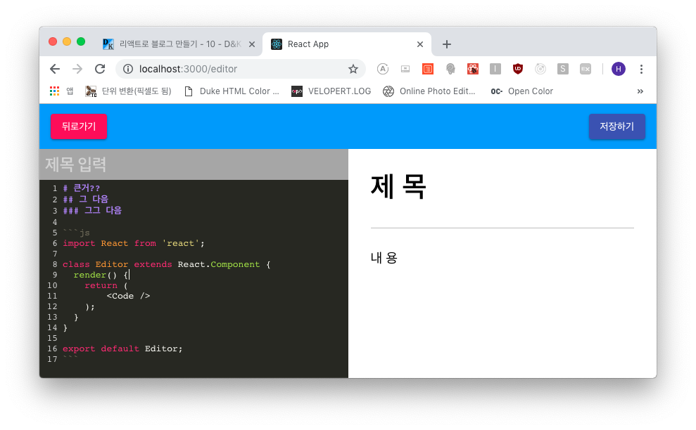

## 마크다운 에디터(MD) 및 미리보기 페이지 완성
마크다운 에디터를 사용하기 위한 모듈을 설치합니다.

```js
$ yarn add codemirror marked prismjs
```

우선 분할 페이지 테스트 시 사용했던 두께가 신경 쓰이니 지우겠습니다.

```scss
- src/components/editor/EditorTemplate.scss

...(생략)
.editor-template {
  // width: 1px; 삭제
  flex: 1;
}
...(생략)
```

***

### Codemirror
*코드미러*는 코드 에디터 라이브러리입니다. 밑의 링크에서 확인 하실 수 있습니다.

<a href="https://github.com/codemirror/codemirror" target="_blank">코드미러</a>

자 그럼 적용을 해 보겠습니다.

```js
- src/components/editor/EditorPane.js

import React, { Component } from 'react';
import './EditorPane.scss';

import CodeMirror from 'codemirror';

import 'codemirror/mode/markdown/markdown';
import 'codemirror/mode/javascript/javascript';
import 'codemirror/mode/jsx/jsx';
import 'codemirror/mode/css/css';
import 'codemirror/mode/shell/shell';
import 'codemirror/lib/codemirror.css';
import 'codemirror/theme/monokai.css';

class EditorPane extends Component {
  editor = null;
  codeMirror = null;

  initializeEditor = () => {
    this.codeMirror = CodeMirror(this.editor, {
      mode: 'markdown',
      theme: 'monokai',
      lineNumbers: true,
      lineWrapping: true
    });
  }

  componentDidMount() {
    this.initializeEditor();
  }

  render() {
    return (
      <div className="editor-pane">
        <input className="title" placeholder="제목 입력" name="title" />
        <div className="code-editor" ref={ref => this.editor=ref}></div>
      </div>
    );
  }
}

export default EditorPane;
```

코드미러를 로드하고 에디터와 코드미러의 레퍼런스를 선언한 후 에디터를 초기화합니다.(initialEditor)
그리고 에디터 초기화 시 옵션들을 넣어주는데 여기서 들어간 옵션은 다음과 같습니다.
- **mode: markdown**      *마크다운*
- **theme: monokai**      *테마는 모노카이*
- **lineNumbers: true**   *좌측에 라인 번호*
- **lineWrapping: true**  *내용이 길면 다음줄로*

그리고 브라우저에서 확인하면 아래와 같이 변경됨을 확인할 수 있습니다.



그럼 이어서 스타일링을 합니다.

```scss
- src/components/editor/EditorPane.scss

...(생략)
  .code-editor {
    flex: 1;
    background: #4C4C4C;
    display: flex;
    flex-direction: column;
    :global .CodeMirror {
      font-size: 1rem;
      flex: 1;
    }
  }
```



***

이번 포스트는 짧게 끝내고 다음 포스트부터 상태 관리를 위해 리덕스를 사용하겠습니다.