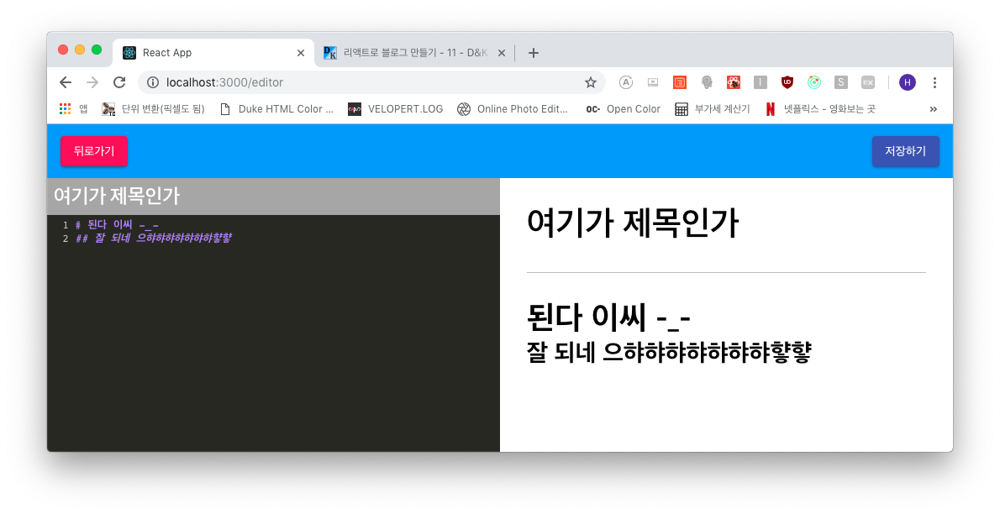

## Redux 설정
우선 모듈부터 설치합니다.

```js
$ yarn add redux redux-actions react-redux redux-pender immutable
```

이후 상태 관리*(state)*를 할 모듈들을 만듭니다.  
- login: 로그인(모달)의 상태 관리
- list: 블로그 포스트의 리스트 상태 관리
- post: 포스트 상세보기의 상태 관리
- editor: 에디터의 상태 관리

이 네가지 파일은 기본 틀이 일단 똑같기 때문에 동일하게 생성하여 주고 인덱스 파일을 만들어줍니다.

```js
- src/store/modules/login.js  list.js, post.js, editor.js

import { createAction, handleActions } from 'redux-actions';
import { Map } from 'immutable';
import { pender } from 'redux-pender';

// 액션 타입

// 액션 생성자

// 상태 초기화
const initialState = Map({

});

// 리듀서
export default handleActions({

}, initialState)
```

```js
- src/store/modules/index.js

export { default as login } from './login';
export { default as list } from './list';
export { default as post } from './post';
export { default as editor } from './editor';
export { penderReducer as pender } from 'redux-pender';
```

이렇게 모듈을 만든 후 스토어를 생성하는 설정 파일을 만들겠습니다.  
이 설정 파일에서는 combineReducers로 모든 모듈을 합칠 겁니다.

```js
- src/store/configure.js

import { createStore, applyMiddleware, compose, combineReducers } from 'redux';
import penderMiddleware from 'redux-pender';

import * as modules from './modules';

const Reducers = combineReducers(modules);
const Middlewares = [penderMiddleware()];

// 개발 모드에서 리덕스 개발툴 사용
const isDev = process.env.NODE_ENV === 'development';
const devTools = isDev && window.__REDUX_DEVTOOLS_EXTENSION_COMPOSE__;
const composeEnhancers = devTools || compose;

const configure = (preloadedState) => createStore(Reducers, preloadedState, composeEnhancers(
  applyMiddleware(...Middlewares)
));

export default configure;
```

개발모드일 때 *Redux Devtools*를 사용하기 위한 세팅을 하였고, preloadedState는 나중에 SSR(서버사이드렌더링)을
작성할 때 사용할 초기 State 입니다.

이제 스토어 함수를 만들었으니 **Provider**로 라우터를 감싸줍니다.

```js
- src/client/Root.js

import React from 'react';
import { BrowserRouter } from 'react-router-dom';
import { Provider } from 'react-redux';

import configure from 'store/configure';
import App from 'shared/App';

const store = configure();

const Root = () => (
  <Provider store={store}>
    <BrowserRouter>
      <App />
    </BrowserRouter>
  </Provider>
);

export default Root;
```

자 이제 리덕스를 사용할 준비가 다 되었습니다.  
그럼 먼저 에디터의 상태 관리를 작성해 볼까요??

***

### Editor State
먼저 에디터 모듈을 만들겠습니다. 모듈의 *editor.js* 파일을 아래와 같이 수정합니다.

```js
- src/store/modules/editor.js

import { createAction, handleActions } from 'redux-actions';
import { Map } from 'immutable';
import { pender } from 'redux-pender';

// 액션 타입
const INITIALIZE = 'editor/INITIALIZE';
const CHANGE_INPUT = 'editor/CHANGE_INPUT';

// 액션 생성자
export const initialize = createAction(INITIALIZE);
export const changeInput = createAction(CHANGE_INPUT);

// 상태 초기화
const initialState = Map({
  title: '',
  markdown: ''
});

// 리듀서
export default handleActions({
  [INITIALIZE]: (state, action) => initialState,
  [CHANGE_INPUT]: (state, action) => {
    const { name, value } = action.payload;
    return state.set(name, value);
  }
}, initialState)
```

위와 같이 INITALIZE, CHANGE_INPUT 액션을 만들었습니다.  
그럼 이제 이 모듈을 사용하는 컨테이너를 만들어서 그 안에 에디터를 넣어 상태 관리를 하도록 합니다.

```js
- src/containers/editor/EditorPaneContainer.js

import React, { Component } from 'react';
import { bindActionCreators } from 'redux';
import { connect } from 'react-redux';
import * as editorActions from 'store/modules/editor';

import { EditorPane } from 'components/editor';

class EditorPaneContainer extends Component {
  handleChangeInput = ({ name, value }) => {
    const { EditorActions } = this.props;
    
    EditorActions.changeInput({ name, value });
  };

  render() {
    const { title, markdown } = this.props;
    const { handleChangeInput } = this;

    return (
      <EditorPane
        title={title}
        markdown={markdown}
        onChangeInput={handleChangeInput}
      />
    );
  }
}

export default connect(
  (state) => ({
    title: state.editor.get('title'),
    markdown: state.editor.get('markdown')
  }),
  (dispatch) => ({
    EditorActions: bindActionCreators(editorActions, dispatch)
  })
)(EditorPaneContainer);
```

title, markdown 상태를 연결하고 handleChangeInput 함수로 CHANGE_INPUT 액션을
수행하도록 합니다. 그리고 에디터 페이지에서 이 컨테이너를 불러옵니다.

다음은 에디터 판을 수정하겠습니다.

```js
- src/components/editor/EditorPane.js

import React, { Component } from 'react';
import './EditorPane.scss';

import CodeMirror from 'codemirror';

import 'codemirror/mode/markdown/markdown';
import 'codemirror/mode/javascript/javascript';
import 'codemirror/mode/jsx/jsx';
import 'codemirror/mode/css/css';
import 'codemirror/mode/shell/shell';
import 'codemirror/lib/codemirror.css';
import 'codemirror/theme/monokai.css';

class EditorPane extends Component {
  editor = null;
  codeMirror = null;
  cursor = null;

  initializeEditor = () => {
    this.codeMirror = CodeMirror(this.editor, {
      mode: 'markdown',
      theme: 'monokai',
      lineNumbers: true,
      lineWrapping: true
    });
    this.codeMirror.on('change', this.handleChangeMarkdown);
  }

  componentDidMount() {
    this.initializeEditor();
  }

  handleChange = (e) => {
    const { onChangeInput } = this.props;
    const { value, name } = e.target;

    onChangeInput({ name, value });
  }

  handleChangeMarkdown = (body) => {
    const { onChangeInput } = this.props;

    this.cursor = body.getCursor();
    onChangeInput({ name: 'markdown', value: body.getValue() });
  }

  componentDidUpdate(prevProps, prevState) {
    if (prevProps.markdown !== this.props.markdown) {
      const { codeMirror, cursor } = this;

      if (!codeMirror) return;
      codeMirror.setValue(this.props.markdown);

      if (!cursor) return;
      codeMirror.setCursor(cursor);
    }
  }

  render() {
    const { title } = this.props;
    const { handleChange } = this;

    return (
      <div className="editor-pane">
        <input className="title" placeholder="제목 입력" name="title"
          value={title} onChange={handleChange}
        />
        <div className="code-editor" ref={ref => this.editor=ref}></div>
      </div>
    );
  }
}

export default EditorPane;
```

바뀐 부분들을 잘 보시면 *props*로 전달받은 값(title, markdown)을 인풋에 설정하고,
내부 값이 변경이 되면 onChangeInput 함수를 호출합니다.

그리고 마크다운 값이 바뀌게 되면 커서의 위치가 초기화 될 수 있으므로 커서 값을 유지해 주기 위해
setCursor로 저장합니다.

그리고 리덕스 개발자 도구를 확인합니다.


오오미!! 잘 반영되네요 ㅎㅎㅎㅎ

***

### 마크다운 렌더링 컴포넌트
이제 마크다운을 렌더링해 줄 컴포넌트를 만들겠습니다.

```js
- src/components/post/MarkdownRender.js

import React, { Component } from 'react';
import marked from 'marked';

import './MarkdownRender.scss';

class MarkdownRender extends Component {
  state = { html: '' };

  renderMarkdown = () => {
    const { markdown } = this.props;

    if (!markdown) {
      this.setState({ html: '' });
      return;
    }

    this.setState({
      hamle: marked(markdown, {
        breaks: true,
        sanitize: true
      })
    })
  }

  // SSR 마크다운 처리
  constructor(props) {
    super(props);

    const { markdown } = props;

    this.state = {
      html: markdown ? marked(props.markdown, {
        breaks: true, sanitize: true
      }) : ''
    }
  }

  componentDidUpdate(prevProps, prevState) {
    if (prevProps.markdown !== this.props.markdown) {
      this.renderMarkdown();
    }
  }

  render() {
    const { html } = this.state;
    const markup = { __html: html };

    return (
      <div
        className="markdown-render"
        dangerouslySetInnerHTML={markup}
      />
    );
  }
}

export default MarkdownRender;
```

```js
- src/components/common/index.js
// MarkdownRender 추가
export { default as Header } from './Header';
export { default as Footer } from './Footer';
export { default as PageTemplate } from './PageTemplate';
export { default as MarkdownRender } from './MarkdownRender';
```

내용을 살펴보면 **componentDidMount**에서 마크다운 변환을 처리하였는데, 뒤에
contructor에서도 다시 마크다운 변환을 합니다.

이유는 나중에 서버사이드 렌더링을 할 때도 사용하기 위해서입니다.  
componentDidMount에서만 작업을 하면 브라우저는 실행을 하겠지만 서버는 움직이지 않을 테니까요.

그럼 이 마크다운 렌더링을 미리보기 컨테이너를 만들어서 넣도록 하겠습니다.

```js
- src/containers/editor/EditorPreviewContainer.js

import React, { Component } from 'react';
import { connect } from 'react-redux';

import { EditorPreview } from 'components/editor';

class EditorPreviewContainer extends Component {
  render() {
    const { markdown, title } = this.props;

    return (
      <EditorPreview
        title={title}
        markdown={markdown}
      />
    );
  }
}

export default connect(
  (state) => ({
    title: state.editor.get('title'),
    markdown: state.editor.get('markdown')
  })
)(EditorPreviewContainer);
```

그리고 이 컨테이너를 에디터 페이지에서 로드해 봅시다.

```js
- src/pages/Editorpage.js

import React, { Component } from 'react';

import {
  EditorTemplate,
  EditorHeader,
} from 'components/editor';

import EditorPaneContainer from 'containers/editor/EditorPaneContainer';
import EditorPreviewContainer from 'containers/editor/EditorPreviewContainer';

class Editorpage extends Component {
  render() {
    return (
      <EditorTemplate
        header={<EditorHeader />}
        editor={<EditorPaneContainer />}
        preview={<EditorPreviewContainer />}
      />
    );
  }
}

export default Editorpage;
```

이제 미리보기 컴포넌트에 마크다운 렌더링을 포함합니다.

```js
- src/components/editor/EditorPreview.js

import React from 'react';
import './EditorPreview.scss';

import { MarkdownRender } from 'components/common';

const EditorPreview = ({ title, markdown }) => (
  <div className="editor-preview">
    <h1 className="title">{title}</h1>
    <div>
      <MarkdownRender markdown={markdown} />
    </div>
  </div>
);

export default EditorPreview;
```

요래 하고 브라우저에서 타이핑을 하면!



잘 반영됩니다!!!!!!

***

미리보기 페이지에서 보이듯이 작성한대로 마크다운이 잘 나옵니다. 하지만 마크다운 작성의 주 목적 중
하나인 코드(자바스크립트, CSS라던지..CSS라던지..)를 작성해보면!


이 따구로 색감 없이 검정색!!으로 나옵니다. ㅜㅜ

따라서 이런 코드에 이쁜 색상을 넣어줄 건데요.
<a href="https://prismjs.com/" target="_blank">PrismJS</a>라는 라이브러리를 사용할 겁니다.

다음 포스트에서 진행할게요!