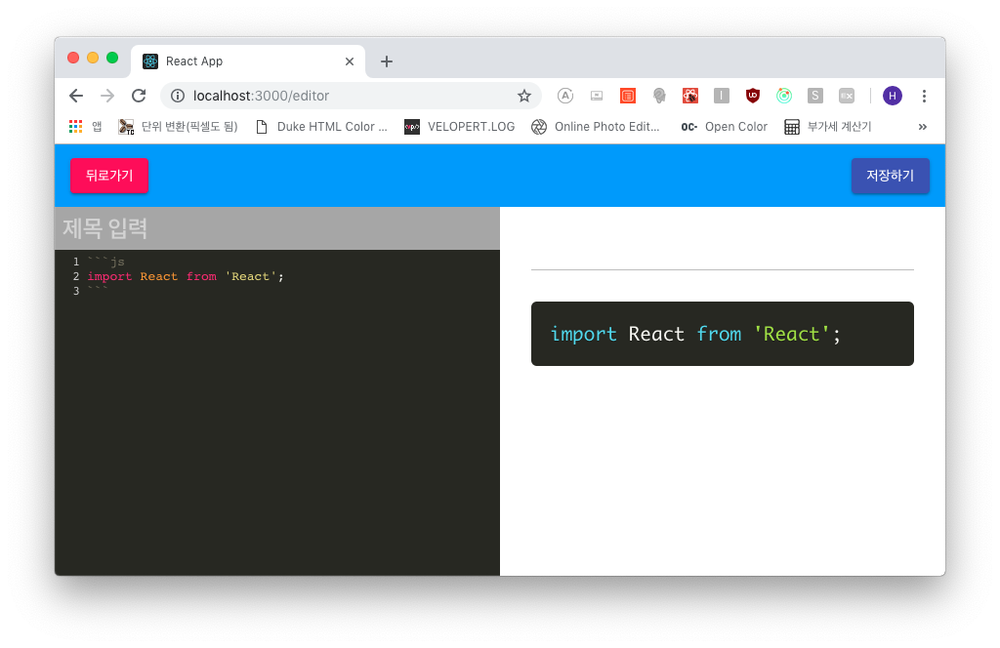

## PrismJS 예쁘게 만들어 봅시다!
지난 포스트에서 언급했던 *못생긴 검정색*을 없앱니다!!!! >ㅁ<

### 프리즘 라이브러리 적용
우선 프리즘 라이브러리를 마크다운 렌더링에서 불러옵시다

```js
- src/components/common/MarkdownRender.js

...(생략)
import './MarkdownRender.scss';

// PrismJS
import Prism from 'prismjs';
import 'prismjs/components/prism-bash.min.js';
import 'prismjs/components/prism-javascript.min.js';
import 'prismjs/components/prism-jsx.min.js';
import 'prismjs/components/prism-css.min.js';

class MarkdownRender extends Component {
...(생략)
```

그리고 `componentDidUpdate()`에서 프리즘 라이브러리의 *highlightAll()* 함수를
사용합니다.

```js
- src/components/common/MarkdownRender.js

...(생략)
  componentDidUpdate(prevProps, prevState) {
    if (prevProps.markdown !== this.props.markdown) {
      this.renderMarkdown();
    }

    if (prevState.html !== this.state.html) {
      Prism.highlightAll();
    }
  }
...(생략)
```

그리고 렌더링



우와우!! 잘됩니다!!!!

***

다음 포스트부터 이전 백엔드에서 작업했던 API와 연결하겠습니다.