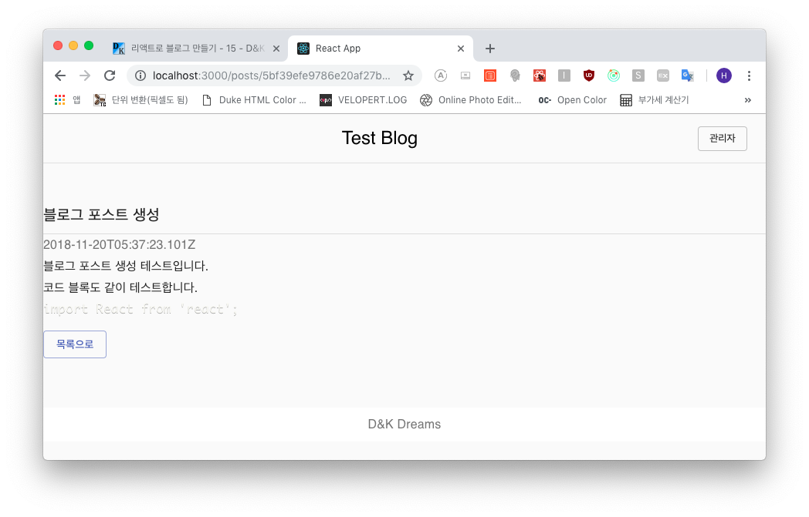

### readPost 함수 생성
우선 API 함수를 먼저 만듭니다.

```js
- frontend/src/api/api.js

import axios from 'axios';

export const writePost = ({ title, body }) => axios.post('/api/posts', { title, body });
export const readPost = (id) => axios.get(`/api/posts/${id}`);
```

뭐 별건 없습니다 ㅎㅎ

그럼 이제 액션을 만들겠습니다. 아래와 같이 작성합니다.

```js
- frontend/src/store/modules/post.js

import { createAction, handleActions } from 'redux-actions';
import { Map, fromJS } from 'immutable';
import { pender } from 'redux-pender';

import * as api from 'api/api';

// 액션 타입
const READ_POST = 'post/READ_POST';

// 액션 생성자
export const readPost = createAction(READ_POST, api.readPost);

// 상태 초기화
const initialState = Map({
  post: Map({})
});

// 리듀서
export default handleActions({
  ...pender({
    type: READ_POST,
    onSuccess: (state, action) => {
      const { data: post } = action.payload;
      return state.set('post', fromJS(post));
    }
  })
}, initialState);
```

`readPost` 함수를 가져와서 *READ_POST* 액션에서 사용하도록 설정합니다.

***

#### Post 컨테이너 작성 및 대체
특정 포스트(id)를 보여주는 컨테이너를 아래와 같이 만듭니다.

```js
- frontend/src/containers/post/PostContainer.js

import React, { Component } from 'react';
import { bindActionCreators } from 'redux';
import { connect } from 'react-redux';

import * as postActions from 'store/modules/post';

import { Post } from 'components/post';

class PostContainer extends Component {
  initialize = async () => {
    const { PostActions, id } = this.props;

    try {
      await PostActions.readPost(id);
    } catch(err) {
      console.log(err);
    }
  }

  componentDidMount() {
    this.initialize();
  }

  render() {
    const { post, loading } = this.props;

    if (loading) return null;

    const { title, body, createdDate } = post.toJS();

    return (
      <div>
        <Post title={title} body={body} createdDate={createdDate} />
      </div>
    );
  }
}

export default connect(
  (state) => ({
    post: state.post.get('post'),
    loading: state.pender.pending['post/READ_POST']
  }),
  (dispatch) => ({
    PostActions: bindActionCreators(postActions, dispatch)
  })
)(PostContainer);
```

이 컨테이너에서 포스트 컴포넌를 불러오고 *componentDidMount* 이벤트가 발생할 때 `id`를
받아와서 그 포스트를 가져옵니다. 이후 렌더링을 할 때 로딩 중이면 아무것도 나오지 않도록
*null* 값을 리턴합니다.

이 컨테이너를 *Postpage* 에서 렌더링합니다.

```js
- frontend/src/pages/Postpage.js

import React from 'react';

import { PageTemplate } from 'components/common';
import PostContainer from 'containers/post/PostContainer';

const Postpage = ({ match }) => {
  const { id } = match.params;

  return (
    <PageTemplate>
      <PostContainer id={id} />
    </PageTemplate>
  );
};

export default Postpage;
```

이제 포스트 내용보기 페이지를 렌더링하기 위해 *App.js*의 라우트 설정을 수정합니다.

```js
- frontend/src/shared/App.js

...(생략)
      <Switch>
        <Route exact path="/" component={Homepage} />
        <Route path="/posts/:id" component={Postpage} />
        <Route path="/editor" component={Editorpage} />
      </Switch>
...(생략)
```

위와 같이 **/posts/** 뒤에 *:id*를 붙여줍시다. 그리고 브라우저에서 특정 포스트를 확인해봅시다.



위와 같이 잘 나옵니다! 글 작성을 하고나서도 확인해 보시면 잘 작동됨을 알 수 있습니다.

***

이제 다음 포스트에서는 이 웹페이지의 첫 페이지의 포스트 목록(리스트)을 작성하겠습니다.