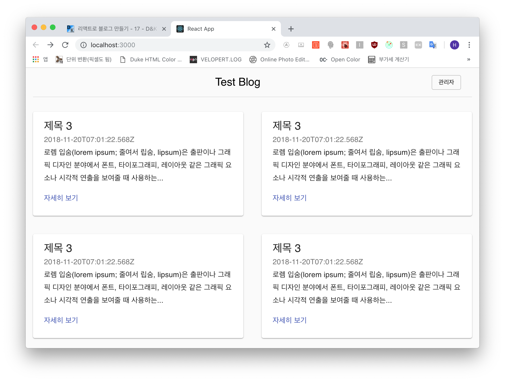

### 실제 포스트리스트 렌더링 준비
임시로 넣어놓은 포스트 리스트 두 개를 실제 데이터로 렌더링해 보겠습니다. 이 과정에서는
하단부의 글을 미리보기처럼 보여줄텐데, 마크다운이 html로 적용되지 않으므로 마크다운 코드가
그대로 노출됩니다. 따라서 이 마크다운을 제거해주는 라이브러리를 하나 사용하겠습니다.

```js
$ yarn add remove-markdown
```

이제 코드를 수정할게요!!

```js
- frontend/src/components/post/PostList.js

import React, { Component } from 'react';
import PropTypes from 'prop-types';
import removeMd from 'remove-markdown';
import { Link } from 'react-router-dom';

import { withStyles } from '@material-ui/core/styles';

import Grid from '@material-ui/core/Grid';
import Card from '@material-ui/core/Card';
import CardContent from '@material-ui/core/CardContent';
import Typography from '@material-ui/core/Typography';

const styles = theme => ({
  card: {
    display: 'flex'
  },
  cardDetails: {
    flex: 1
  }
});

class PostList extends Component {
  render() {
    const { classes, posts } = this.props;

    const PostItem = ({ title, body, createdDate, id }) => {
      return (
        <Grid item key={id} xs={12} md={6}>
          <Card className={classes.card}>
            <div className={classes.cardDetails}>
              <CardContent>
                <Typography component="h2" variant="h5">{title}</Typography>
                <Typography variant="subtitle1" color="textSecondary">{createdDate}</Typography>
                <Typography variant="subtitle1" paragraph>{removeMd(body)}</Typography>
                <Link to={`/posts/${id}`}>
                  <Typography variant="subtitle1" color="primary">자세히 보기</Typography>
                </Link>
              </CardContent>
            </div>
          </Card>
        </Grid>
      )
    }

    const postList = posts.map(
      (post) => {
        const { _id, title, body, createdDate } = post.toJS();

        return (
          <PostItem key={_id} id={_id} title={title} body={body} createdDate={createdDate} />
        )
      }
    );

    return (
      <Grid container spacing={40} className={classes.cardGrid}>
        {postList}
      </Grid>
    )
  }
}

PostList.propTypes = {
  classes: PropTypes.object.isRequired
};

export default withStyles(styles)(PostList);
```

*PostItem* 을 만들어 적용시키고 `postList`에서 **map()**함수를 이용하여 배열을
순서대로 넣어 아이템 컴포넌트를 반복시킵니다. 이후 그 반복된 `postList`를 렌더링합니다.



리스트가 잘 나옵니다!!

***

### 페이지 네이션 적용
이제 웹사이트 하단 부의 페이지네이션(버튼)을 적용하겠습니다.

먼저 *App.js* 의 라우트를 수정합니다.  
`/page/:page` 라우트를 *Homepage* 페이지에 적용합니다.

```js
- frontend/src/shared/App.js

...(생략)
    return (
      <Switch>
        <Route exact path="/" component={Homepage} />
        <Route path="/page/:page" component={Homepage} />
        <Route path="/posts/:id" component={Postpage} />
        <Route path="/editor" component={Editorpage} />
      </Switch>
    );
  }
}
...(생략)
```

이제 페이지네이션 컴포넌트를 수정합니다.

```js
- frontend/shared/App.js

import React, { Component } from 'react';
import PropTypes from 'prop-types';
import { Link } from 'react-router-dom';

...(생략)

class Pagination extends Component {
  render() {
    const { classes, page, lastPage } = this.props;
    const createPagePath = (page) => {
      return `/page/${page}`;
    }

    return (
      <div className={classes.pagination}>
        <Button disabled={page === 1}>
          <Link to={createPagePath(page - 1)}>이전 페이지</Link>
        </Button>
        <div className={classes.page}>{page} 페이지</div>
        <Button disabled={page === lastPage}>
          <Link to={createPagePath(page + 1)}>다음 페이지</Link>
        </Button>
      </div>
    );
...(생략)
```

링크를 리액트 라우터 라이브러리에서 추가해 주고 *props*로 받아온 정보를 이용해 `페이지 경로`를
만들어주는 함수 *createPagePath*를 만들어서 아래 페이지네이션 버튼에 추가해줍니다.

이제 브라우저로 접속하여 최종 페이지까지 잘 되는지 확인해봅니다.


최종 페이지인 11페이지까지 잘 나옵니다!

***

이제 다음 포스트에서는 현재 띄워진 포스트를 수정하고 삭제하는 기능을 구현하겠습니다.