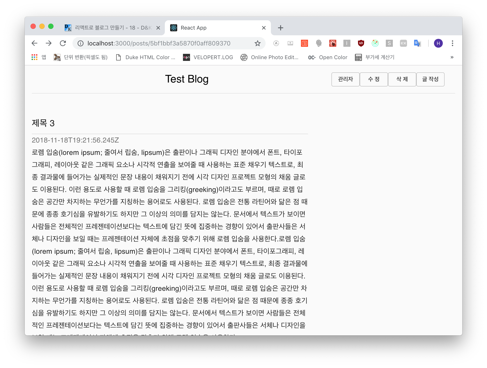
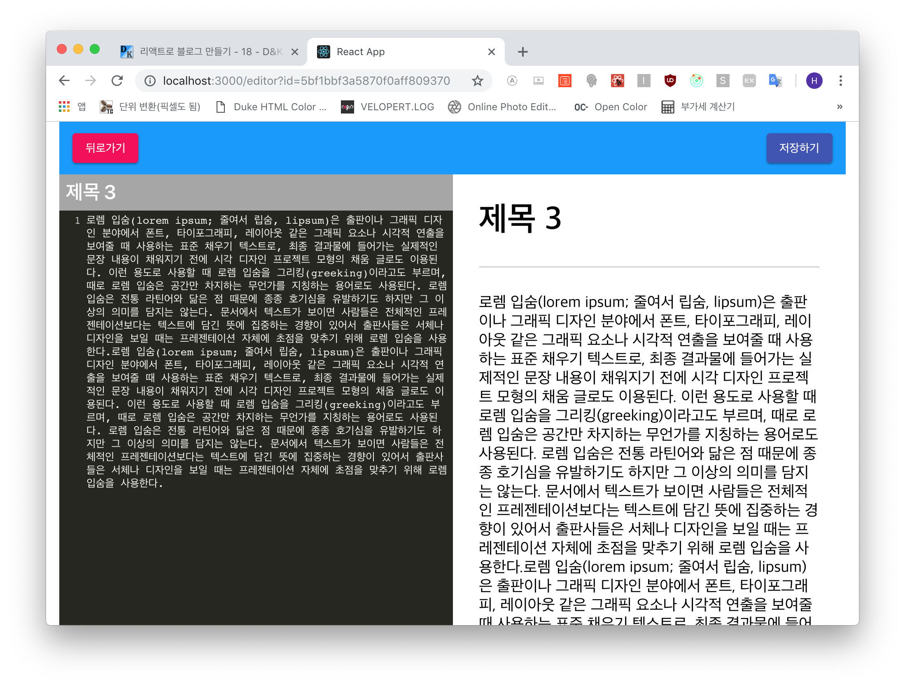

### 포스트 수정 및 삭제 기능 구현
포스트 본문의 수정 및 삭제 기능 구현을 위해 버튼을 만들어 넣습니다. 이를 위해 *HeaderContainer*를
만들어 버튼을 추가해 주겠습니다.

```js
- frontend/src/containers/common/HeaderContainer.js

import React, { Component } from 'react';
import { withRouter } from 'react-router-dom';

import { Header } from 'components/common';

class HeaderContainer extends Component {
  handleRemove = () => {

  }

  render() {
    const { match } = this.props;
    const { id } = match.params;
    const { handleRemove } = this;

    return (
      <Header postId={id} onRemove={handleRemove} />
    );
  }
}

export default withRouter(HeaderContainer);
```

임시로 제거 함수인 *handleRemove* 를 만들어 놓고 컨테이너 틀만 먼저 만듭니다.

이제 *PageTemplate*에서 헤더를 컨테이너로 대체합니다.

```js
- frontend/src/components/common/PageTemplate.js

import React, { Component } from 'react';
import PropTypes from 'prop-types';

import HeaderContainer from 'containers/common/HeaderContainer';
import { Footer } from 'components/common';

// Material Styles
...(생략)
        <CssBaseLine />
        <div className={classes.layout}>
          <HeaderContainer />
          <main>
            { this.props.children }
          </main>
...(생략)
```

파라미터로 `id`가 존재할 때 해당 파라미터 값을 헤더 컨테이너로 전달합니다.  
이제 헤더 컴포넌트에서 파라미터 값이 존재할 때 버튼이 나타나도록 코딩합니다.

```js
- frontend/src/components/common/Header.js

...(생략)

  render() {
    const { classes, postId, onRemove } = this.props;

    return (
      <Toolbar className={classes.toolbarMain}>
        <Typography className={classes.toolbarTitle}
          component="h2" variant="h5" color="inherit"
          align="center" noWrap
        >
          <Link to="/">Test Blog</Link>
        </Typography>
        <Button variant="outlined" size="small" onClick={this.handleOpen}>
          관리자
        </Button>

        {postId && [
          <Button variant="outlined" size="small" key="edit">
            <Link to={`/editor?id=${postId}`}>수 정</Link>
          </Button>,
          <Button variant="outlined" size="small" key="remove" onClick={onRemove}>
            삭 제
          </Button>
        ]}
        <Button variant="outlined" size="small">
          <Link to="/editor">글 작성</Link>
        </Button>

        <Modal aria-labelledby="제목" aria-describedby="본문"
          open={this.state.isOpen} onClose={this.handleClose}
        >
          <div className={classes.layout}>
...(생략)
```

브라우저에서 확인하면



이상없이 버튼이 잘 나옵니다.

***

#### 포스트 수정
현재 **수 정** 버튼을 누르면 *id*라는 쿼리가 설정되고 에디터가 열릴 때 id 값이 있다면
그 id에 해당하는 포스트를 로드하여 *editor* 리덕스에 넣습니다.

```js
- frontend/src/store/modules/editor.js

...(생략)
// 액션 타입
...(생략)
const READ_POST = 'editor/READ_POST'; // 추가

// 액션 생성자
export const readPost = createAction(READ_POST, api.readPost);  // 추가

// 상태 초기화
...(생략)

// 리듀서
export default handleActions({
...(생략)
  }),
  ...pender({
    type: READ_POST,
    onSuccess: (state, action) => {
      const { title, body } = action.payload.data;
      return state.set('title', title)
                  .set('markdown', body)
    }
  })
}, initialState);
```

그리고 *EditorHeaderContainer* 를 수정합니다.

```js
- frontend/src/containers/editor/EditorHeaderContainer.js

...(생략)
import queryStrig from 'query-string';

import { EditorHeader } from 'components/editor';
import * as editorActions from 'store/modules/editor';

class EditorHeaderContainer extends Component {
  componentDidMount() {
    const { EditorActions, location } = this.props;
    EditorActions.initialize();

    const { id } = queryStrig.parse(location.search);

    if (id) {
      EditorActions.readPost(id);
    }
  }

  handleBack = () => {
    const { history } = this.props;
    history.Back();
  }
...(생략)
```

*query-string* 라이브러리를 로드해서 **componentDidMount()**에서 `location`의
search에서 id값이 있다면 *readPost* 함수를 이용하여 포스트 정보를 가져옵니다.

그리고 수정 버튼을 눌러보면



포스트 정보가 잘 로드되어 에디터로 들어갑니다.

***

다음 포스트에서는 수정 API 함수, 액션을 만들겠습니다.