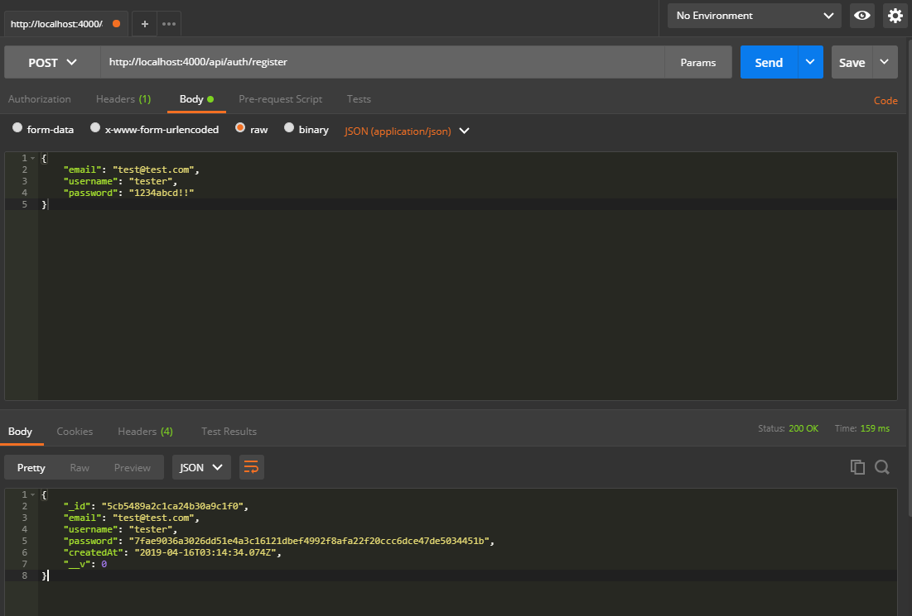
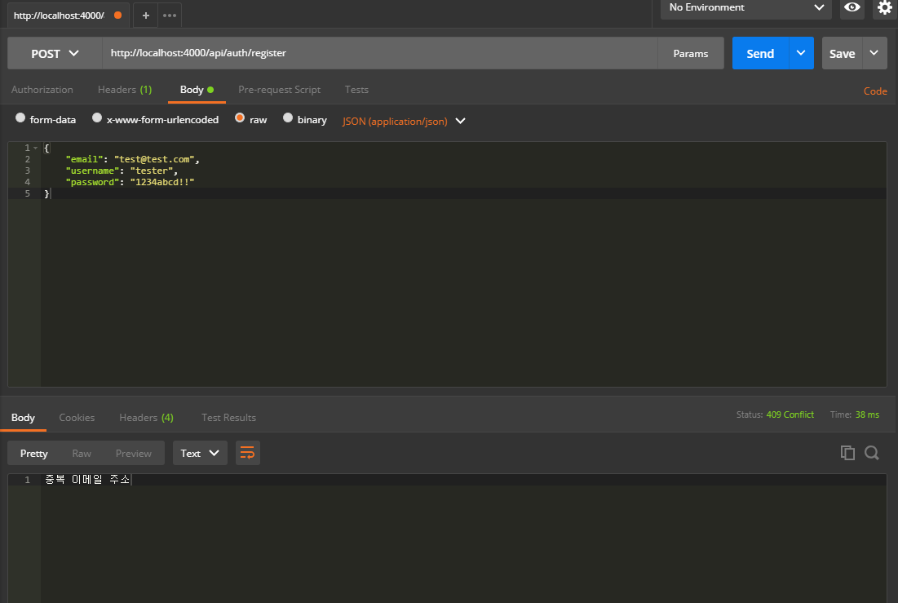

## RestAPI Create
지난 번에 만든 mongoose 모델(`User`)을 사용하여 Create(*회원가입: register*)를 만들겁니다.  
이미 `User` 모델 메소드로 **register** 를 만들어 두었기에 매우 간단간단합니다.  
우선 데이터 검증을 위한 모듈을 하나 설치합니다!

```js
 $ /mobx-blog/server/yarn add joi
```

계정인증 라우팅을 위한 라우터를 만들겠습니다!

```js
- file: /mobx-blog/server/api/index.js

import Router from 'koa-router'

// 라우터
import auth from './auth'

const api = new Router()

api.get('/', (ctx) => {
  ctx.body = 'API 분기점'
})

api.use('/auth', auth.routes())

export default api
```

```js
- file: /mobx-blog/server/api/auth/index.js

import Router from 'koa-router'
import authCtrl from './auth.ctrl'

const auth = new Router()

auth.get('/', (ctx) => {
  ctx.body = 'Auth 분기점'
})

// 사용자 인증 함수
auth.post('/register', authCtrl.register)
auth.post('/login', authCtrl.login)
auth.post('/logout', authCtrl.logout)
auth.get('/check', authCtrl.check)

export default auth
```

```js
- file: /mobx-blog/server/api/auth/auth.ctrl.js

import User from 'models/User'
import Joi from 'joi'

// 회원가입 (POST) API '/api/auth/register'
exports.register = async (ctx) => {

}

// 로그인 (POST) API '/api/auth/login'
exports.login = async (ctx) => {

}

// 로그아웃 (POST) API '/api/auth/logout'
exports.logout = async (ctx) => {

}

// 사용자 접속 확인 (GET) API '/api/auth/check'
exports.check = (ctx) => {
  
}
```

여기까지는 지난 번과 같으므로 따로 설명은 없어도 되겠군요!!

### 회원가입 구현
우선 브라우저로부터 입력받은 데이터(ctx.request)를 검증하고 이상이 없으면 이메일주소 중복 확인 후에 몽고DB에 저장하겠습니다.

```js
- file: /mobx-blog/server/api/auth/auth.ctrl.js
(...생략)

// 회원가입 (POST) API '/api/auth/register'
exports.register = async (ctx) => {
  const data = Joi.object().keys({
    email: Joi.string().email().required(),
    username: Joi.string().required(),
    password: Joi.string().min(6).required()
  })

  const result = Joi.validate(ctx.request.body, data)

  if (result.error) {
    ctx.status = 400  // 잘못된 요청
    return
  }

  let existing = null

  try {
    existing = await User.findByEmail(ctx.request.body.email)
  } catch (err) {
    ctx.throw(500, err)
  }

  if (existing) {
    ctx.status = 409  // 충돌
    ctx.body = '중복 이메일 주소'
    return
  }

  // 사용자 계정 생성
  let user = null

  try {
    user = await User.register(ctx.request.body)
  } catch (err) {
    ctx.throw(500, err)
  }

  ctx.body = user
}

(...생략)
```

어려운 내용은 없는 듯 합니다!

이어 포스트맨에서 테스트 해보면~


> 정상 회원가입 요청시


> 이메일주소 중복 가입 요청시

잘 나옵니다!! 그럼 다음 포스트에서 로그인을 구현할게요~!