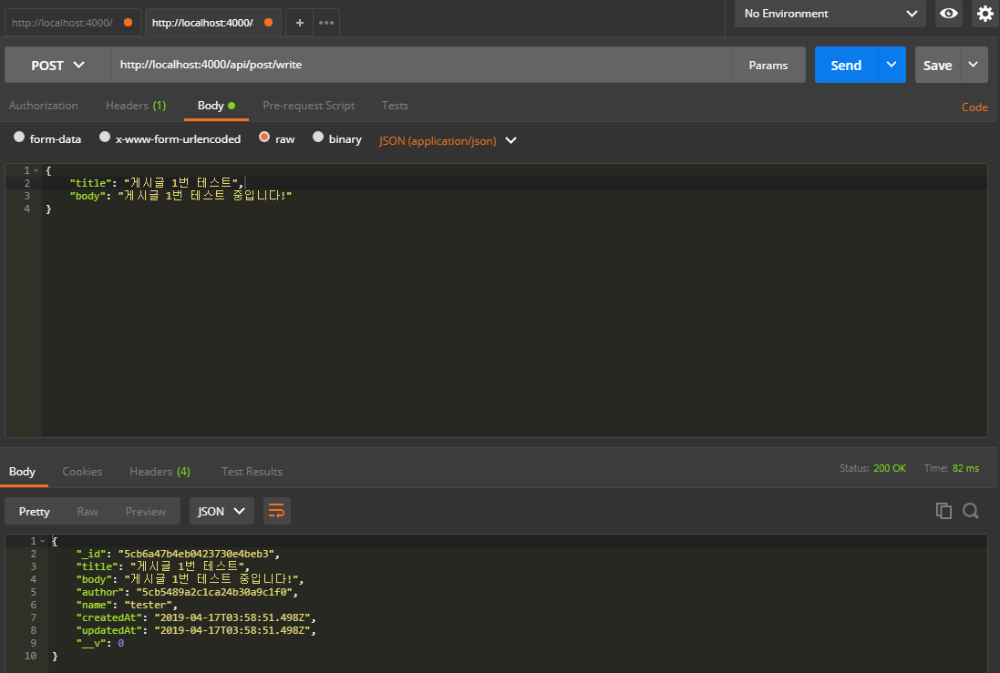

## RestAPI Post(게시판)
사용자 인증을 끝냈으니 이제 게시판 CRUD를 만들어야겠네요!

### 라우터
백문이 불여일타! 매우 칩시다!
```js
- file: /mobx-blog/server/src/api/index.js
import auth from './auth'
import post from './post'   // 추가

const api = new Router()

(...생략)

api.use('/auth', auth.routes())
api.use('/post', post.routes())   // 추가

(...생략)
```

```js
- file: /mobx-blog/server/src/api/post/index.js

import Router from 'koa-router'
import postCtrl from './post.ctrl'

const post = new Router()

post.get('/', (ctx) => {
  ctx.body = '포스트 API 분기점'
})

// 라우터
post.post('/write', postCtrl.write)

export default post 
```

이렇게 라우터를 기본으로 잡아놓고 게시글 모델(Post)을 만들어요!

```js
- file: /mobx-blog/server/src/models/Post.js

import mongoose from 'mongoose'

const Post = new mongoose.Schema({
  title: String,
  body: String,
  author: {
    type: mongoose.Schema.Types.ObjectId,
    ref: 'User'
  },
  name: String,
  createdAt: {
    type: Date,
    default: Date.now
  },
  updatedAt: {
    type: Date,
    default: Date.now
  }
})

export default mongoose.model('Post', Post) 
```

모델은 단순하고 간결하게 만들었습니다. 저는 개발이 전문이 아니라서 좀 코드가 난잡할 수 있습니다! ㅋㅋ

위에 `author`는 몽구스의 객체 아이디로 **User** 모델을 가져올거구요, 그 아래 `name`은 나중에 현 접속한 사용자와 비교하려고 만들었습니다.

이제 게시글 작성을 만들어 보죠!

***

### 게시글 작성 (Create)
```js
- file: /mobx-blog/server/src/api/post/post.ctrl.js

import Post from 'models/Post'
import User from 'models/User'
import Joi from 'joi'

// 포스트 작성 (POST) API '/api/post/write'
exports.write = async (ctx) => {
  // 사용자 로그인 상태 확인
  const { user } = ctx.request

  if (!user) {
    ctx.status = 403  // 권한 없음
    return
  }

  // 입력값 검증
  const data = Joi.object().keys({
    title: Joi.string().required(),
    body: Joi.string().required()
  })

  const result = Joi.validate(ctx.request.body, data)

  if (result.error) {
    ctx.status = 400
    ctx.body = result.error
    return
  }

  // 현재 접속자 정보
  let currentUser = null

  try {
    currentUser = await User.findById(user).exec()
  } catch (err) {
    ctx.throw(500, err)
  }

  // 데이터베이스에 저장할 정보
  const { title, body } = ctx.request.body
  const author = ctx.request.user
  const name = currentUser.username

  // 새 글 작성
  const post = new Post({
    title, body, author, name
  })

  try {
    await post.save()

    ctx.body = post
  } catch (err) {
    ctx.throw(500, err)
  }
} 
```

설명은 주석으로!

포스트 맨을 이용하여 게시글 작성을 해봅시다!



잘 등록되는 군요!! 다음 포스트에서 **게시글 리스트**와 특정 **게시글 보기** 를 만들어 보겠습니다!