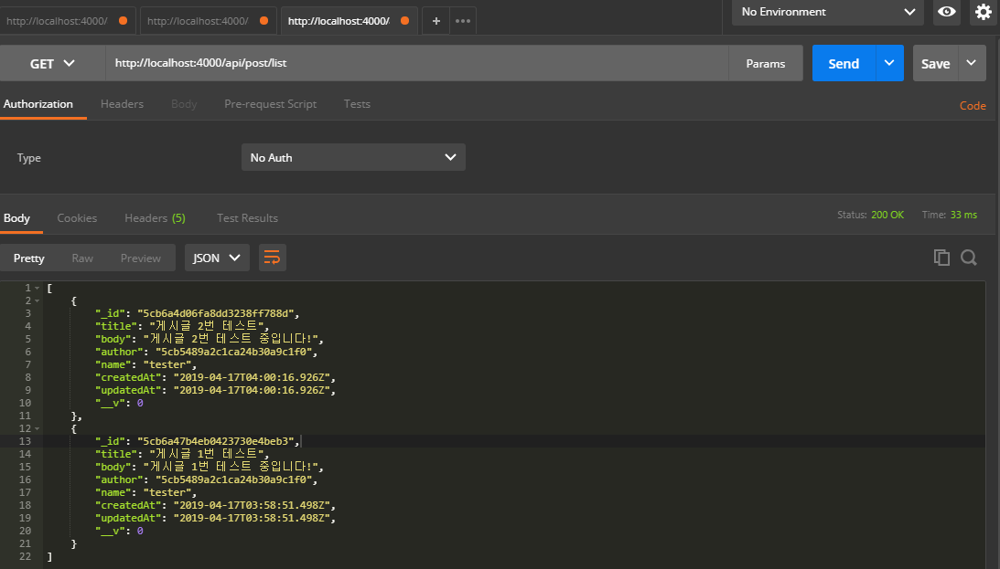
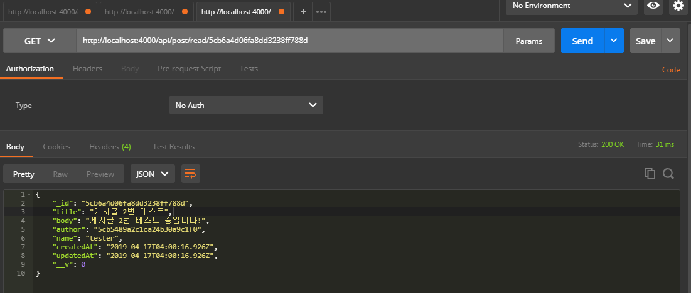

### 게시글 리스트 & 특정 게시글 (Read)
게시글 리스트 보기와 특정 게시글 보기를 만들어보겠습니다.

```js
- file: /mobx-blog/server/src/api/post/post.ctrl.js
(...생략)

// 게시글 리스트 (GET) APi '/api/post/list'
exports.list = async (ctx) => {
  // 파라미터 값으로 페이지값이 없을 시 page = 1, 10진법
  const page = parseInt(ctx.params.page || 1, 10)

  if (page < 1) {
    // page가 1보다 작을 시 잘못된 요청 반환
    ctx.status = 400
    return
  }

  try {
    // sort: _id 값 역순으로 정렬
    const postlist = await Post.find()
                              .sort({_id: -1})
                              .limit(5)
                              .skip((page - 1) * 5).exec()
    const lastpage = await Post.countDocuments().exec

    ctx.set('last-page', Math.ceil(lastpage / 10))
    ctx.body = postlist
  } catch (err) {
    ctx.throw(500, err)
  }
}

// 특정 포스트 글 읽기 (GET) API '/api/post/read/:id'
exports.read = async (ctx) => {
  // 파라미터로 id 값 가져오기
  const { id } = ctx.params

  try {
    const post = await Post.findById(id).exec()

    if (!post) {
      ctx.status = 404
      return
    }

    ctx.body = post
  } catch (err) {
    ctx.throw(500, err)
  }
}
```

특이사항들은 전부 주석에 달아 놓았습니다.

이제 라우터에 추가해주겠습니다.
```js
- file: /mobx-blog/server/src/api/post/index.js

(...생략)

post.get('/list', postCtrl.list)
post.get('/read/:id', postCtrl.read)

(...생략)
```

저 페이지 구성하는 방법은 구글링을 해보시면 정말 정말 많은 방법들이 있으니 참고하시면 좋을 것 같아요~!

다시 포스트맨으로!

***

게시글 리스트


특정 게시글


잘 되네요!!!