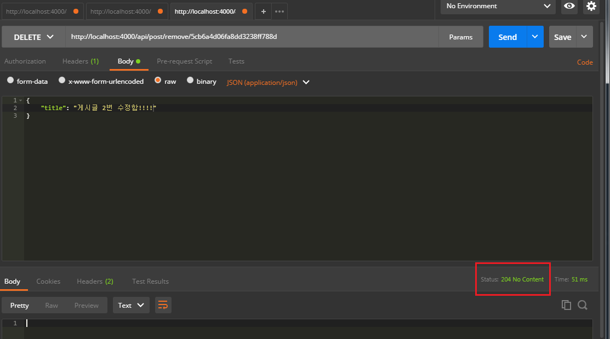

### 특정 게시글 수정 (Update), 삭제 (Delete)
특정 게시글 수정입니다. 이것도 어려운 내용은 없으나 현 접속 사용자와 게시글 작성자를 비교하는 것만 주의하면 될 듯 합니다!

```js
- file: /mobx-blog/server/src/api/post/post.ctrl.js

// 특정 게시글 수정하기 (PUT) API '/api/post/update/:id'
exports.update = async (ctx) => {
  // 게시글 사용자 비교를 위한 user
  const { user } = ctx.request
  const { id } = ctx.params

  ctx.request.body.updatedAt = Date.now()

  try {
    const post = await Post.findByIdAndUpdate(
      id,
      ctx.request.body,
      { new: true }
    ).exec()

    if (!post) {
      ctx.status = 404
      return
    }

    // 접속한 사용자가 업거나 게시글 작성자와 다를 경우
    if (!user || user._id !== post.author.toString()) {
      ctx.status = 403
      return
    }

    ctx.body = post
  } catch (err) {
    ctx.throw(500, err)
  }
}
```

그리고 게시글 삭제!

```js
- file: /mobx-blog/server/src/api/post/post.ctrl.js

// 특정 게시글 삭제하기 (DELETE) API '/api/post/remove/:id'
exports.remove = async (ctx) => {
  // 게시글 사용자 비교를 위한 user
  const { user } = ctx.request
  const { id } = ctx.params

  try {
    const post = await Post.findById(id).exec()

    if (!user || user._id !== post.author.toString()) {
      ctx.status = 403
      return
    }

    await Post.findByIdAndRemove(id).exec()

    ctx.status = 204
  } catch (err) {
    ctx.throw(500, err)
  }
} 
```

라우터에 추가합니다.

```js
- file: /mobx-blog/server/src/api/post/index.js

(...생략)

post.put('/update/:id', postCtrl.update)
post.delete('/remove/:id', postCtrl.remove)

(...생략)
```

그럼 포스트맨으로 다시 확인!!

***

게시글 수정


게시글 삭제


잘 됩니다!

***

이로써 백엔드 사용자 인증(JWT), 게시판(CRUD) 기능은 완성했습니다.

다음 포스트 부터 리액트로 이 백엔드를 바탕으로 구성해보겠습니다!