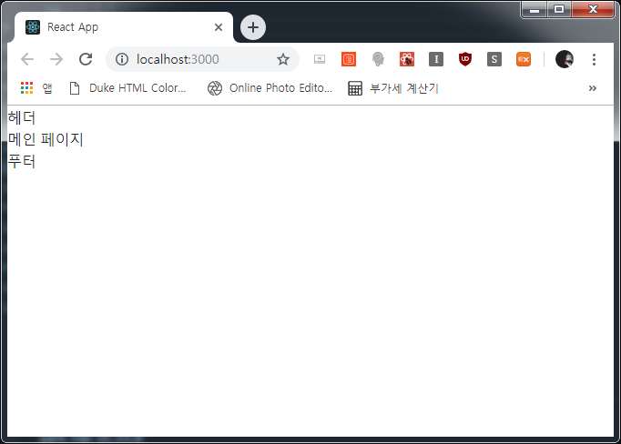

## 리액트 초기 설정
언제나처럼 CRA를 이용하여 리액트 프로젝트를 구성하겠습니다.  
패키지도 함께 하죠!

```js
- path: /mobx-blog
 $ npx create-react-app client
 $ cd client
 $ yarn add react-router-dom mobx mobx-react moment moment-react reactstrap bootstrap axios node-sass
```

이후 git commit을 하여 현 상태를 기록해주고 MobX 상태관리를 할 때 좀 더 편리하게 하기 위하여 데코레이터를 설정합니다. 데코레이터를 설정할 때 `yarn eject`를 하기 위해 git commit이 필요합니다.

```js
- path: /mobx-blog
 $ git add ./
 $ git commit -m "Frontend Start"
 $ cd client
 $ yarn eject
```

`eject`가 끝나면 클라이언트 **package.json**에 바벨 플러그인을 추가합니다.  
가장 아래쪽에 있을 거에요.

```js
- file: /mobx-blog/client/package.json

(...생략)

  "babel": {
    "presets": [
      "react-app"
    ],
    "plugins": [
      ["@babel/plugin-proposal-decorators", { "legacy": true }],
      ["@babel/plugin-proposal-class-properties", { "loose": true }]
    ]
  }

(...생략)
```

그리고 패키지 추가

```js
- path: /mobx-blog/client
 $ yarn add @babel/plugin-proposal-class-properties @babel/plugin-proposal-decorators
```

import 시 조금 더 편리하게 하기 위해 `.env`도 만들어줄게요.

```js
- file: /mobx-blog/client/.env

NODE_PATH=src
```

이제 **src** 폴더안의 index.js를 제외하고 모든 파일을 제거합니다.  
기본 레이아웃을 잡아보죠!

```js
- file: /mobx-blog/client/src/components/App.js

import React, { Component } from 'react'
import { Switch, Route } from 'react-router-dom'

// Pages
import { Mainpage } from 'pages'

class App extends Component {
  render() {
    return (
      <Switch>
        <Route exact path="/" component={Mainpage} />
      </Switch>
    )
  }
}

export default App 
```

```js
- file: /mobx-blog/client/src/components/common/Header.js

import React, { Component } from 'react'

// Style
import 'scss/Header.scss'

class Header extends Component {
  render() {
    return (
      <div className="header">
        헤더
      </div>
    )
  }
}

export default Header 
```

```js
- file: /mobx-blog/client/src/components/common/Footer.js

import React from 'react'

// Style
import 'scss/Footer.scss'

function Footer() {
  return (
    <div className="footer">
      푸터
    </div>
  )
}

export default Footer 
```

```js
- file: /mobx-blog/client/src/components/common/Page.js

import React from 'react'

// Components
import { Header, Footer } from 'components/common'

// Style
import 'scss/Page.scss'

function Page(props) {
  return (
    <div className="page">
      <Header />

      <main>
        { props.children }
      </main>

      <Footer />
    </div>
  )
}

export default Page 
```

```js
- file: /mobx-blog/client/src/components/common/index.js

export { default as Page } from './Page'
export { default as Header } from './Header'
export { default as Footer } from './Footer'
```

```js
- file: /mobx-blog/client/src/pages/Mainpage.js

import React, { Component } from 'react'
import { Page } from 'components/common'

class Mainpage extends Component {
  render() {
    return (
      <Page>
        메인 페이지
      </Page>
    )
  }
}

export default Mainpage 
```

```js
- file: /mobx-blog/client/src/pages/index.js

export { default as Mainpage } from './Mainpage'
```

이렇게 레이아웃을 잡고 MobX 스토어를 물려줄게요
```js
- file: /mobx-blog/client/src/store/header.js

export default class HeaderStore {
  constructor(root) {
    this.root = root
  }
} 
```

```js
- file: /mobx-blog/client/src/store/index.js

import HeaderStore from './header'

export default class RootStore {
  constructor() {
    this.header = new HeaderStore(this)
  }
} 
```

```js
- file: /mobx-blog/client/src/index.js

import React from 'react'
import ReactDOM from 'react-dom'
import { BrowserRouter } from 'react-router-dom'

import 'bootstrap/dist/css/bootstrap.min.css'

// MobX
import { Provider } from 'mobx-react'
import RootStore from 'stores'

import App from 'components/App'

const root = new RootStore()

ReactDOM.render(
  <Provider {...root}>
    <BrowserRouter>
      <App />
    </BrowserRouter>
  </Provider>,
  document.getElementById('root')
)
```

이렇게 해주면 스토어를 `store/index.js` 하나에서 관리하기 편리해집니다.

그리고 나서 가동해보도록 하죠!

```js
- path: /mobx-blog/client

 $ yarn start
```



포스트가 너무 길었네요.. 다음으로... ㅜㅜ
