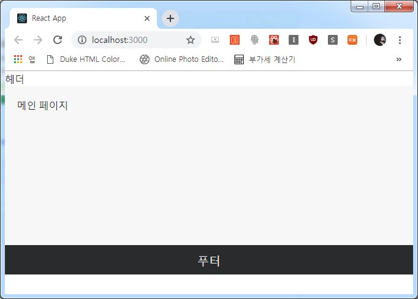
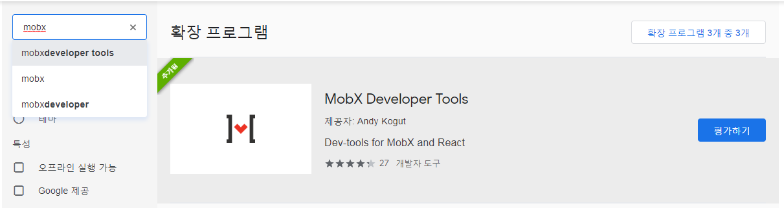
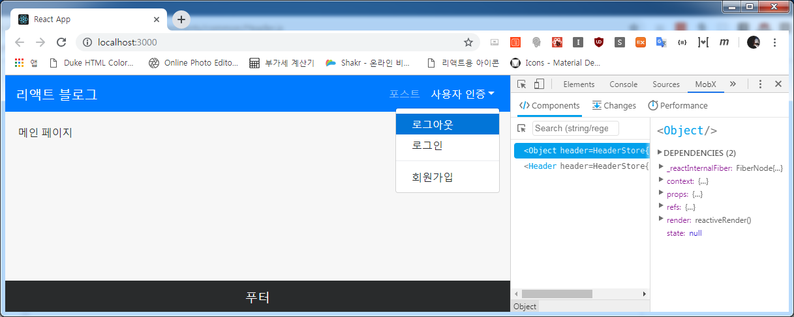

## 페이지 레이아웃
가벼웁게 스타일링을 해주겠습니다. 어차피 리액트 스트랩을 사용할 거라 간단한 것들만 손봐줄게요.(어차피 잘 하지도 못하는뎈ㅋㅋ)

```js
- file: /mobx-blog/client/src/scss/Header.scss

.header {
  .dropdown-item:hover {
    background: #0275d8;
    color: white;
  }
} 
```

```js
- file: /mobx-blog/client/src/scss/Footer.scss

.footer {
  background: #292b2c;
  height: 3rem;
  color: white;
  font-size: 1.2rem;
  display: flex;
  align-items: center;
  justify-content: center;
}
```

```js
- file: /mobx-blog/client/src/scss/Page.scss

.page {
  main {
    background: #f7f7f7;
    min-height: calc(100vh - 3rem - 56px);
    padding: 1.2rem;
  }
} 
```

그럼 아래와 같이 푸터가 턱! 박힐거에요.



MobX를 이용해서 상태를 관리할 거니깐 구글 크롬 웹스토어에서 MobX Developer Tools를 받아주세요!



설치 후 개발자모드에서 Mobx를 선택하면 쨘~



어이쿠... 아직 헤더를 안 만들었는데 미리 찍은게 걸렸군요. ㅋㅋㅋ

### 백엔드 API 연동
package.json의 프록시를 백엔드 Koa 서버랑 물려주겠습니다.

```js
- file: /mobx-blog/client/package.json

(...생략)
 },
 "proxy":"http://localhost:4000/"
}
```

이제 헤더(네비게이션)을 만들어봅시다!

```js
- file: /mobx-blog/client/src/components/common/Header.js

import React, { Component } from 'react'
import { Link } from 'react-router-dom'

// MobX
import { inject, observer } from 'mobx-react'

// React Strap
import { Navbar, NavbarBrand, NavbarToggler, Collapse, Nav,
  NavItem, NavLink, UncontrolledDropdown, DropdownToggle, DropdownMenu, DropdownItem
 } from 'reactstrap'

// Style
import 'scss/Header.scss'

@inject('header')
@observer
class Header extends Component {
  render() {
    const { header } = this.props

    return (
      <div className="header">
        <Navbar color="primary" dark expand="md">
          <NavbarBrand tag={Link} to="/">리액트 블로그</NavbarBrand>
          <NavbarToggler onClick={header.toggleMenu} />
          
          <Collapse isOpen={header.menuOpen} navbar>
            <Nav className="ml-auto" color="white" navbar>
              <NavItem>
                <NavLink tag={Link} to="/">포스트</NavLink>
              </NavItem>
              <UncontrolledDropdown nav inNavbar>
                <DropdownToggle nav caret>
                  사용자 인증
                </DropdownToggle>

                <DropdownMenu right>
                  <DropdownItem>로그아웃</DropdownItem>
                  <DropdownItem tag={Link} to="/auth/login">로그인</DropdownItem>
                  <DropdownItem divider />
                  <DropdownItem tag={Link} to="/auth/register">회원가입</DropdownItem>
                </DropdownMenu>
              </UncontrolledDropdown>
            </Nav>
          </Collapse>
        </Navbar>
      </div>
    )
  }
}

export default Header
```

https://reactstrap.github.io/components/navbar/ 이곳에 설명이 자세히 나와있으니 보시면 네브 구조는 쉽게 이해하실 수 있으실 겁니다.

우선 위에 MobX 상태 관리를 위해 데코레이터를 사용한(@) 것이 보일거에요.

`inject`로 사용하고 싶은 스토어를 부르고 `observer`로 변화가 이뤄지면 감시를 할 대상 컴포넌트를 지정해 주면 저 위에 있는 **header** 라는 스토어를 사용할 수가 있습니다.  
`header` 스토어는 또한 *this.props*로 지정하여 사용하면 아래 구문들이 간결해 지겠죠!

일단 아직 상태관리를 하지는 않았습니다.

다음 포스트에서 저 네비게이션에 사용할 상태 관리를 만들고 로그인/회원가입 등의 사용자 인증관리를 만들게요!