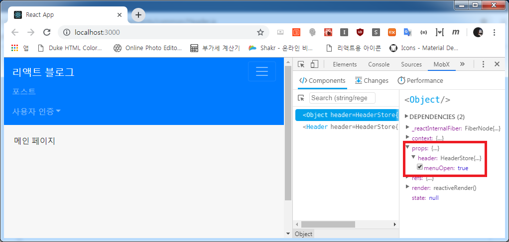
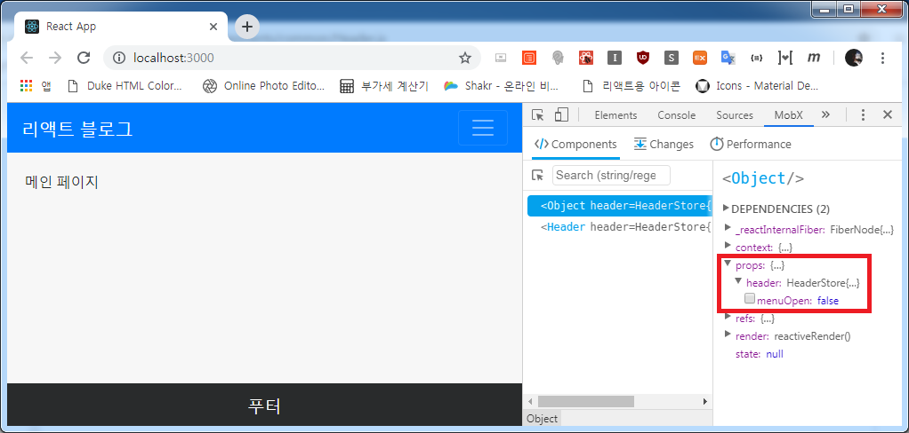
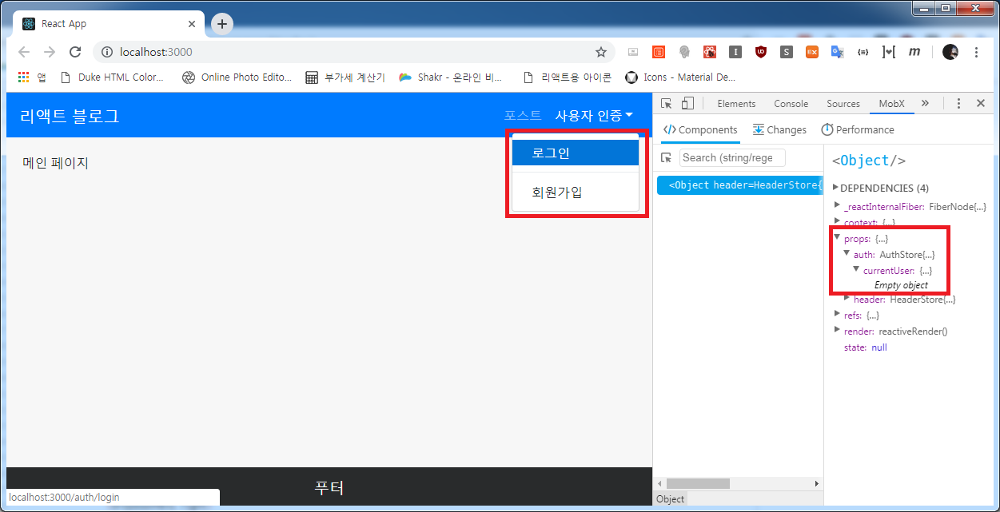
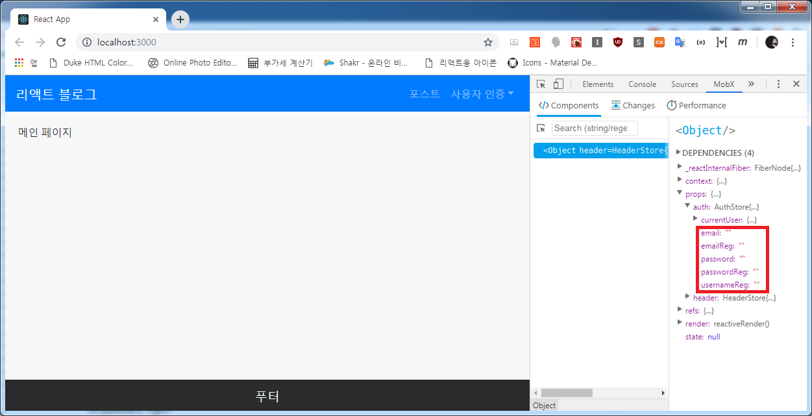
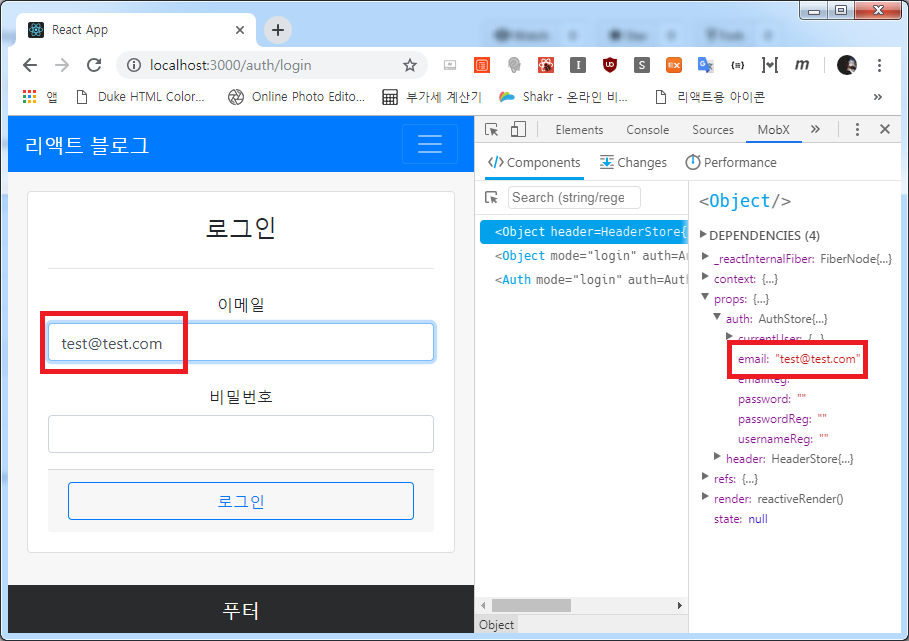
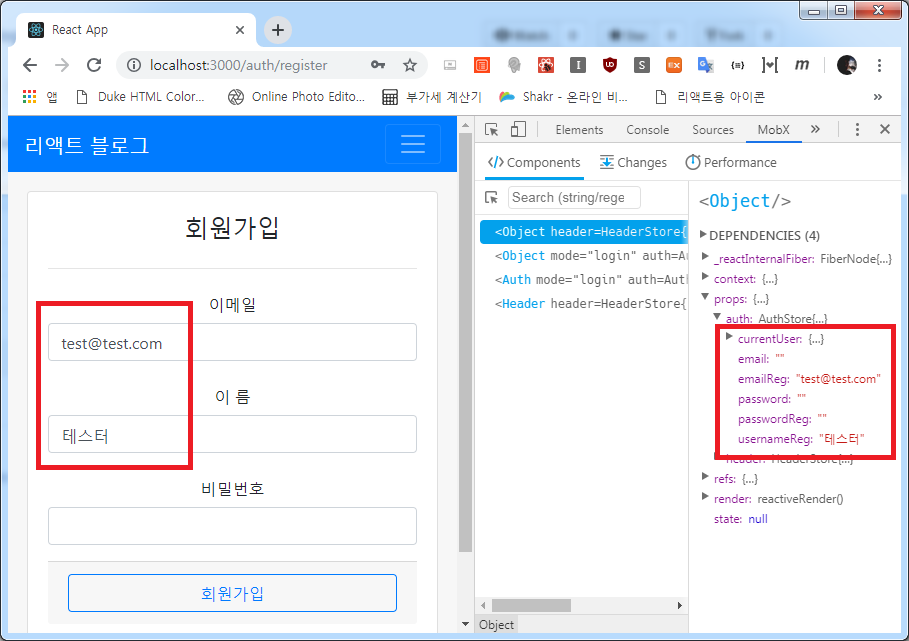
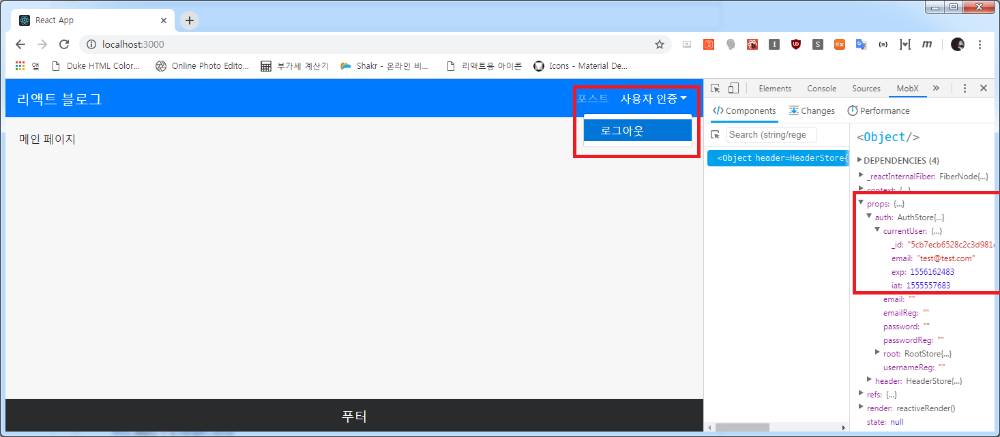

## 사용자 인증
이번엔 사용자 인증을 만들겠습니다.

아... 그 전에 헤더부분을 먼저 손봐야죠... (토글이라던가... 토글이라던가...)

```js
- file: /mobx-blog/client/src/components/common/Header.js

(...생략)

<NavbarBrand tag={Link} to="/">리액트 블로그</NavbarBrand>
          <NavbarToggler onClick={header.toggleMenu} />
          
          <Collapse isOpen={header.menuOpen} navbar>
            <Nav className="ml-auto" color="white" navbar>

(...생략)
```

```js
- file: /mobx-blog/client/src/stores/header.js

import { observable, action } from 'mobx'

export default class HeaderStore {
  @observable menuOpen = false

  @action toggleMenu = () => {
    this.menuOpen = !this.menuOpen
  }
}
```

이렇게 *menuOpen*에 메뉴토글을 Boolean 값으로 넣어주고 그것을 클릭시마다 ! 역변환을 시켜주면 간단하게 토글~

이제 인증을 해봅시다!

```js
- file: /mobx-blog/client/src/stores/auth.js

import { observable, action } from 'mobx'
import axios from 'axios'

export default class AuthStore {
  // 로그인 상태 확인
  @observable currentUser = {}

  @action isLoggedIn = async () => {
    await axios.get('/api/auth/check')
      .then(res => {
        this.currentUser = res.data
      })
      .catch((err) => {
        return
      })
  }
}
```

현재 접속되어 있는 사용자 확인입니다.  
백엔드 API에서 받아온 데이터를 `auth` 스토어의 **currentUser** 상태(state)에 넣어줍니다. 나중에 이 값을 헤더를 불러올 때 componentDidMount()에 넣어서 로그인 상태 점검을 하면 될 거 같습니다.

이어서 로그인 구현입니다.

```js
- file: /mobx-blog/client/src/stores/auth.js

(...이어서)

  // 로그인 구현
  @observable email = ''
  @observable password = ''

  @action changeEmail = (e) => {
    this.email = e.target.value
  }

  @action changePassword = (e) => {
    this.password = e.target.value
  }

  @action loginSubmit = (e) => {
    e.preventDefault()
    axios.post('/api/auth/login', {
      email: this.email,
      password: this.password
    }).then(res => {
      document.location.href="/"
    }).catch((err) => console.error(err))
  }

  @action keyPressLogin = (e) => {
    if (e.key === 'Enter') {
      this.loginSubmit(e)
    }
  }
```
`email`, `password`의 상태를 만들고 각각 입력값이 변화함에 따라 상태를 넣어주고, 로그인 버튼이 Submit 되면 백엔드 `/api/auth/login`으로 `email`과 `password` 상태 값을 넣어줍니다.

로그인 시 마우스 클릭도 하지만 엔터를 치시는 분들이 많으므로 **onKeyPress** 이벤트로 연결해 줍니다.

이어서 회원가입입니다.

```js
- file: /mobx-blog/client/src/stores/auth.js

(...이어서)

  // 회원가입 구현
  @observable emailReg = ''
  @observable usernameReg = ''
  @observable passwordReg = ''

  @action changeEmailReg = (e) => {
    this.emailReg = e.target.value
  }

  @action changeUsernameReg = (e) => {
    this.usernameReg = e.target.value
  }

  @action changePasswordReg = (e) => {
    this.passwordReg = e.target.value
  }

  @action registerSubmit = (e) => {
    e.preventDefault()
    axios.post('/api/auth/register', {
      email: this.emailReg,
      username: this.usernameReg,
      password: this.passwordReg
    }).then(res => {
      document.location.href="/"
    }).catch((err) => console.error(err))
  }

  @action keyPressRegister = (e) => {
    if (e.key === 'Enter') {
      this.registerSubmit(e)
    }
  }
```

로그인과 거의 유사하여 설명은 없어도 될 듯 하지만, 로그인 상태관리와 헷갈릴 수 있어서 걍 뒤에 `Reg` 를 붙여줬습니다.  
나머지는 로그인과 동일합니다.

이제 제일 쉬운 로그아웃!

```js
- file: /mobx-blog/client/src/stores/auth.js

(...이어서)

  // 로그아웃 구현
  @action handleLogout = () => {
    axios.post('/api/auth/logout')
      .then(() => {
        document.location.href="/"
      })
      .catch((err) => {
        console.error(err)
        return
      })
  }
```

그리고 루트 스토어에 물려주겠습니다.

```js
- file: /mobx-blog/client/src/stores/index.js

import HeaderStore from './header'
import AuthStore from './auth'

export default class RootStore {
  constructor() {
    this.header = new HeaderStore(this)
    this.auth = new AuthStore(this)
  }
}
```

네브바에 적용시킵니다.

```js
- file: /mobx-blog/client/src/components/common/Header.js

(...생략)

  <DropdownMenu right>
    {auth.currentUser._id ?
      <DropdownItem onClick={auth.handleLogout}>로그아웃</DropdownItem>
        :
      <>
        <DropdownItem tag={Link} to="/auth/login">로그인</DropdownItem>
        <DropdownItem divider />
        <DropdownItem tag={Link} to="/auth/register">회원가입</DropdownItem>
      </>
    }
  </DropdownMenu>

(...생략)
```

아이고... 길어진다... ㅋㅋㅋ

이제 돌려보시면!



보시는 것과 같이 `menuOpen` state가 props 안의 header안에 유지되는 것을 확인할 수 있습니다.

주욱 한번 보시지요!








다음 포스트에서 게시글을 다뤄보겠습니다. 뿅~