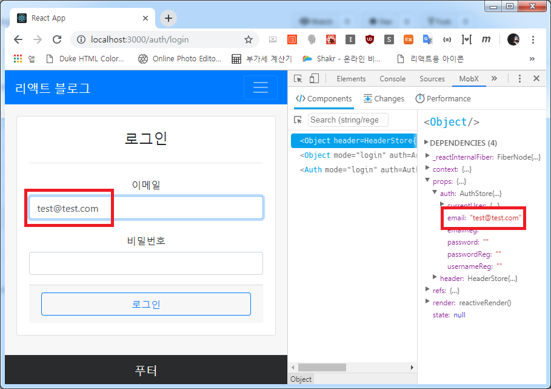
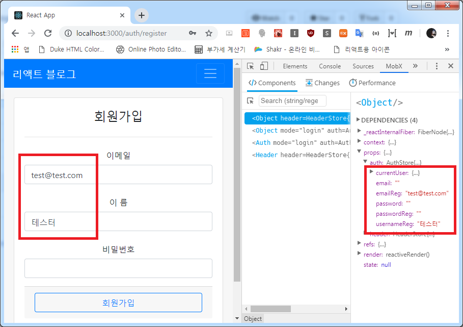
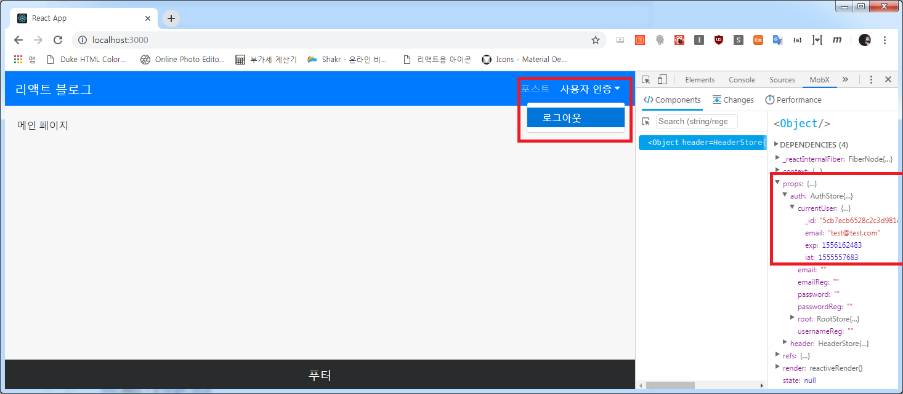

## 사용자 인증 페이지
지난 포스트에서 만들지도 않은 사용자 인증 페이지를 보여드려 사과드립니다 (__);;  
ㅋㅋ.. 사실 미리 만들어놓고 조금씩 쪼개다 보니 나온 실수...

그럼 인증 페이지를 구현해봅시다!

```js
- file: /mobx-blog/client/src/components/App.js

(...생략)
// Pages
import { Mainpage, Authpage } from 'pages'

class App extends Component {
  render() {
    return (
      <Switch>
        <Route exact path="/" component={Mainpage} />
        <Route path="/auth/:mode" component={Authpage} />
      </Switch>
    )
  }

(...생략)
```

`App` 에 인증 페이지(`Authpage`)를 물려주고 *Login*과 *Register*를 각 모드별로 사용하기 위해 파라미터로 `:mode`를 넣어주었습니다.

그럼 우선 인증 페이지를 만들구요!

```js
- file: /mobx-blog/client/src/pages/Authpage.js

import React from 'react'

// Components
import { Page } from 'components/common'
import { Auth } from 'components/auth'

function Authpage(props) {
  const { match } = props

  return (
    <Page>
      <Auth mode={match.params.mode} />
    </Page>
  )
}

export default Authpage 
```

```js
- file: /mobx-blog/client/src/pages/index.js

export { default as Mainpage } from './Mainpage'
export { default as Authpage } from './Authpage' 
```

`Auth` 컴포넌트를 만들어서 파라미터 값에 따라 로그인과 회원가입을 나눠보여주도록 할게요. 
그리고 기존 인덱스 파일로 묶어줍니다.

이제 저 `Auth` 컴포넌트를 만들겠습니다!

```js
- file: /mobx-blog/client/src/components/auth/Auth.js

import React, { Component } from 'react'

// MobX
import { inject, observer } from 'mobx-react'

// React Strap
import { Row, Col,
  Form, FormGroup, Label, Input, CardFooter, Button,
  Card, CardTitle } from 'reactstrap'

@inject('auth')
@observer
class Auth extends Component {
  render() {
    const { auth, mode } = this.props

    const loginView = (
      <Card body>
        <CardTitle className="h4">로그인</CardTitle>
        <hr />
        <Form>
          <FormGroup row>
            <Label for="email" sm={3}>이메일</Label>
            <Col sm={9}>
              <Input type="email" id="email"
                value={auth.email} onChange={auth.changeEmail} autoFocus
              />
            </Col>
          </FormGroup>
          <FormGroup row>
            <Label for="password" sm={3}>비밀번호</Label>
            <Col sm={9}>
              <Input type="password" id="password"
                value={auth.password} onChange={auth.changePassword}
                onKeyPress={auth.keyPressLogin}
              />
            </Col>
          </FormGroup>
        </Form>
        <CardFooter>
          <Button block outline color="primary"
            onClick={auth.loginSubmit}
          >
            로그인
          </Button>
        </CardFooter>
      </Card>
    )

    const registerView = (
      <Card body>
        <CardTitle className="h4">회원가입</CardTitle>
        <hr />
        <Form>
          <FormGroup row>
            <Label for="emailReg" sm={3}>이메일</Label>
            <Col sm={9}>
              <Input type="email" id="emailReg"
                value={auth.emailReg} onChange={auth.changeEmailReg} autoFocus
              />
            </Col>
          </FormGroup>
          <FormGroup row>
            <Label for="usernameReg" sm={3}>이 름</Label>
            <Col sm={9}>
              <Input type="username" id="usernameReg"
                value={auth.usernameReg} onChange={auth.changeUsernameReg}
              />
            </Col>
          </FormGroup>
          <FormGroup row>
            <Label for="passwordReg" sm={3}>비밀번호</Label>
            <Col sm={9}>
              <Input type="password" id="passwordReg"
                value={auth.passwordReg} onChange={auth.changePasswordReg}
                onKeyPress={auth.keyPressRegister}
              />
            </Col>
          </FormGroup>
        </Form>
        <CardFooter>
          <Button block outline color="primary"
            onClick={auth.registerSubmit}
          >
            회원가입
          </Button>
        </CardFooter>
      </Card>
    )

    return (
      <Row className="text-center" style={{ justifyContent: 'center' }}>
        <Col sm="4">
          {mode === 'login' ? loginView : registerView}
        </Col>
      </Row>
    )
  }
}

export default Auth 
```

```js
- file: /mobx-blog/client/src/auth/index.js

export { default as Auth } from './Auth'
```

긴듯 하지만 별거 없습니다. **mode**  파라미터값에 따라 *loginView*와 *registerView*를 나누어 보여주도록 했고 사전에 만들어 놓은 `auth 스토어`를 불러와 Input 값을 물려주고, Change 이벤트도 물려주고 최종칸에서는 keyPress 이벤트도 물려줍니다.

그럼 이제 `auth 스토어`에 만들어 두었던 **isLoggedIn**을 브라우저에 존재하는 Cookie의 'access_token' 값을 적용합니다.

```js
- file: /mobx-blog/client/src/components/common/Header.js

(...생략)

@inject('header', 'auth')
@observer
class Header extends Component {
  componentDidMount() {
    this.props.auth.isLoggedIn()
  }
}

(...생략)
```

그리고 각 스토어들을 서로 교차로 불러올 수 있게 root 설정을 해줄게요

```js
- file: /mobx-blog/client/src/stores/auth.js

import axios from 'axios'

export default class AuthStore {
  constructor(root) {
    this.root = root
  }

  // 로그인 상태 확인
(...생략)
```

```js
- file: /mobx-blog/client/src/stores/header.js

import { observable, action } from 'mobx'

export default class HeaderStore {
  constructor(root) {
    this.root = root
  }

  @observable menuOpen = false
(...생략)
```

이러면!





이상없이 인증절차가 잘 실행되고 로그인 상태 추적이 되는 것을 확인할 수 있습니다!

다음 포스트에서는 게시글 작성 및 리스트 출력 등의 게시글 관련 프론트엔드를 작성할게요!