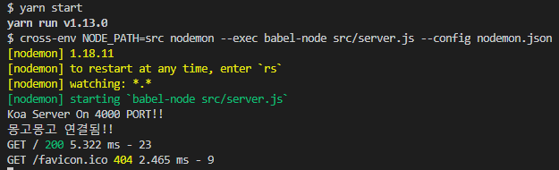

## Koa 서버
그럼 먼저 프로젝트 초기화부터!

```js
- path: /mobx-blog/server

 $ yarn init --yes
 $ yarn add koa koa-router koa-morgan koa-bodyparser mongoose dotenv jsonwebtoken
 $ yarn add cross-env nodemon babel-cli babel-preset-env babel-preset-stage-3 --dev
```

와장창 설치하고 설정파일들을 만듭니다!

```js
- file: /mobx-blog/server/.env

PORT=4000
MONGO_URI=mongodb://localhost/mobx-blog
SECRET_KEY=mobxblog1$1$123$
```

```js
- file: /mobx-blog/server/nodemon.json

{
  "env": {
    "JWT_SECRET": "mobxblog1#1#123$"
  }
}
```
위 파일은 이 프로젝트에서 사용자 인증을 **Json Webtoken**을 사용할 건데 .env 파일에 넣은 상태로
*nodemon*으로 서버를 가동하니 에러가 나더군요. 그래서 구글링을 해 보니 루트 디렉토리에 `nodemon.json`으로
넣어주니 잘 되길래 만드는 겁니다!(전 초보라 잘 몰라요!)

```js
- file: /mobx-blog/server/.babelrc

{
  "presets": [
    "env", "stage-3"
  ]
}
```

그리고 `package.json`을 수정합니다.

```js
- file: /mobx-blog/server/package.json

{
  (...)
  },
  "scripts": {
    "start": "cross-env NODE_PATH=src nodemon --exec babel-node src/server.js --config nodemon.json"
  }
}
```

그리고 서버 파일 생성!

```js
- file: /mobx-blog/server/src/server.js

import { config } from 'dotenv'

// Koa Server 모듈
import Koa from 'koa'
import Router from 'koa-router'
import bodyParser from 'koa-bodyparser'
import morgan from 'koa-morgan'

// MongoDB 모듈
import mongoose from 'mongoose'

// Dotenv 설정파일 사용 (/.env)
config()

// 서버, 라우터, Process.env 레퍼런스 작성
const app = new Koa()
const router = new Router()
const { PORT: port=4000, MONGO_URI: mongoURI } = process.env

// MongoDB NodeJS 프라미스 사용 선언
mongoose.Promise = global.Promise

// Database 세팅
mongoose.connect(mongoURI, { useNewUrlParser: true })
.then(() => console.log('몽고몽고 연결됨!!'))
.catch((err) => console.error(err.stack))

// 미들웨어
app.use(morgan('dev'))
.use(bodyParser())
.use(router.routes())
.use(router.allowedMethods())

router.get('/', (ctx) => {
  ctx.body = '루트 경로 테스트'
})

// Server Listening
app.listen(port, () => console.log(`Koa Server On ${port} PORT!!`))
```

헉헉.... 설정이 더 오래 걸리는 군요 ㅜㅜ

그리고 나서 서버를 가동해 봅니다!  
```js
 $ /mobx-blog/yarn server
  또는
 $ /mobx-blog/server/yarn start
```




잘 실행됩니다!! (몽고몽고하군욬ㅋ)