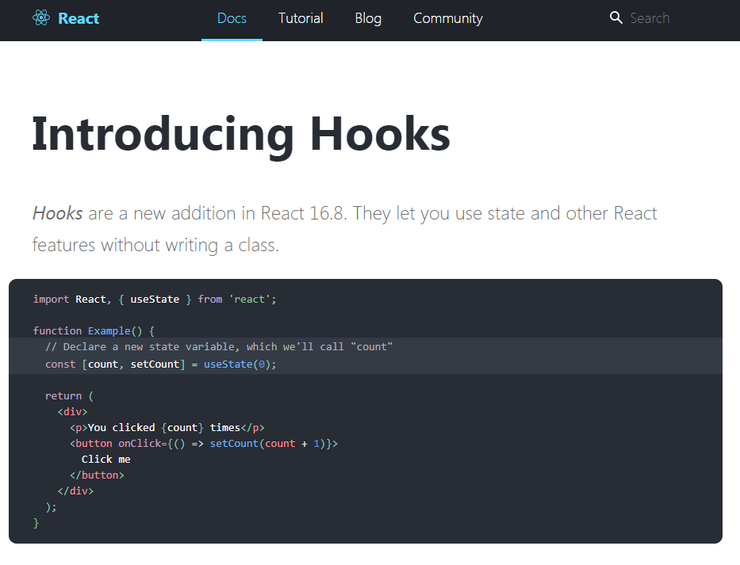

# 블로그가 좀 정리되나 싶으면!
여지없이 새로운 기술들이 쏟아져 나온다!!! 아 행복해 ㅜㅜ

뭐 좀 해볼라 치면 새로운 게 하도 나와서 행복하면서 머리아프면서 좋으면서 짜증나면서 ㅋㅋㅋㅋㅋㅋㅋㅋㅋ

암튼 뭐 GraphQL도 아직 제대로 적응 못했고, Hooks는 좀 마음에 드는 구석이 많아 먼저 좀 익혀보려고 한다.

## 공홈을 참고!!
역시나 시작은 공홈에서!!!
> https://reactjs.org/docs/hooks-intro.html



일단 기존 리액트 작성법과 가장 큰 차이점이라 하면 Class를 사용하지 않고도 State 및 다른 리액트 기능들을 사용할 수 있다고 한다.

기존 코드와 비교해보면!

```js
import React from 'react'

class Test extends React.Component {
  state = {
    count: 0
  }

  setCount = () => {
    this.setState({
      count: count + 1
    })
  }

  render() {
    const { count } = this.props
    const { setCount } = this

    return (
      <div>
        <p>당신은 {count}번 클릭하셨습니다!</p>
        <button onClick={setCount}>
          클릭!
        </button>
      </div>
    )
  }
}

export default Test
```

위와 같은 코드를 훅스로 작성을 하면,

```js
import React, { useState } from 'react'

const Test = () => {
  const [ count, setCount ] = useState(0)

  return (
    <div>
      <p>당신은 {count}번 클릭하셨습니다!</p>
      <button onClick={() => setCount(count + 1)}>
        클릭!
      </button>
    </div>
  )
}

export default Test
```

이렇게 간단해진다! 자세한 훅스 내용은 블로그를 바꾸면서 적어보자!