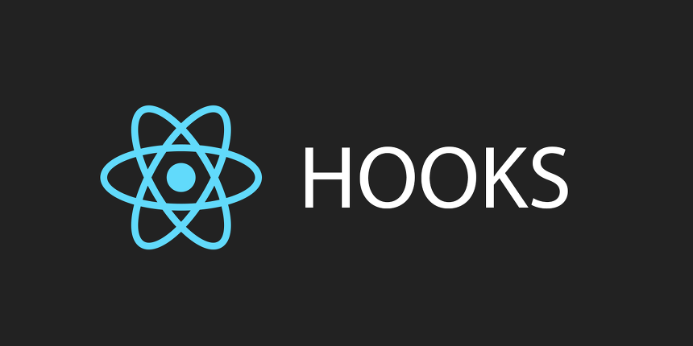
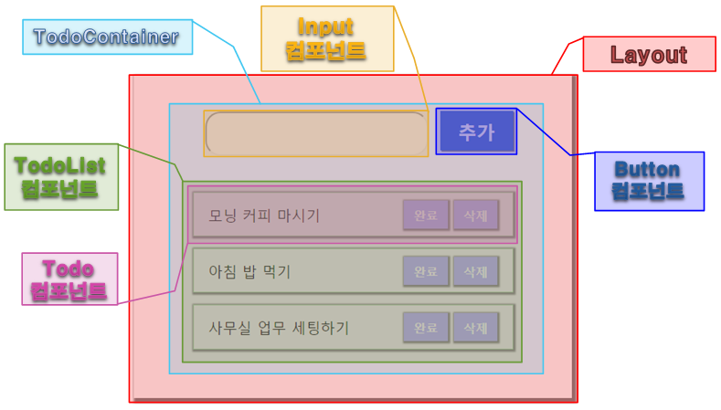
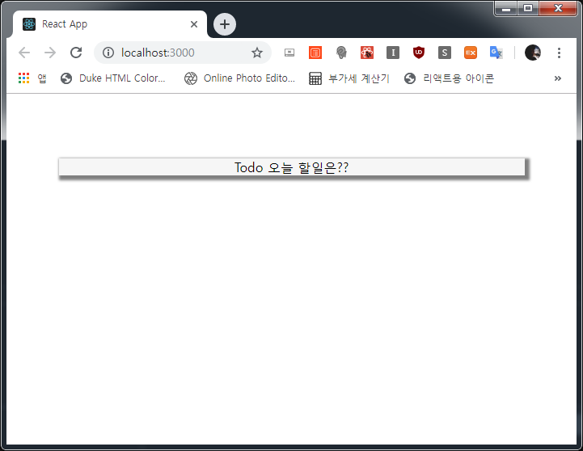
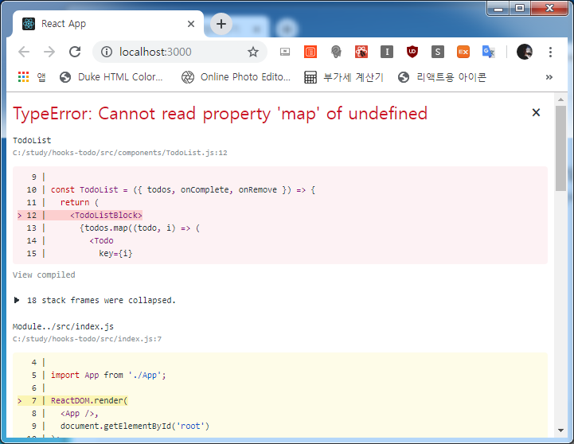
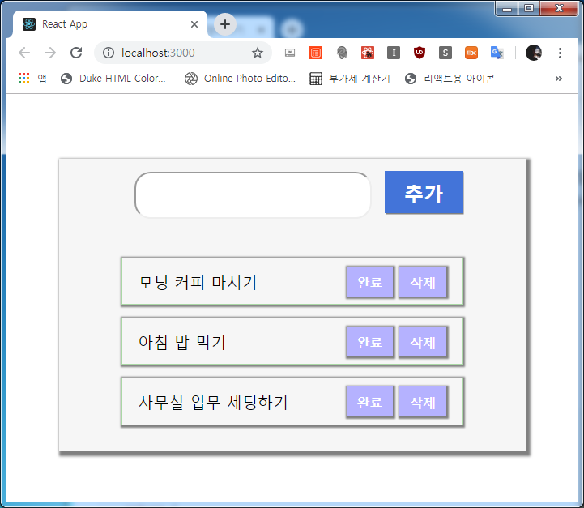

# **React Hooks Todo** 만들기!
언제까지 Todo 시리즈를 만들어야 끝나는 건가용 ㅋㅋㅋㅋㅋㅋ

훅스로 Todo를 한 번 만들어보고, 다음 포스트에서 Redux를 훅스랑 접목해서 같은 Todo를 만들어 봐야겠습니당~



## 프로젝트 초기화 및 구조
```js
- 프로젝트 초기화
$ yarn create react-app hooks-todo
$ yarn add styled-components
```

CRA를 이용해서 리액트 프로젝트를 구성하고 모듈은 Styled Components 하나만 설치합니당.  
(어차피 스타일링도 제대로 못하면서....... OTL )

쓰지 않는 파일들을 정리해주고 (App.test.js, Logo.svg, App.css) 아래와 같은 구조로 만들죠.

```js
[hooks-todo]
─┬ <public>
 │ ├ favicon.ico
 │ ├ index.html
 │ ├ logo192.png
 │ ├ logo512.png
 │ ├ manifest.json
 │ └ robots.txt
─┼ <src>
 │ ├ <components>
 │ │ ├ Button.js
 │ │ ├ Input.js
 │ │ ├ Todo.js
 │ │ └ TodoList.js
 │ ├ <containers>
 │ │ └ TodoContainer.js
 │ ├ App.js
 │ ├ index.css
 │ └ index.js
─┼ .gitignore
 ├ package.json
 └ yarn.lock
```

이번에 만들 Todo 프로젝트는 아래와 같은 컴포넌트로 만들겁니당.



더 잘게 쪼갤 수도 있지만, 귀찮기도 하고 너무 잘게 쪼개면 제 머리가 못 따라갈 거 같아서 이만큼만 쪼개겠습니다. ㅋㅋㅋ

프로젝트 초기화를 위해 기존 파일들을 정리할게요.

```js
- src/index.js

import React from 'react';
import ReactDOM from 'react-dom';
import './index.css';

import App from './App';

ReactDOM.render(
  <App />,
  document.getElementById('root')
);
```

```css
- src/index.css

body {
  margin: 0;
  padding: 0;
  box-sizing: border-box;
}

a {
  color: inherit;
  text-decoration: none;
}
```

이제 `App`을 수정할 텐데요. 이전까지는 css나 scss 파일을 import해서 스타일링을 주로 했었는데, 요즘 유행하는
CSS in JS 같은 기능을 수행해 주며 scss와 같은 구조로 스타일링을 할 수 있는 **styled-components**를 사용할 겁니다.

아래와 같이 코딩합니다.

```js
- src/App.js

import React from 'react';
import styled from 'styled-components';

// div를 'Layout'으로 컴포넌트처럼 만들어서 스타일링
const Layout = styled.div`
  width: 576px;
  background: #F6F6F6;
  display: flex;
  margin: 0 auto;
  margin-top: 5rem;
  justify-content: center;
  box-shadow: 3px 3px 3px 3px gray;
`;

const App = () => {
  return (
    <Layout>
      Todo 오늘 할일은??
    </Layout>
  );
};

export default App;
```

이후 `$ yarn start`로 실행하여 브라우저 확인~!



그럼 이어서 **TodoContainer** 를 만듭니당.

```js
- src/containers/TodoContainer.js

import React from 'react';

const TodoContainer = () => {
  return (
    <div>
      Todo 컨테이너
    </div>
  )
};

export default TodoContainer;
```

그리고 이어서 `App`에 반영

```js
- src/App.js

...생략...
import TodoContainer from './containers/TodoContainer';

// div를 'Layout'으로 컴포넌트처럼 만들어서 스타일링
const Layout = styled.div`
  width: 576px;

...생략...

const App = () => {
  // Container 삽입
  return (
    <Layout>
      <TodoContainer />
    </Layout>
  );
};

```

그럼 이제 컨테이너에 들어갈 **Button, Input, Todo, TodoList** 컴포넌트를 차례로 만들어 컨테이너에 반영하겠습니다.
우선 먼저 등록되어 있을 Todo 리스트 내용을 `useState`를 통해 선언할게요~!  
이 `useState`는 함수용 컴포넌트에서도 가변적인 상태(state)를 지니고 관리할 수 있게 해주는 가장 기본적인 Hook입니다.

```js
- src/components/Button.js

import React from 'react';
import styled from 'styled-components';

const ButtonBlock = styled.button`
  display: inline-flex;
  align-items: center;
  font-weight: 600;
  font-size: 1.5rem;
  outline: none;
  border: none;
  color: white;
  background: #4374D9;
  margin: 0;
  padding: .6rem 1.5rem;
  box-shadow: 1.5px 1.5px gray;
  
  &:hover {
    background: #6798FD;
  }
`;

const Button = ({ onClick, children }) => {
  return (
    <ButtonBlock onClick={onClick}>
      { children }
    </ButtonBlock>
  );
};

export default Button;
```

```js
- src/components/Input.js

import React from 'react';
import styled from 'styled-components';

const InputBox = styled.input`
  margin: 1rem;
  padding: 1rem 1.5rem;
  border-radius: 20px;
  font-size: 1.2rem;
  
  &:hover {
    background: #FFEEFB;
  }
`;

const Input = ({ type, name, value, onChange, onKeyPress }) => {
  return (
    <InputBox
      type={type}
      name={name}
      value={value}
      onChange={onChange}
      onKeyPress={onKeyPress}
    />
  );
};

export default Input;
```

```js
- src/components/Todo.js

import React from 'react';
import styled from 'styled-components';

const TodoBlock = styled.div`
  display: flex;
  align-items: center;
  justify-content: space-between;
  margin: 0 auto;
  margin-bottom: 1rem;
  padding: .6rem 1.2rem;
  font-size: 1.2rem;
  border: 1px solid #AAD7A5;
  box-shadow: 1px 1px 2px 2px gray;

  &:hover {
    box-shadow: 2px 2px 2px 2px gray;
  }

  .switch {
    margin-left: auto;
  }
`;

const SwitchBtn = styled.button`
  margin-left: .5rem;
  padding: .5rem .8rem;
  outline: none;
  border: none;
  color: white;
  background: #B5B2FF;
  font-size: 1rem;
  font-weight: 600;
  box-shadow: 1px 1px 2px 2px gray;

  &:hover {
    box-shadow: 2px 2px 2px 2px gray;
  }
`;

const Todo = ({ todo, onComplete, onRemove }) => {
  return (
    <TodoBlock style={{
      textDecoration: todo.isDoit ? 'line-through' : '',
      background: todo.isDoit ? '#D5D5D5' : ''
    }}>
      <span>{ todo.text }</span>
      <div className="switch">
        <SwitchBtn onClick={onComplete}>완료</SwitchBtn>
        <SwitchBtn onClick={onRemove}>삭제</SwitchBtn>
      </div>
    </TodoBlock>
  );
};

export default Todo;
```

```js
- src/components/TodoList.js

import React from 'react';
import styled from 'styled-components';
import Todo from './Todo';

const TodoListBlock = styled.div`
  width: 100%;
  margin: 2rem 0rem;
`;

const TodoList = ({ todos, onComplete, onRemove }) => {
  return (
    <TodoListBlock>
      {todos.map((todo, i) => (
        <Todo
          key={i}
          index={i}
          todo={todo}
          onComplete={() => onComplete(i)}
          onRemove={() => onRemove(i)}
        />
      ))}
    </TodoListBlock>
  );
};

export default TodoList;
```

이 컴포넌트들을 컨테이너에 반영

```js
- src/containers/TodoContainer.js

import React from 'react';

import Button from '../components/Button';
import Input from '../components/Input';
import TodoList from '../components/TodoList';

const TodoContainer = () => {
  return (
    <div>
      <Input
        type="text"
        name="todo"
      />
      <Button>추가</Button>
      <TodoList />
    </div>
  )
};

export default TodoContainer;
```

그러면 이렇게 에러가 뙇!!!



당연하죠? **map** 으로 돌릴 배열이 없으니까요 ㅋㅋ  
그러면 Todo에 기본 값을 넣어줍시다. 이제 `useState`를 사용합니다.

```js
- src/containers/TodoContainer.js

import React, { useState } from 'react';  // useState 추가

...생략...

const TodoContainer = () => {
  // 배열을 todos라는 state에 적용, 그 state를 조작하려면 setTodos(value) 형식으로 사용
  const [todos, setTodos] = useState([
    { text: '모닝 커피 마시기', isDoit: false },
    { text: '아침 밥 먹기', isDoit: false },
    { text: '사무실 업무 세팅하기', isDoit: false }
  ]);

  return (
    <div>
      <Input
        type="text"
        name="todo"
      />
      <Button>추가</Button>
      <TodoList
        todos={todos}
      />
    </div>
  )
};

export default TodoContainer;
```

그러면 화면이 뙇!!!



와... 내용은 별 거 없는데 스샷 때문에 엄청 길어지는 군요... -_-  
그럼 state 조작 및 최적화 과정은 다음 포스트에서 이어하겠습니다.