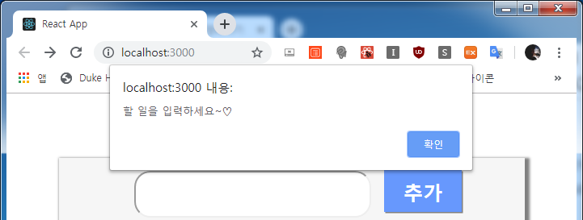
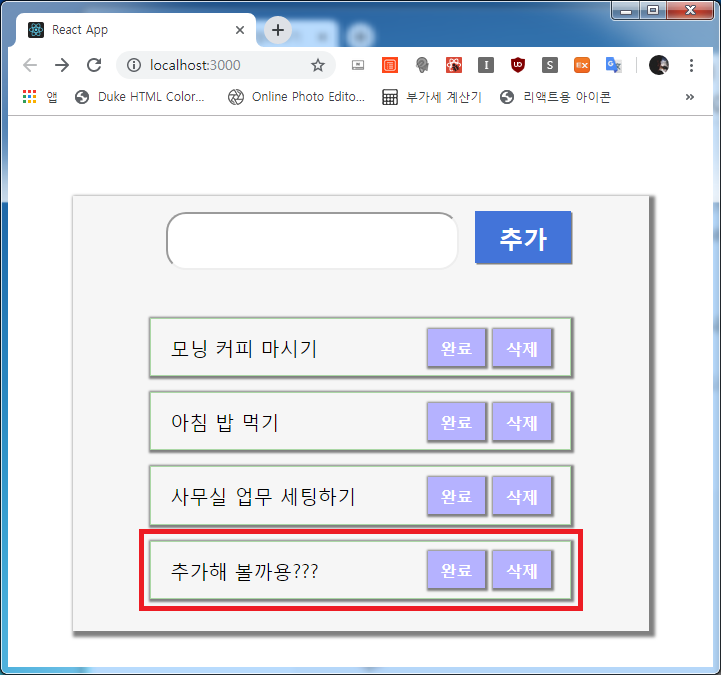
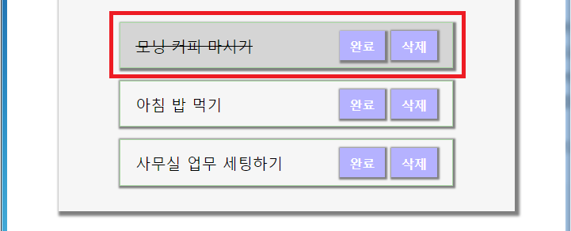
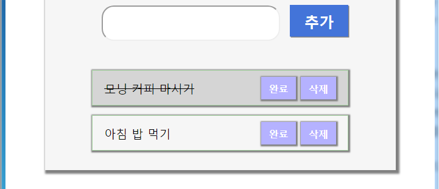

# **React Hooks Todo** 만들기(2)!
그럼 이어서 **TodoContainer** 에 Todo App 기능들을 부여해 볼게요.

먼저 `Input` 값을 받기 위한 state를 추가해 주고 인풋값의 변화에 따른 state 조정 함수와 추가 버튼을 눌렀을 때
**todos** 라는 state에 *todo* 한 줄을 추가하고, 인풋이 빈 칸일 경우 경고창을 띄우겠습니당.

```js
- src/containers/TodoContainer.js

...생략...

const [todos, setTodos] = useState([
    { text: '모닝 커피 마시기', isDoit: false },
    { text: '아침 밥 먹기', isDoit: false },
    { text: '사무실 업무 세팅하기', isDoit: false }
  ]);
  const [value, setValue] = useState('');

  const onChange = e => {
    setValue(e.target.value);
  };

  const onAddTodo = e => {
    e.preventDefault();

    if (!value) {
      alert('할 일을 입력하세요~♡');
      return;
    }

    const newTodos = {
      text: value,
      isDoit: false
    };

    setTodos(todos.concat(newTodos));
    setValue('');
  };

  const onKeyPress = e => {
    if (e.key === 'Enter') {
      onAddTodo(e);
    }
  };

  return (
    <div>
      <Input
        type="text"
        name="todo"
        value={value}
        onChange={onChange}
        onKeyPress={onKeyPress}
      />
      <Button onClick={onAddTodo}>추가</Button>

...생략...
```

인풋을 비워놓고 `추가`를 누르면,



인풋에 **추가해 볼까용???** 을 입력 후 `추가`를 누르면,



위와 같이 잘 추가됩니다~!

이제 남은 기능은 `완료`, `삭제` 버튼 구현과 렌더링 최적화인데요. 렌더링 최적화는 `useCallback`을 사용합니다.  
`useCallback`을 사용하면 이벤트 핸들러 함수를 필요로 할 때만 생성할 수 있습니다.  
이렇게 작은 규모일 때는 사실 필요 없지만 연습삼아 할게요. 사용 방법은 아래와 같습니당.

> ```js
> useCallback(() => {
>   생성할 함수
> }, [이 값이 바뀔 때 함수를 새로 생성할 지]);
> ```
> 기존 값을 조회하지 않고 설정만 하는 `onChange` 의 경우에는 두번째 배열을 빈 배열 **[]**로 두시면 됩니다.

남은 버튼 두 가지와 렌더링 최적화를 같이 하죠. 길지 않으니 ㅋㅋ

```js
- src/containers/TodoContainer.js

import React, { useState, useCallback } from 'react'; // useCallback 추가

...생략...

// useCallback 적용
  const onChange = useCallback(e => {
    setValue(e.target.value);
  }, []);

  const onAddTodo = useCallback(e => {
    e.preventDefault();

  ...생략...

  }, [todos, value]);

  ...생략...

  const onComplete = index => {
    const newTodos = [...todos];

    newTodos[index].isDoit = true;
    setTodos(newTodos);
  };

  const onRemove = index => {
    const newTodos = [...todos];

    newTodos.splice(index, 1);
    setTodos(newTodos);
  };

  return (
    <div>
      <Input
        type="text"
        name="todo"
        value={value}
        onChange={onChange}
        onKeyPress={onKeyPress}
      />
      <Button onClick={onAddTodo}>추가</Button>
      <TodoList
        todos={todos}
        onComplete={onComplete}
        onRemove={onRemove}
      />

...생략...
```

`완료`, `삭제`는 뭐 단순하게 배열을 조작하는 거라 어려운 게 없네용.

그럼 테스트!! 먼저 **모닝 커피 마시기** `완료`를 클릭하면



다음은 일을 하기 싫으니!! **사무실 업무 세팅하기** `삭제`를 클릭!



위와 같이 잘 삭제 되는군요!

훌륭하진 않지만 Todo App을 완성했습니다. 깃 허브 링크는 아래와 같구요.
[깃 허브 링크](https://github.com/kokily/hooks-todo)

적용된 웹은 아래와 같습니당.
[리액트 훅스 투두](https://stupefied-goldwasser-450121.netlify.com/)

훅스를 더 자세히 들여다 보려면 사실

> **useEffect**: 렌더링 시 특정 작업 수행(componentDidMount, Update)  
> **useContext**: 함수용 컴포넌트에서 Context를 사용할 수 있게 해줌  
> **useReducer**: useState보다 더 여러가지 상황에서 많은 state를 업데이트하기 위함  
> **useMemo**: 컴포넌트 내부의 연산 최적화  
> **usePromise**: 함수형 컴포넌트에 Promise 사용  
> **useRef**: 함수형 컴포넌트에서 ref 사용  
> **customHook**: 반복 발생하는 로직을 구성하여 사용자가 재 사용할 수 있게 하는 훅

이렇게나 많지만 시간 관계상 여까지 하고(ㅋㅋ)  
다음 포스트에 **ReactHooks + Redux** 를 해보도록 할게요~!  

P.S: 언제나 하는 말이지만 전 개발자가 아닙니다. 여기 질문하셔도 제가 잘 몰라요 ㅋㅋㅋㅋ  
P.S2: Typescript를 공부 중인데 저 같은 초보가 보기에는 참 어렵군요 ㅎㅎ