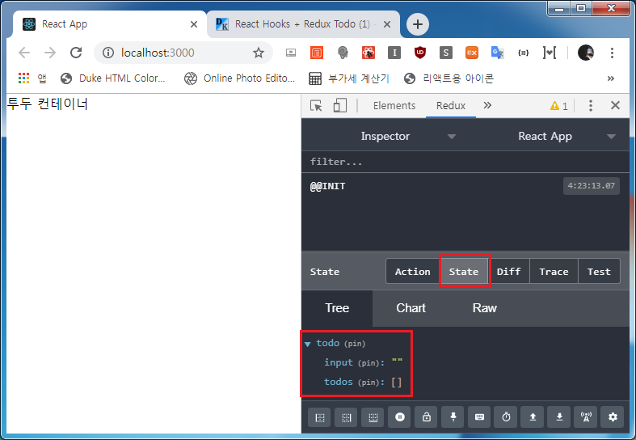

# **React Hooks + Redux Todo** 만들기!(1)


## 프로젝트 초기화 및 구조
```js
- 프로젝트 초기화
$ yarn create react-app hooks-redux-todo
$ yarn add styled-components
$ yarn add redux react-redux redux-devtools-extension redux-thunk
```

CRA로 초기화 한 후 스타일링 모듈 `styled-components` 를 동일하게 사용하고 리덕스 관련 모듈들 설치

## Redux Modules
> `redux`: 자바스크립트 앱을 위한 상태 컨테이너  
> `react-redux`: 리액트 앱과 리덕스를 연결시켜주는 모듈  
> `redux-devtools-extenstion`: 리덕스의 상태 추적을 브라우저에서 할 수 있게 해주는 확장모듈  
> `redux-thunk`: 액션 대신 함수를 반환, 액션 디스패치시 딜레이 발생, 특정조건 시 디스패치 등을 지원하는 미들웨어

프로젝트 구조는 아래와 같습니당.

```js
[hooks-redux-todo]
─┬ <public>
 │ ├ favicon.ico
 │ ├ index.html
 │ ├ logo192.png
 │ ├ logo512.png
 │ ├ manifest.json
 │ └ robots.txt
─┼ <src>
 │ ├ <components>
 │ │ ├ Button.js
 │ │ ├ Input.js
 │ │ └ TodoList.js
 │ ├ <containers>
 │ │ └ TodoContainer.js
 │ ├ <modules>
 │ │ ├ index.js
 │ │ └ todo.js
 │ ├ <styles>
 │ │ └ utils.js
 │ ├ App.js
 │ ├ index.css
 │ └ index.js
─┼ .gitignore
 ├ package.json
 └ yarn.lock
```

먼저 안 쓰는 파일들을 정리하고 프로젝트를 초기화합니다. 리덕스 `todo`도 만들어서 리액트앱과 연결합니다.

```js
- src/modules/todo.js

// Action Type
export const CHANGE_INPUT = 'todo/CHANGE_INPUT';
export const ADD_TODO = 'todo/ADD_TODO';
export const COMPLETE = 'todo/COMPLETE';
export const REMOVE = 'todo/REMOVE';

// Initial State
const initialState = {
  input: '',
  todos: []
};

// Reducer
const reducer = (state = initialState, action) => {
  switch (action.type) {
    default:
      return state;
  }
};

export default reducer;
```

그리고 이 **todo.js** 를 index 파일로 불러 `combineReducers` 로 합쳐줍니다. 사실 이 과정은 없어도 되지만
나중에도 리덕스를 사용할 때 여러가지 모듈을 각각 불러오는 건 비효율적이므로 연습겸 하겠습니당

```js
- src/modules/index.js

import { combineReducers } from 'redux';
import todo from './todo';

const rootReducer = combineReducers({
  todo,
});

export default rootReducer;
```

그리고 간단하게 App, 저 밑의 *open-color*는 스타일링을 할 때 색상을 간단간단하게 선택할 수 있게 해주는
라이브러리 입니다. 그리고 *TodoContainer* 도 만들어서 App에 걸어주겠습니당.

```js
- src/App.js

import React from 'react';
import styled from 'styled-components';
import oc from 'open-color';

import TodoContainer from './containers/TodoContainer';

const Layout = styled.div`

`;

const App = () => {
  return (
    <Layout>
      <TodoContainer />
    </Layout>
  );
};

export default App;
```

```js
- src/containers/TodoContainer.js

import React from 'react';

const TodoContainer = () => {
  return (
    <>
      투두 컨테이너
    </>
  );
};

export default TodoContainer;
```

그럼 이제 이 App을 불러와서 리덕스와 연결~!

```js
- src/index.js

import React from 'react';
import ReactDOM from 'react-dom';
import './index.css';
import App from './App';

// Redux
import { createStore, applyMiddleware } from 'redux';
import { Provider } from 'react-redux';
import { composeWithDevTools } from 'redux-devtools-extension';
import thunkMiddleware from 'redux-thunk';

import rootReducer from './modules';

const middleware = applyMiddleware(thunkMiddleware);
const store = createStore(rootReducer, composeWithDevTools(middleware));

ReactDOM.render(
  <Provider store={store}>
    <App />
  </Provider>,
  document.getElementById('root')
);
```

이제 yarn start !!



그럼 보시는 바와 같이 redux-devtools-extension에서 state 가 확인이 되네요~!  
아 물론 여기 적지는 않았지만 Google 확장 프로그램에서 설치하셔야 합니다.

그리고 추가적으로 스타일링을 도와줄 `utils.js` 파일도 하나 만들어두죠~!  

```js
// Shadow-Effect https://codepen.io/sdthornton/pen/wBZdXq
export const shadow = (w) => {
  const shadows = [
    css`box-shadow: 0 1px 3px rgba(0,0,0,0.12), 0 1px 2px rgba(0,0,0,0.24);`,
    css`box-shadow: 0 3px 6px rgba(0,0,0,0.16), 0 3px 6px rgba(0,0,0,0.23);`,
    css`box-shadow: 0 10px 20px rgba(0,0,0,0.19), 0 6px 6px rgba(0,0,0,0.23);`,
    css`box-shadow: 0 14px 28px rgba(0,0,0,0.25), 0 10px 10px rgba(0,0,0,0.22);`,
    css`box-shadow: 0 19px 38px rgba(0,0,0,0.30), 0 15px 12px rgba(0,0,0,0.22);`
  ];

  return shadows[w];
};
```

이제 저 shadow는 나중에 styled-components로 스타일링을 할 때 **${shadow(숫자)}** 이런 식으로
적용할 수 있습니당~!

오늘은 프로젝트 초기화만 하고 다음 포스트에서 리듀서를 정의하고 컨테이너에 적용해 볼게요~!!