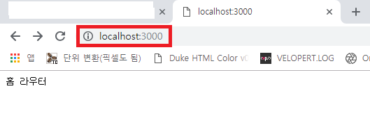
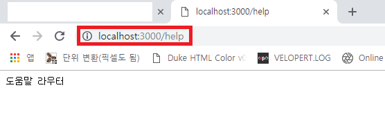
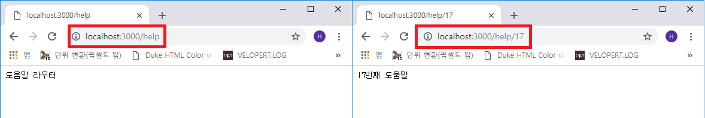
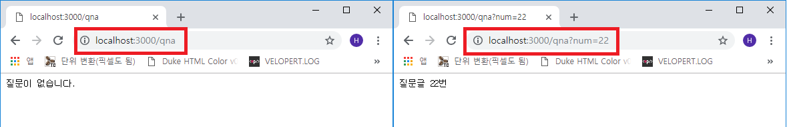

## Koa.JS 라우터
> **라우터** : 어플리케이션 서버에서 경로를 제어하는 목적(경로 설정)

Koa에는 라우터가 내장되어 있지 않아 `koa-router` 모듈을 설치해야 합니다.
```js
C:\test> yarn add koa-router
```

이전 장과 동일하게 `index.js` 파일을 생성하고 아래와 같이 작성합니다.
```js
- index.js

const Koa = require('koa');
const Router = require('koa-router');

const app = new Koa();
const router = new Router();

const port = 3000;

// 라우터 세팅
router.get('/', (ctx) => {
  ctx.body = '홈 라우터';
});

router.get('/help', (ctx) => {
  ctx.body = '도움말 라우터';
});

// 라우터 사용 선언
app.use(router.routes()).use(router.allowedMethods());

app.listen(port, () => {
  console.log(`Koa Server on ${port}port`);
});
```

이후 Koa 웹 서버를 실행합니다.
`C:\test> node index.js`





### Koa 라우터 Params, Query
라우터의 Params(파라미터)와 Query(쿼리)는 라우트 경로에 특정 값을 넣는 것을 의미합니다.  

> **Params(파라미터)** : ~/help/<font color="blue" style="font-weight: 600">:number</font>  
> **Query(쿼리)** : ~/help<font color="blue" style="font-weight: 600">?num=6</font>

위와 같이 라우트 경로를 사용하며 파라미터는 `ctx.params` 객체에서 쿼리는 `ctx.query` 객체에서
조회가 가능합니다.

위에서 사용한 예제문을 그대로 사용하겠습니다.
```js
- index.js

...(생략)

// 라우터 세팅
router.get('/', (ctx) => {
  ctx.body = '홈 라우터';
});

router.get('/help/:number?', (ctx) => {
  // 파라미터 뒤에 '?'를 붙히면 있거나 없거나의 조건부
  // 라우트에서 받은 number를 객체 형태의 'number' 변수에 삽입
  const { number } = ctx.params;

  // 파라미터가 존재하면 'number번째 도움말', 없을 시 '도움말 라우터'
  ctx.body = number ? `${number}번째 도움말` : '도움말 라우터';
});

router.get('/qna', (ctx) => {
  // 라우트에서 받은 쿼리(?num=06)를 'num' 객체에 삽입
  const { num } = ctx.query;

  // 쿼리가 존재하면 '질문글 num번', 없을 시 '질문이 없습니다'
  ctx.body = num ? `질문글 ${num}번` : '질문이 없습니다.';
});

// 라우터 사용 선언
...(생략)
```

웹 브라우저에서 테스트를 해보겠습니다.

<figure>
  
  <figcaption style="text-align: center">
    <span>~/help</span>
    <span style="margin-left: 300px">~/help/17</span>
  </figcaption>
</figure>

<figure>
  
  <figcaption style="text-align: center">
    <span>~/qna</span>
    <span style="margin-left: 300px">~/qna?num=22</span>
  </figcaption>
</figure>