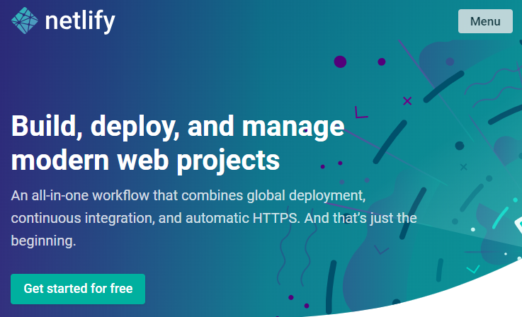
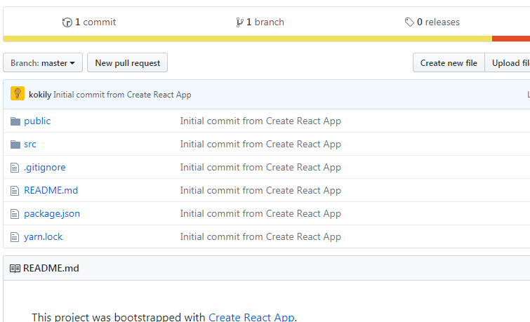
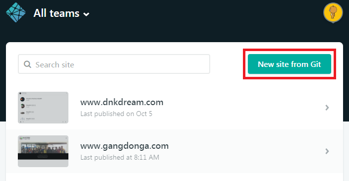
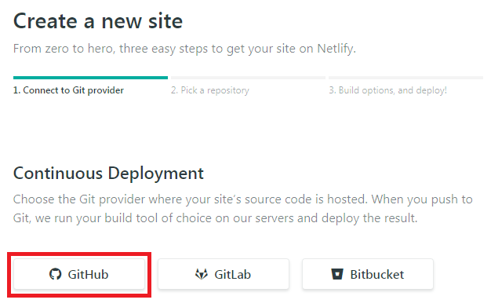
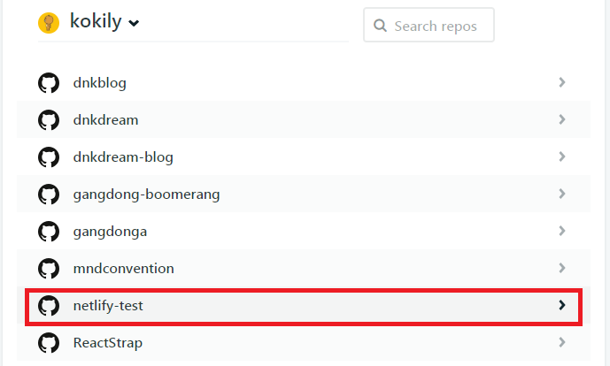
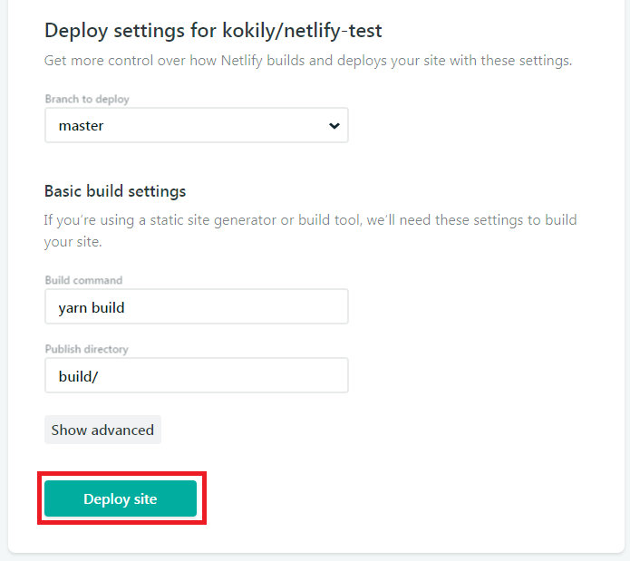
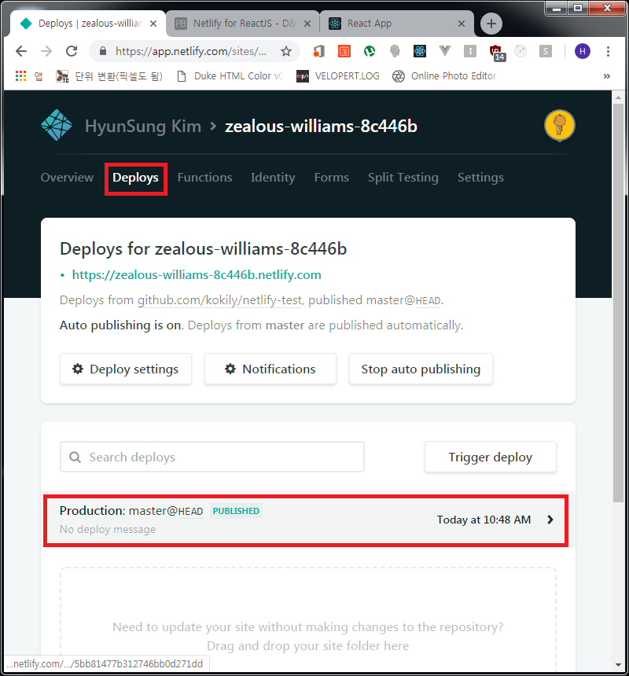
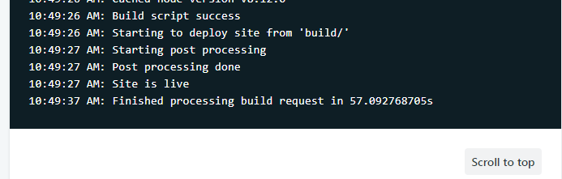
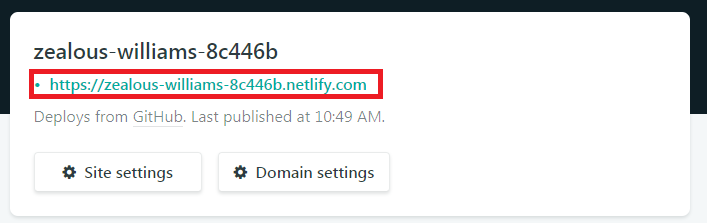
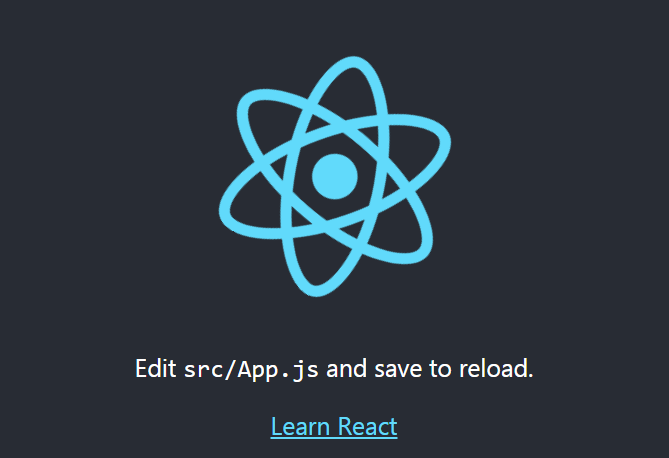

## Netlify 이 편리한 툴 같으니!!
ReactJS 뿐만 아니라 Gatsby, NodeJS 등 웹앱을 제작할 때 여태까지 개인서버(맥미니)를
운영해 왔는데, 엄청난 툴을 찾았따! 라기보다는... `Gatsby`로 블로그 운영을 하다보니
자연스레 알게 된 것!!

> <a href="https://netlify.com" target="_blank">Netlify</a> : Build, Deploy, and Manage Modern Web Projects



### Netlify 사용을 위한 CRA, Git 세팅
```js
- 깃허브 저장소가 있다고 가정

C:\> create-react-app netlify-test
C:\> cd netlify-test
C:\netlify-test> git init
C:\netlify-test> git add .
C:\netlify-test> git commit -m "First Commit"
C:\netlify-test> git remote add origin <본인 Github 주소>
C:\netlify-test> git push origin master
```

위와 같이 작성하여 CRA 세팅 후 깃허브 저장소에 커밋, 푸쉬를 합니다.



그리고 <a href="https://netlify.com" target="_blank">Netlify</a>에 접속을 하여
로그인을 합니다. 깃허브, 깃랩, 비트버켓 아이디로도 간편 가입도 가능합니다.  
그리고 아래의 순서대로 작성합니다.



저는 깃허브 저장소를 이용했으므로 깃허브를 선택합니다.





위와 같이 Deploy를 한 후에 최초 접속 창으로 돌아가서 `Deploys`메뉴를 선택 후 아래를
보시면 `Build`가 진행됩니다.




위와 같이 빌드가 이상없이 완료가 되었고 사이트가 실행됨을 알려줍니다.  
`Site is live`  
그리고 최초 접속 창에 가보시면 아래와 같이 도메인이 부여되었음을 알 수 있고 클릭해보면
방금 작성한 CRA 앱이 정상적으로 실행됩니다.




### Https 부여방법
Netlify에서는 본인이 개인적으로 인증받은 인증서도 가능하지만 Let's Encrypt를
지원합니다. 사용방법은 정말 간단합니다. **하!지!만!**
https를 부여하기 위한 조건은 먼저 도메인 설정을 해줘야 하기 때문에... 이미 다 설정을
해버려서... OTL..

나중에 다시 포스팅 하는 걸로 하겠습니다. ㅋㅋㅋㅋ  
(절대 귀찮아서가 아닙니다)