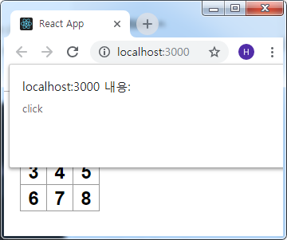
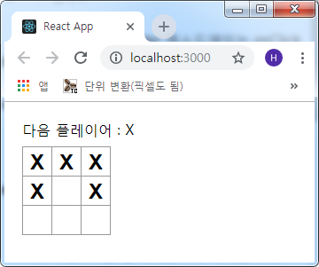

## 틱택토 게임 Interactive 컴포넌트 구현
상자(Square)를 클릭하면 `Square` 컴포넌트에 **X** 표시를 채우도록 해보겠습니다.  
먼저, `Square` 컴포넌트의 `render()` 함수의 버튼 태그를 아래와 같이 수정하겠습니다.

```js
- src/Components/Square.js

...(생략)
<button
  className="square"
  onClick={() => { alert('click'); } }>
  { this.props.value }
</button>
...(생략)
```
그리고 상자를 클릭해보면 아래와 같이 `alert()` 이벤트가 발생됨을 확인할 수 있습니다.
코드를 보시면 `() =>` 화살표 함수를 사용했는데 사실 `function() {...}`과 동일합니다.
다만 리액트 공홈에서도 타이핑을 줄이고 가독성을 위해 이벤트 핸들러에 대하여
`화살표 함수`로 사용할 것을 권장하고 있습니다.




다음은 `Suqare` 컴포넌트가 **클릭**되었음을 **저장** 할 수 있어야 합니다. 그 표시는
`X` 문자이고 정보를 저장하기 위해 `state`를 사용합니다.

리액트 컴포넌트는 `constructor` 에서 `this.state` 를 설정합니다. `this.state`는
정의된 리액트 컴포넌트에 대하여 private으로 간주되어야 합니다. `this.state`에
`Square`의 현재 값을 저장하고 `Square`를 클릭할 때마다 변경되게 합니다.

먼저 클래스에 `constructor`를 추가하여 `state`를 초기화 하겠습니다.

```js
- src/Components/Square.js

...(생략)
class Square extends Component {
  constructor(props) {
    super(props);   // 하위 클래스의 생성자를 정의할 때는 항상 super를 호출

    this.state = {
      value: null
    };
  }

  render() {
...(생략)
```

이제 `Suqare`의 `render()` 메소드를 수정하여 클릭 할 때마다 현재 `state` 값을
표시하게끔 하겠습니다. `<button>` 태그의 **this.props.value**를 **this.state.value**로 수정합니다.  
그리고 `<button>` 태그의 onClick 이벤트 핸들러를 수정합니다. **(Props → State)**

```js
- src/Components/Square.js

...(생략)
render() {
  return (
    <button
      className="square"
      onClick={() => { this.setState({ value: 'X' }) } }>
      { this.state.value }
    </button>
  );
}
...(생략)
```



`Square` 컴포넌트의 `render()` 메소드에 있는 onClick 이벤트 핸들러에서
**this.setState**를 호출하면 `<button>`을 클릭할 때마다 그 해당 `Square`를
리렌더링 시킵니다.  
업데이트가 끝나면 `Square`의 `this.state.value`의 값은 **"X"**가 되므로
해당 칸에 **"X"**가 표기 되는 것이고 컴포넌트에서 `setState`를 호출하면 리액트는
내부 자식 컴포넌트도 자동으로 업데이트를 합니다.

다음 포스트에 이어서..