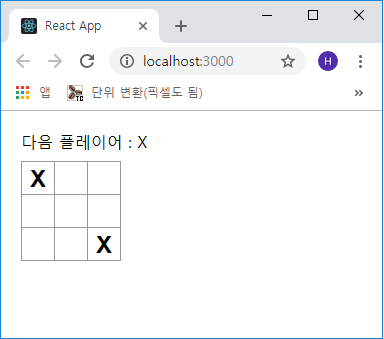

## 틱택토 게임의 완성요소 구축
저번 장까지 **틱택토** 게임의 기본 구성을 완성하였습니다. 게임을 진행할 수 있게 하려면
`Board` 컴포넌트에 **X** 와 **O**를 번갈아 가며 사용하여 승자를 결정할 방법을 구현해야
합니다.

현재 각 `Square` 컴포넌트는 게임의 상태(state)를 유지합니다. 승자를 확인하기 위하여 현 위치에서
9개의 정사각형 각각의 `value` 를 유지합니다.  
여기서 들 수 있는 생각은 `Board` 컴포넌트가 각각의 `Square`에게 `Square의 value(state)`를 확인해야
하는 건가라는 것입니다.  

이러한 접근방법은 ReactJS 에서도 가능하지만 코드를 이해하기가 어렵고 버그 발생 우려 및 리팩토링시
어려움이 많기 때문에 사용하지 않는 것을 권장합니다.

따라서 가장 좋은 방법은 게임의 각 상태를 `Square` 컴포넌트가 아닌 그 부모인 `Board` 컴포넌트에
저장하는 것입니다. `Board` 컴포넌트는 각 `Square`에 숫자를 전달할 때와 마찬가지로 각각의 `Square`
컴포넌트에 표시할 내용을 알릴 수 있습니다. → (this.props.value)

여러 자식(children)으로부터 데이터를 수집하거나 두 자식(children) 컴포넌트가 서로 통신할 수 있도록
하려면 부모(parent) 컴포넌트에서 공유 상태(shared state)를 선언하면 됩니다. 부모 컴포넌트는 props를
사용하여 state를 다시 자식 컴포넌트에게 전달할 수 있습니다.  
이것은 자식 컴포넌트를 각각의 자식 컴포넌트 간의, 또 부모 컴포넌트와 동기화되도록 유지합니다.

***

### 코드 작성
백문이 불여일타! 매우 쳐봅시다.  
ReactJS 컴포넌트가 리팩토링이 되면 부모 컴포넌트로 State를 리프팅 시킵니다.
`Board` 컴포넌트에 *contructor*를 추가하고 `Board` 초기 상태를 9개의 널값(null)이 있는 배열을
포함하도록 설정합니다. 이 9개의 널값은 9개의 사각형(Square)에 해당합니다.

```js
- src/Components/Board.js

...(생략)
class Board extends Component {
  constructor(props) {
    super(props);
    this.state = {
      squares: Array(9).fill(null)
    };
  }

  renderSquare(i) {
...(생략)
```
나중에 `Board`를 채울 때 아래와 같이 보이게 될 겁니다.

```js
[
  'O', null, 'X',
  'X', 'X', 'O',
  'O', null, null,
]
```
이제 우리는 props 통신을 이용해 매커니즘을 다시 만들 겁니다.  
`Board`는 각 `Square` 컴포넌트에 현재의 값('X', 'O', null)에 대해 지시하도록 수정합니다.
이미 `Board`의 *constructor*를 통해 `Sqaure`의 배열을 정의했으며 `Board`의 *renderSquare*
메소드를 수정하겠습니다.

```js
  renderSquare(i) {
    return <Square value={this.state.squares[i]} />;  // i값 수정
  }
```

이제 각 `Square`에는 'X', 'O', null 값인 props를 전달 받을 수 있게 되었습니다.

다음은 각 `Square`를 클릭했을 때(event)를 수정해 주어야 합니다. `Board` 컴포넌트는 이제
각 사각형에 어떤 값이 들어가 있는지를 유지할 수 있게 되었습니다.  

우리는 `Square`가 `Board`의 *state*를 업데이트 할 수 있게 해야 합니다. state 값은 비공개로
간주되므로 `Square`의 *state*를 직접 업데이트 할 수는 없습니다.

`Board`의 *state*값 프라이버시를 유지하기 위해 `Square`에서 `Board`로 함수를 전달할 것입니다.
`Square` 클릭 시 이 함수가 호출되게 합니다. 따라서 `Board` 컴포넌트의 *renderSquare* 메소드를
아래와 같이 수정합니다.

```js
- src/Components/Board.js

...(생략)
renderSquare(i) {
  return (
    <Square
      value={this.state.squares[i]}
      onClick={() => this.handleClick(i)}
    />
  )
}
...(생략)
```

이제 `Board`에서 `Square`까지 두개의 props(value, onClick())를 전달합니다. *onClick* props는
`Square`가 클릭될 때 호출할 수 있는 함수입니다. **Square.js**를 다음과 같이 수정합니다.

```js
- src/Components/Square.js 파일 전체 수정
import React, { Component } from 'react';

class Square extends Component {
  render() {
    return (
      <button
        className="square"
        onClick={() => this.props.onClick()}
      >
        { this.props.value }
      </button>
    );
  }
}

export default Square;
```

이제 `Board` 컴포넌트에 *handleClick* 함수를 추가합니다.

```js
- src/Components/Board.js

...(생략)
  handleClick(i) {
    const squares = this.state.squares.slice();
    squares[i] = 'X';
    this.setState({ squares: squares });
  }

  renderSquare(i) {
...(생략)
```

위와 같이 수정하고 나면 아래와 같이 다시 사각형을 클릭했을 때 'X'가 채워지는 것을 확인할 수
있습니다. 하지만 이전과 다르게 이제 *state*는 각각의 `Square` 컴포넌트 대신 `Board` 컴포넌트에
저장이 됩니다. 또한 `Board`의 *state*가 변경이 되면 `Square` 컴포넌트가 자동으로 리렌더링
됩니다.



`Square` 컴포넌트(자식)는 이제 *state*를 유지하지 않으므로 `Board` 컴포넌트(부모)로부터
값을 수신하고 클릭(event)이 되면 `Board` 컴포넌트에게 통보합니다.

ReactJS 용어로 `Square` 컴포넌트는 Controlled Components(제어된 컴포넌트)입니다.

이제 `Board` 컴포넌트는 모든 권한을 가지고 있습니다.

위 예제에서는 기존 배열을 수정하는 대신 사각형 배열의 복사본을 만들기 위해 *slice*를
호출하였습니다. 이제 이 내용에 대해 설명하겠습니다.

***

### ReactJS 불변성(Immutability)

#### Complex Features Become Simple(복잡함을 간결화)
불변성(Immutable)으로 인해 복잡한 기능들을 더 쉽게 구현 할 수 있습니다.  
이 튜토리얼의 후반부에서 구현할 **뒤로가기**, 웹앱에서 자주 쓰이는 기능이므로 중요합니다.

직접 배열(데이터)의 변이를 피함으로써 이전의 정보를 손상시키지 않아 나중에 재사용이
가능하다는 장점이 있습니다.

#### Detecting Changes(변경사항 감지)
객체를 직접 수정하였을 때 변경사항을 감지하는데는 많은 어려움이 있습니다. 이 불변성을
사용함으로써 이전 사본과의 비교가 정확해 집니다.

#### Determining when to re-render in React(리액트에서 리렌더링 결정)
불변성을 사용함에 있어서 가장 주된 이점은 ReactJS에서 순수한(pure) 컴포넌트를 구축하는데
도움이 된다는 점입니다. 변경이 불가능한 데이터는 컴포넌트의 리렌더링 시점을 결정하는데
도움이 되는 **변경사항**이 있는지 쉽게 구별이 가능하기 때문입니다.

나중에 나올 sholdComponentUpdate() 및 성능 최적화에 대한 내용을 확인할 텐데 그 때
순수한 컴포넌트를 구축하는 방법에 대해 자세히 배울 수 있습니다.