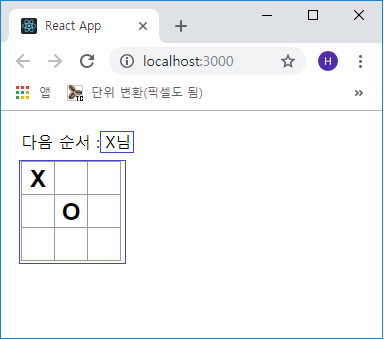
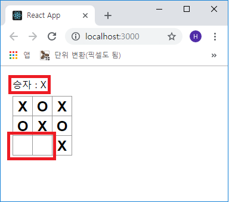

## 함수형 컴포넌트
기존의 `Square` 컴포넌트는 *state* 값이 없기 때문에 함수형 컴포넌트로 변경할 것입니다.  
ReactJS에서 함수형 컴포넌트는 렌더링 메소드와 입력받은 props만 렌더링하는 것으로 간결하고
작성하는데 피로도를 많이 줄여줄 수 있습니다.

기존 `Square` 컴포넌트를 수정해 보겠습니다.

```js
- src/Components/Square.js  파일 전체 수정

import React from 'react';

function Square(props) {
  return (
    <button className="square" onClick={props.onClick}>
      { props.value }
    </button>
  );
};

export default Square;
```

***

### 틱택토 게임의 구성
이제는 프로젝트에 **틱택토 게임**의 룰을 적용해야 합니다. 현재 "O"는 보드에 표시를 할 수가
없습니다.  
첫 번째 클릭시 'X'가 표기되도록 설정합니다. `Board` 컴포넌트의 *contructor*를 수정하여 이
기본값을 바꾸겠습니다.

```js
- src/Components/Board.js

...(생략)
class Board extends Component {
  constructor(props) {
    super(props);
    this.state = {
      squares: Array(9).fill(null),
      xIsNext: true   // 추가
    };
  }
...(생략)
```

플레이어 순번이 바뀔 때마다 *xIsNext*(boolean 값)를 뒤집어서 다음 순번을 결정하고 게임의 상태를
저장합니다. `Board` 컴포넌트의 *handleClick* 함수를 수정하겠습니다.

```js
- src/Components/Board.js

...(생략)
  handleClick(i) {
    const squares = this.state.squares.slice();

    // 삼항 연산자 [조건] ? [참] : [거짓]
    squares[i] = this.state.xIsNext ? 'X' : 'O';
    this.setState({
      squares: squares,

      // xIsNext state 값 반전
      xIsNext: !this.state.xIsNext
    });
  }
...(생략)
```

위와 같이 코딩하면 사각형을 클릭할 때마다 'X', 'O'(state)가 번갈아가며 표시가 되고
저장이 됩니다. 그리고 `Board` 컴포넌트 렌더링 시 *status* 텍스트를 변경하여 다음 순서가
누구인지를 표시하여 알려주도록 수정하겠습니다.

```js
- src/Components/Board.js

...(생략)
  render() {
    const status = '다음 순서 : ' + (this.state.xIsNext ? 'X' : 'O') + '님';

    return (
...(생략)
```



***

### 승자 선언
이제 게임에 승자가 결정되고 더 이상 턴이 필요 없을 시도 렌더링 하여야 합니다.  
승자 결정 함수를 만들어 `Board` 컴포넌트에 포함시키고 렌더링하겠습니다.

```js
- src/Components/Board.js

...(생략)
  }
}

function calcaulateWinner(squares) {
  const lines = [
    [0, 1, 2],
    [3, 4, 5],
    [6, 7, 8],
    [0, 3, 6],
    [1, 4, 7],
    [2, 5, 8],
    [0, 4, 8],
    [2, 4, 6],
  ];

  for (let i=0; i<lines.length; i++) {
    const [a, b, c] = lines[i];

    if (squares[a] && squares[a] === squares[b] && squares[a] === squares[c]) {
      return squares[a];
    }
  }

  return null;
}

export default Board;
```

`Board` 컴포넌트의 렌더 함수에서 *calculateWinner* 함수를 호출하여 누가 승리하였는지
확인을 합니다. 승자는 `승리 : X` 또는 `승리 : O`와 같은 텍스트로 표시합니다.  
`Board` 컴포넌트의 *render* 함수를 아래와 같이 수정합니다.

```js
- src/Components/Board.js

...(생략)
  render() {
    const winner = calcaulateWinner(this.state.squares);
    let status;

    if (winner) {
      status = '승자 : ' + winner;
    } else {
      status = '다음 순서 : ' + (this.state.xIsNext ? 'X' : 'O') + ' 님';
    }

    return (
...(생략)
```

`Board` 의 *handleClick* 함수를 수정하여 게임의 승자가 발생하거나 사각형이 다 채워진 경우
클릭을 무시하도록 합니다.

```js
- src/Components/Board.js

...(생략)
  handleClick(i) {
    const squares = this.state.squares.slice();

    // 승자 발생 또는 사각형 만칸 시
    if (calcaulateWinner(squares) || squares[i]) {
      return;
    }

    squares[i] = this.state.xIsNext ? 'X' : 'O';
...(생략)
```

그리고 게임을 진행해 보면 아래와 같이 승자가 표기되고 다른 칸의 *클릭*이 무시됨을 알 수 있습니다.

