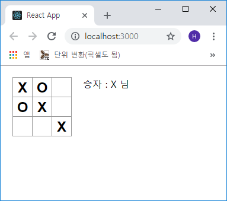

## 히스토리 이동에 대하여
이제 ReactJS 튜토리얼의 마지막 순서인 *히스토리*에 대하여 시작하겠습니다.

<a href="https://dnkdream.com/react-tictactoe-4/" target="_blank">이전 장</a>에서
기술했듯이 직접 객체(배열)를 수정을 하면 *히스토리*를 구현하는 것이 매우 어려워집니다.
따라서 지금까지 모든 이동 후의 사각형 배열(Square)의 새로운 복사본을 *slice*를 이용해
생성하였고, 불변(immutable)으로 처리를 하였습니다.

이렇게 하면 이 사각형 배열의 모든 이전 상태를 저장하고 이미 발생한 전환사항들을 탐색할 수
있게 됩니다.

이제 과거의 배열을 *history*라는 다른 배열에 저장을 할 겁니다. *history* 배열은 첫 번째에서
마지막으로 이동한 모든 보드 상태를 저장 및 표시하게 할 겁니다.

모양은 다음과 같습니다.

```js
history = [
  {
    squares: [
      null, null, null,
      null, null, null,
      null, null, null
    ]
  },
  {
    squares: [
      null, null, 'X',
      null, null, null,
      null, null, null
    ]
  },
  {
    squares: [
      null, null, 'X',
      null, null, null,
      null, null, 'O'
    ]
  },
  ...(생략)
]
```

이제 어떤 컴포넌트가 기록상태를 보유(저장)해야 하는지 결정합니다.

*history*에 액세스를 해야 하므로 *history*의 *state*를 최상위 레벨 컴포넌트에 배치합니다.
이 *state*를 최상위 컴포넌트에 배치를 하면 자식 `Board` 컴포넌트에서 과거 이력을 삭제할 수 있습니다.
`Square` 컴포넌트에서 `Board` 컴포넌트로 *state*를 리프트 업 했던 것처럼 `Board` 컴포넌트에서
부모 컴포넌트(`Game`)로 *state*를 리프트 업 하면 됩니다.

이는 `Game` 컴포넌트가 `Board`의 데이터를 완벽하게 통제할 수 있게 하며 이 `Board` 컴포넌트가
*history*에서 이전 턴을 렌더링하도록 지시할 수 있게 해줍니다.

먼저 `Game` 컴포넌트의 *constructor*를 초기화 합니다.

```js
- src/Components/Game.js

...(생략)
class Game extends Component {
  constructor(props) {
    super(props);
    this.state = {
      history: [
        {
          squares: Array(9).fill(null)
        }
      ],
      xIsNext: true
    };
  }

  render() {
...(생략)
```

다음은 `Board` 컴포넌트에 `Game` 컴포넌트에서 props(value, onClick)를 받아옵니다.

이제 `Board` 컴포넌트에 많은 `Square`에 대한 단일 클릭 핸들러가 있으므로, 각 `Square`의 위치를
*onClick* 이벤트 핸들러에 전달하여 어떤 `Square`가 클릭이 되었는지를 표시해야 합니다.

`Board` 컴포넌트를 변환하는데 필요한 단계를 설명하면 다음과 같습니다.

> * `Board`의 *renderSquare*에서 this.**state**.squares[i]를 this.**props**.squares[i]로 변경
> * `Board`의 *renderSquare*에서 this.**handleClick(i)**를 this.**props.onClick(i)**로 변경

이제 `Board` 컴포넌트를 다음과 같이 수정합니다.

```js
- src/Components/Board.js

...(생략)
class Board extends Component {
  // contructor 삭제

  handleClick(i) {
    const squares = this.state.squares.slice();

    if (calcaulateWinner(squares) || squares[i]) {
      return;
    }

    squares[i] = this.state.xIsNext ? 'X' : 'O';
    this.setState({
      squares: squares,
      xIsNext: !this.state.xIsNext
    });
  }

  renderSquare(i) {
    return (
      <Square
        value={this.props.squares[i]}
        onClick={() => this.props.onClick(i)}
      />
    ) // state → props, this.handleClick(i) → this.props.onClick(i)
  }

  render() {
...(생략)
```

가장 최근의 기록 항목을 사용하여 `Game`의 *state*를 확인하고 표시하도록 `Game` 컴포넌트의
렌더링을 수정합니다.

```js
- src/Components/Game.js

...(생략)
  render() {
    const history = this.state.history;
    const current = history[history.length - 1];
    const winner = calculateWinner(current.squares);

    let status;

    if (winner) {
      status = '승자 : ' + winner; + ' 님';
    } else {
      status = '다음 순서 : ' + (this.state.xIsNext ? 'X' : 'O') + ' 님';
    }

    return (
      <div className="game">
        <div className="game-board">
          <Board
            squares={current.squares}
            onClick={(i) => this.handleClick(i)}
           />
        </div>
        <div className="game-info">
          <div>{ status }</div>
          <ol>{/* 나중에 */}</ol>
        </div>
      </div>
    );
...(생략)
```

`Game` 컴포넌트가 이제 *state*를 렌더링하므로 `Board` 컴포넌트의 렌더링 메소드에서 해당 코드를
제거할 수 있습니다. 아래와 같이 수정합니다.

```js
- src/Components/Board.js

...(생략)
  render() {
    return (
      <div>
        <div className="status">{status}</div>
...(생략)
```

마지막으로 *handleClick* 함수를 `Board` 컴포넌트에서 `Game` 컴포넌트로 옮깁니다.
또한 `Game` 컴포넌트의 *state*는 구성 요소가 다르기 때문에 *handleClick* 함수를 수정해야
합니다.

```js
- src/Components/Game.js

...(생략)
      ],
      xIsNext: true
    };
  }

  handleClick(i) {
    const history = this.state.history;
    const current = history[history.length - 1];
    const squares = current.squares.slice();

    if (calculateWinner(squares) || squares[i]) {
      return;
    }

    squares[i] = this.state.xIsNext ? 'X' : 'O';
    this.setState({
      history: history.concat([
        {
          squares: squares
        }
      ]),
      xIsNext: !this.state.xIsNext
    });
  }

  render() {
    const history = this.state.history;
...(생략)
```

> Note: concat() 메소드는 push()와 다르게 배열을 변경하지 않습니다

지금 `Board` 컴포넌트는 *renderSquare* 및 *render* 메소드만 있으면 됩니다. 게임의
*state*와 *handleClick* 메소드는 `Game` 컴포넌트에 있어야 합니다.

일단 전과 마찬가지로 작동은 잘 되지만 아직 *history* 기능이 활성화 되지 않음을 알 수 있습니다.



***

그럼 다음 장에서 이 *history* 기능을 마저 구현하겠습니다.