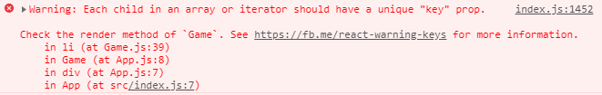
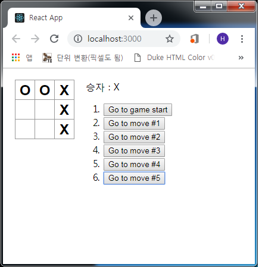
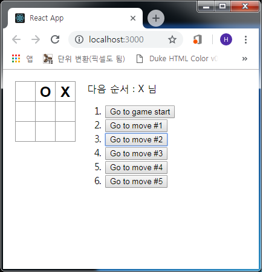

## Showing the Past Moving
이제 이 Game의 *history*를 기록하고 있기 때문에 플레이어에게 과거의 목록을
표시할 수 있습니다. ReactJS는 Javascript 객체입니다. 따라서 ReactJS에서
여러 항목을 렌더링하려면 리액트 엘리먼트의 배열을 사용하여야 합니다.

Javascript에서 배열의 데이터를 매핑하는데 일반적으로 상요되는 `map()` 메소드가
있습니다. 예제문은 다음과 같습니다.

```js
const numbers = [1, 2, 3];
const doubled = numbers.map(x => x * 2)

--- 출력
[2, 4, 6]
```

`map()` 메소드를 사용하면 *history*를 화면상의 버튼에 매핑하여 렌더링해보겠습니다.

```js
- src/Components/Game.js

...(생략)
render() {
    const history = this.state.history;
    const current = history[history.length - 1];
    const winner = calculateWinner(current.squares);

    // 추가 
    const moves = history.map((step, move) => {
      const desc = move ? 'Go to move #' + move : 'Go to game start';

      return (
        <li>
          <button onClick={() => this.jumpTo(move)}>
            { desc }
          </button>
        </li>
      )
    })  // -->

    let status;

    if (winner) {
      status = '승자 : ' + winner;
    } else {
      status = '다음 순서 : ' + (this.state.xIsNext ? 'X' : 'O') + ' 님';
    }

    return (
      <div className="game">
        <div className="game-board">
          <Board
            squares={current.squares}
            onClick={(i) => this.handleClick(i) }
          />
        </div>
        <div className="game-info">
          <div>{ status }</div>
          <ol>{ moves }</ol>  {/* moves 추가 */}
        </div>
      </div>
    );
  }
}

function calculateWinner(squares) {
...(생략)
```

여기서 개발자모드에 들어가보면 아래와 그림과 같은 경고문을 볼 수 있습니다.
대충 확인해보면



> 배열 또는 반복자의 각 자식에는 고유한 "KEY" prop 값이 있어야 함

***

### KEY 선택
이 히스토리 목록을 렌더링할 때 리액트는 렌더링이 된 각각의 항목에 대한 정보를 저장합니다.

```html
<li>Ben     : 9 tasks left</li>
<li>Claudia : 9 tasks left</li>
<li>Alexa   : 9 tasks left</li>
```

```js
<li key={user.id}>{user.name} : {user.taskCount} tasks left</li>
```

엘리먼트가 생성되면 리액트는 `KEY` 속성을 추출하고 리턴된 엘리먼트에 직접 `KEY`를 저장합니다.

***

### 히스토리 간 이동 구현
틱택토 게임의 히스토리에서 과거의 각각 이동에는 고유한 **ID**가 있습니다. 이동은 다시 정렬되거나
삭제되거나 중간에 삽입이 되지 않으므로 *move index*를 KEY로 사용하는 것이 안전합니다.

Game 컴포넌트의 *render()* 메소드에서 KEY를 `<li key={move}>`로 추가하면 개발자 모드의 경고가
사라집니다.

```js
- src/Components/Game.js

...(생략)
      return (
        <li key={move}>  {/* key 값 move 추가 */}
          <button onClick={() => this.jumpTo(move)}>
            { desc }
          </button>
        </li>
      )
...(생략)
```

현재는 *jumpTo()* 함수가 정의되지 않았기 때문에 버튼을 클릭하면 오류가 발생합니다.
*jumpTo()* 함수를 구현하기 전에 `stepNumber`를 `Game` 컴포넌트의 *state*에 추가하여
현재 어떤 단계인지를 표시합니다.

```js
- src/Components/Game.js

...(생략)
class Game extends Component {
  constructor(props) {
    super(props);
    this.state = {
      history: [{ squares: Array(9).fill(null) }],
      stepNumber: 0,        // 추가
      xIsNext: true
    };
  }
...(생략)
```

다음은 Game에서 `jumpTo()` 함수를 정의하여 해당 *stepNumber*를 업데이트 합니다.
*stepNumber*를 변경하는 숫자가 짝수이면 *xIsNext*를 **true**로 설정합니다.

```js
- src/Components/Game.js

...(생략)
  }

  jumpTo(step) {
    this.setState({
      stepNumber: step,
      xIsNext: (step % 2) === 0
    });
  }

  render() {
...(생략)
```

이제 사각형을 클릭할 때 발생하는 `Game` 컴포넌트의 *handleClick* 함수를 약간 변형할 겁니다.\
방금 추가한 *stepNumber* state는 이제 사용자에게 표시되는 *move*(이동)을 반영합니다.
새로운 *move*를 만든 후에는 *step.setState* 인수의 일부로 `stepNumber: history.length` 를
추가하여 *stepNumber*를 업데이트 해야 합니다.

```js
- src/Components/Game.js

...(생략)
  handleClick(i) {
    // this.state.history → this.state.history.slice(0, this.state.stepNumber + 1)
    const history = this.state.history.slice(0, this.state.stepNumber + 1);
    const current = history[history.length - 1];
    const squares = current.squares.slice();

    if (calculateWinner(squares) || squares[i]) {
      return ;
    }

    squares[i] = this.state.xIsNext ? 'X' : 'O';

    this.setState({
      history: history.concat([{ squares: squares }]),
      stepNumber: history.length,     // 추가
      xIsNext: !this.state.xIsNext
    });
  }
...(생략)
```

마지막으로 `Game` 컴포넌트의 *render()* 메소드를 항상 마지막 *move*를 렌더링하는 것으로부터
*stepNumber*에 따라 현재 선택된 이동을 렌더링하는 것으로 수정합니다.

```js
- src/Components/Game.js

...(생략)
  render() {
    const history = this.state.history;
    // current 수정
    const current = history[this.state.stepNumber];
    const winner = calculateWinner(current.squares);

    const moves = history.map((step, move) => {
...(생략)
```

***

### 최종 실행
다시 브라우저를 열어 실행한 후에 게임을 진행하여 승자를 발생시키고



히스토리의 `Go to move #2`를 클릭해보면


### 수고하셨습니다!
### 이로써 리액트 공식 홈페이지의 튜토리얼을 완성하였습니다!

<a href="https://tictactoe-exam.netlify.com/" target="_blank">예제 실행</a>  
<a href="https://github.com/kokily/tictactoe-game" target="_blank">깃허브 저장소</a>